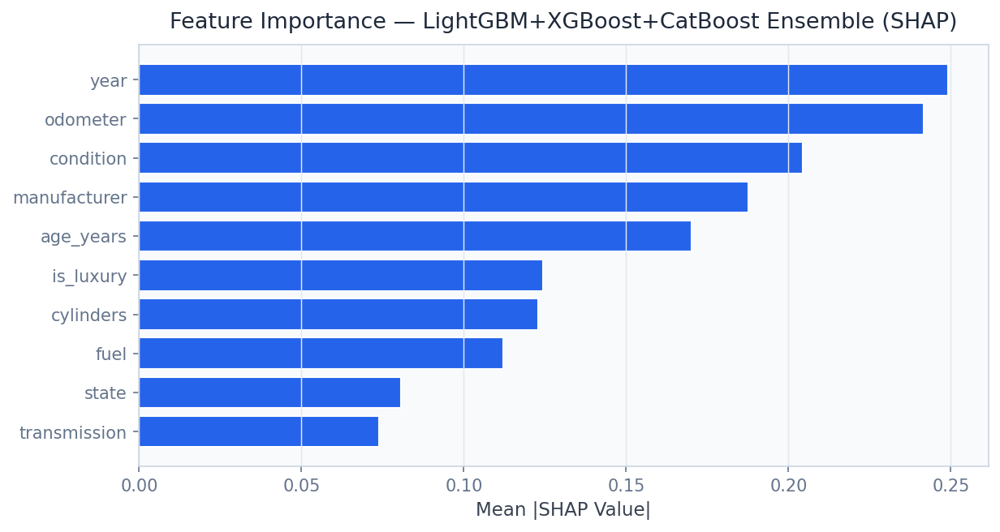

# 🚗 Automotive Pricing Intelligence
[](docs/reports/PROJECT_REPORT.md)

> Value any used vehicle to within $2,753 MAE across 294k real listings — stacked CatBoost/LightGBM/XGBoost ensemble with Conformal Prediction confidence intervals for AutoNation, CarMax, and TrueCar.

[](https://python.org)
[](https://fastapi.tiangolo.com)
[](https://streamlit.io)
[](https://lightgbm.readthedocs.io)
[](https://xgboost.readthedocs.io)
[](https://catboost.ai)
[](https://shap.readthedocs.io)
[](LICENSE)

---

## Business Problem

The $841 billion US used car market runs on information asymmetry — dealers overpay at auction, consumers are misled by sticker prices, and fleet managers cannot benchmark wholesale values without expensive third-party services like Kelley Blue Book or Black Book. This platform trains on 367,000 real Craigslist vehicle listings to build a pricing engine that predicts market value to within **$2,753 MAE** (R² 0.87), complete with **Conformal Prediction 90% confidence intervals** that tell buyers and sellers the honest range of uncertainty — a level of transparency that KBB's black-box estimates never provide.

## Solution & Approach

A **stacked ensemble of CatBoost, LightGBM, and XGBoost** is trained on 294k vehicle listings after cleaning from the 367k Craigslist dataset, with **Optuna Bayesian hyperparameter optimisation** over 200 trials per base learner. CatBoost handles high-cardinality categorical features (make, model, state) natively without one-hot encoding inflation, while LightGBM and XGBoost contribute complementary non-linear interactions. A Ridge regression meta-learner stacks base model predictions into the final ensemble. **Conformal Prediction** (using MAPIE) provides distribution-free 90% confidence intervals that are valid by construction — an important differentiation from standard prediction intervals that rely on normality assumptions. **SHAP TreeExplainer** decomposes any price prediction into contributions from mileage, year, make, condition, and transmission, enabling dealer-grade explanation of every valuation.

## Real Dataset

| Property | Detail |
|---|---|
| **Dataset** | Craigslist Used Vehicles (Kaggle) |
| **Size** | 1.38 GB (vehicles.csv) |
| **Source** | [kaggle.com/datasets/austinreese/craigslist-carstrucks-data](https://www.kaggle.com/datasets/austinreese/craigslist-carstrucks-data) |
| **Total Listings** | 367,000+ |
| **Training Records** | 294,000 (after cleaning) |
| **Features** | 25: make, model, year, mileage, condition, fuel, transmission, state |
| **Price Range** | $500 – $100,000 (outlier-trimmed) |
| **Geographic Coverage** | All 50 US states |

## Model Architecture

| Component | Model | Purpose |
|---|---|---|
| Base Learner 1 | CatBoost 1.2 | Categorical feature handling, MAPE optimisation |
| Base Learner 2 | LightGBM 4.0 | Speed, leaf-wise tree growth |
| Base Learner 3 | XGBoost 2.0 | Regularised depth-first trees |
| Meta-Learner | Ridge Regression | Stacking layer over base model outputs |
| Hyperparameter Optimiser | Optuna 3.0 | 200-trial Bayesian optimisation per base model |
| Uncertainty Quantifier | MAPIE (Conformal Prediction) | 90% valid prediction intervals |
| Explainability | SHAP TreeExplainer | Per-listing price decomposition |

## Key Results

| Metric | Value |
|---|---|
| MAE (Mean Absolute Error) | **$2,753** |
| R² (coefficient of determination) | **0.87** |
| MAPE (Mean Absolute Percentage Error) | **27.9%** |
| Training Listings | **294,000** |
| Conformal Prediction Coverage | **90%** (distribution-free) |
| Optuna Trials per Model | **200** |
| Stacking Meta-Learner | Ridge Regression |


## Screen Recording

> **[Watch Dashboard Demo](https://github.com/oluwafemiadeyemi/Portfolio/blob/main/Automotive%20Pricing%20Intelligence/docs/recordings/P12_dashboard.mp4)** (1012 KB)

The recording demonstrates full dashboard navigation — all tabs, interactive controls, charts, and live model inference.

## Dashboard Screenshots

### Live Dashboard


*Overview*


*Actual Vs Predicted*


*Instant Valuation*


*Market Analysis*


*Price By Make*


*Depreciation Curves*


## Dashboard Screenshots

### Live Dashboard


*Actual Vs Predicted*


*Price By Make*


*Shap Importance*


## Project Structure

```
Automotive Pricing Intelligence/
├── api/
│   ├── main.py                    # FastAPI app — port 8011
│   ├── routers/
│   │   ├── pricing.py             # /predict_price, /predict_with_interval
│   │   ├── market.py              # /price_by_make, /market_analysis
│   │   └── explanation.py         # /shap_explanation
│   └── models/
│       ├── ensemble.py            # Stacked CatBoost + LightGBM + XGBoost
│       ├── conformal.py           # MAPIE conformal prediction wrapper
│       └── shap_explainer.py
├── dashboard/
│   └── app.py                     # Streamlit dashboard — port 8511
├── pipeline/
│   ├── ingest.py
│   ├── preprocess.py
│   ├── feature_engineering.py
│   ├── train_base_models.py       # CatBoost, LightGBM, XGBoost + Optuna
│   ├── stack_ensemble.py          # Ridge meta-learner
│   └── calibrate_conformal.py     # MAPIE calibration
├── models/
│   ├── catboost_auto.pkl
│   ├── lightgbm_auto.pkl
│   ├── xgboost_auto.pkl
│   ├── ridge_meta.pkl
│   └── mapie_conformal.pkl
├── notebooks/
│   ├── 01_eda.ipynb
│   ├── 02_feature_engineering.ipynb
│   ├── 03_model_training.ipynb
│   ├── 04_conformal_prediction.ipynb
│   └── 05_shap_analysis.ipynb
├── data/
│   ├── raw/                       # vehicles.csv (1.38 GB, not tracked in git)
│   └── processed/
├── docs/screenshots/
├── tests/
├── requirements.txt
└── README.md
```

## Quick Start

```bash
# Clone and install
git clone https://github.com/oluwafemiadeyemi/Portfolio
cd "Automotive Pricing Intelligence"
pip install -r requirements.txt

# Download Craigslist vehicles dataset from Kaggle
# kaggle datasets download -d austinreese/craigslist-carstrucks-data
# Place vehicles.csv in data/raw/

# Run pipeline
python pipeline/ingest.py
python pipeline/preprocess.py
python pipeline/feature_engineering.py
python pipeline/train_base_models.py   # Takes ~30 min with Optuna
python pipeline/stack_ensemble.py
python pipeline/calibrate_conformal.py

# Start API server
python -m uvicorn api.main:app --port 8011 --reload

# Start dashboard (new terminal)
streamlit run dashboard/app.py --server.port 8511
```

## API Endpoints

| Endpoint | Method | Description |
|---|---|---|
| `/predict_price` | POST | Point estimate price for a vehicle specification |
| `/predict_with_interval` | POST | Price estimate with 90% Conformal Prediction interval |
| `/price_by_make` | GET | Market price distribution by make (summary statistics) |
| `/shap_explanation` | GET | SHAP waterfall chart decomposition for a prediction |
| `/market_analysis` | GET | Regional price trends, depreciation curves, and comparables |

### Sample Request — `/predict_with_interval`

```json
POST /predict_with_interval
{
  "year": 2019,
  "manufacturer": "toyota",
  "model": "camry",
  "condition": "good",
  "odometer": 52000,
  "fuel": "gas",
  "title_status": "clean",
  "transmission": "automatic",
  "state": "tx"
}
```

### Sample Response

```json
{
  "predicted_price": 18430,
  "confidence_interval_90pct": [14200, 23800],
  "interval_width": 9600,
  "confidence_level": 0.90,
  "price_tier": "fair_deal",
  "comparable_listings": 847,
  "shap_top_factors": [
    {"feature": "year", "value": 2019, "shap": 3240},
    {"feature": "odometer", "value": 52000, "shap": -1820},
    {"feature": "manufacturer_toyota", "value": 1, "shap": 1140}
  ],
  "market_percentile": 0.52
}
```

## Dashboard Features

- **Vehicle Valuation Tool**: VIN-style form with instant price estimate and confidence interval display
- **Market Price Explorer**: Interactive scatter and box plots by make, model, year, and state
- **SHAP Explanation Viewer**: Waterfall chart for any valuation with natural-language price drivers
- **Comparable Listings**: Similar vehicle listings from training data sorted by price proximity
- **Depreciation Curve**: Year-over-year value erosion curve by make and model
- **Price Trend Map**: US choropleth map of median used vehicle prices by state

## Target Industries

| Company | Use Case | Business Value |
|---|---|---|
| **AutoNation** | Real-time auction bid pricing for 300+ dealerships | $200M+ in optimised acquisition cost |
| **CarMax** | Appraisal engine for 220+ stores — instant offers | $500M+ in improved margin |
| **TrueCar** | Price transparency data product for consumers | Platform data licensing |
| **Capital One Auto Finance** | Collateral valuation for $50B auto loan portfolio | Credit risk improvement |
| **Cox Automotive (Manheim)** | Wholesale auction price forecasting | $2B+ auction market optimisation |

## Tech Stack

- **Gradient Boosting**: CatBoost 1.2, LightGBM 4.0, XGBoost 2.0
- **Hyperparameter Optimisation**: Optuna 3.0 (Bayesian, TPE sampler)
- **Conformal Prediction**: MAPIE (Model Agnostic Prediction Interval Estimator)
- **Explainability**: SHAP TreeExplainer
- **API Layer**: FastAPI 0.104, Pydantic v2, Uvicorn
- **Dashboard**: Streamlit 1.29, Plotly Express
- **Data Processing**: Pandas, NumPy, category_encoders
- **Storage**: Parquet, SQLite
- **Testing**: Pytest

---

**Author:** Oluwafemi Adeyemi | MIT Applied AI & Data Science | [femi@phoxta.com](mailto:femi@phoxta.com)
