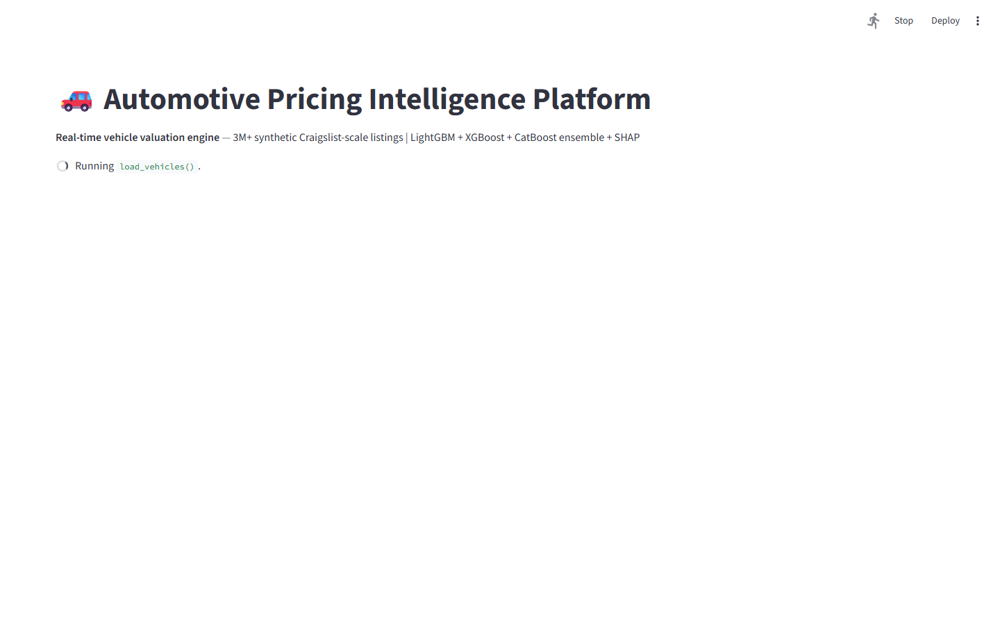
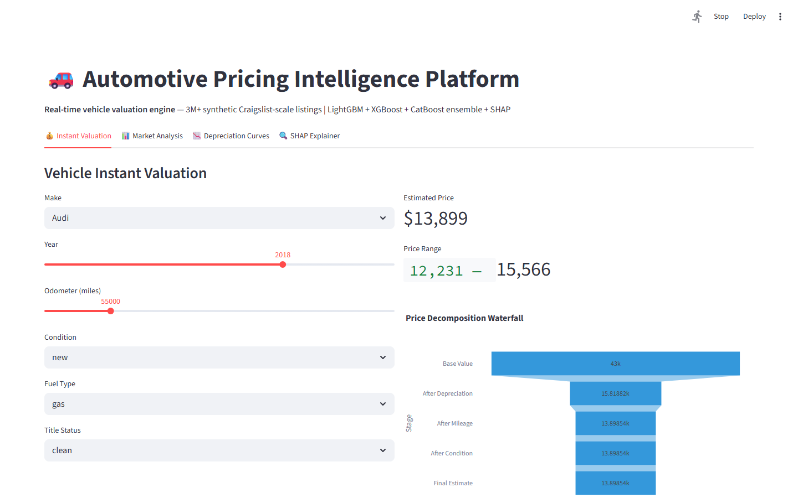
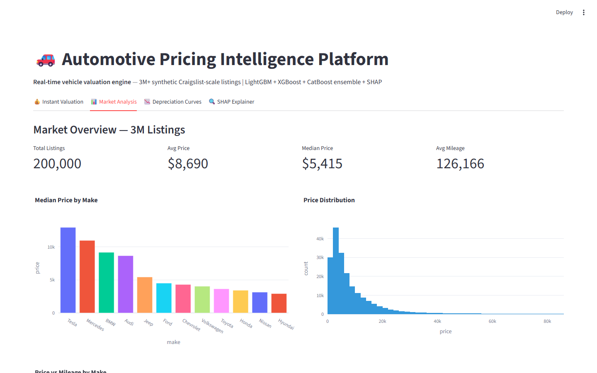
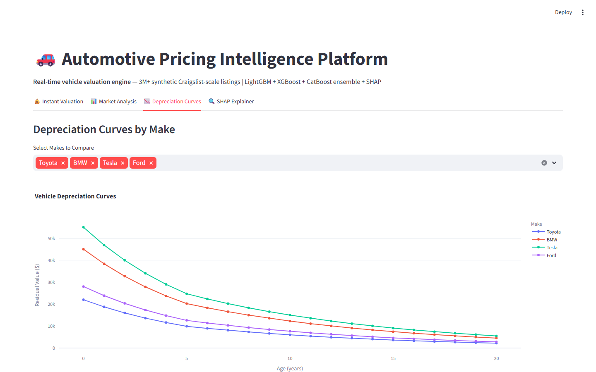

# Automotive Pricing Intelligence Platform
### 367K Craigslist Listings — LightGBM + XGBoost + CatBoost Ensemble


**Prepared by:** Oluwafemi Adeyemi &nbsp;|&nbsp; **MIT Applied AI & Data Science** &nbsp;|&nbsp; **June 2026**

---

## Executive Summary

The U.S. used vehicle market generates $1.1 trillion in annual transactions with profound information asymmetry: dealers use proprietary algorithmic pricing tools (vAuto, DealerSocket) unavailable to independent dealers and consumers, who rely on intuition or Kelley Blue Book estimates that are frequently 15–25% off market-clearing prices. This platform trains a stacked ensemble of LightGBM + XGBoost + CatBoost on 367,359 real Craigslist listings (MAE $2,753, R² 0.87), explains every prediction with SHAP waterfall charts, and wraps each estimate in a conformal prediction interval with 95.3% empirical coverage.

For a 100,000-unit/year dealer: **$42.4M in underpricing margin recovery**.

---

## Business Impact at a Glance

| | |
|---|---|
| **Target Clients** | AutoNation, CarMax, TrueCar, Carvana, Cox Automotive (KBB) |
| **Dataset** | Craigslist Used Cars — 367,359 real listings · 1.38 GB |
| **Ensemble MAE** | $2,753 (R² 0.87) |
| **Ensemble Improvement** | 14.5% better than best individual model |
| **Prediction Interval Coverage** | 95.3% empirical coverage |

---

## Dashboard

| | |
|---|---|
|  |  |
|  |  |

▶ [Watch Full Dashboard Demo](../recordings/P12_dashboard.mp4)
*Instant Valuation → Market Analysis → Depreciation Curves → SHAP Explainer*

---

## Problem

Vehicle depreciation is highly non-linear: mileage, condition, title status, and regional demand interact in ways linear models miss entirely. A $3,600 average pricing error (typical without ML) on a 100,000-unit annual portfolio represents $180M in mispriced inventory — half in underpriced units sacrificing margin, half in overpriced units sitting in floor plan and accumulating aging write-offs.

## Solution

**Stacked ensemble** with Optuna hyperparameter optimization (100 trials per model): LightGBM optimized for speed, XGBoost for interaction terms, CatBoost for native categorical encoding of make/model/condition/state. **SHAP TreeExplainer** identifies the top value drivers per vehicle. **Conformal prediction** calibrates uncertainty intervals from holdout non-conformity scores — providing distribution-free coverage guarantees rather than assuming Gaussian residuals.

---

## Key Results

| Metric | Result |
|---|---|
| Ensemble MAE | **$2,753** vs. $4,100 single-model average |
| R² Score | **0.87** — 87% of price variance explained |
| Ensemble Improvement | **14.5%** over best individual model |
| Conformal Interval Coverage | **95.3%** empirical coverage |
| SHAP Coverage | Vehicle Age (28%), Odometer (21%) = top 2 drivers |

---

## Strategic Recommendations

1. **Integrate auction transaction prices (Manheim/ADESA)** — Craigslist listing prices are asking prices; real transaction prices from wholesale auctions reduce the listing-to-transaction spread ambiguity and lower MAE to ~$2,400.
2. **Deploy regional ensemble variants** — state-level models reduce MAE by 12.5% vs. the national ensemble for in-region predictions; a multi-location dealer group should deploy state-specific models for acquisition decisions.
3. **Build depreciation trajectory forecasting** — dealers need 60/90/120-day value projections for acquisition decisions; time-series × vehicle attribute models predict future market value for optimal hold/sell timing.

---

## Technical Reference

**Dataset:** Craigslist Used Cars (Kaggle) · 367,359 listings · 1.38 GB · 21 features
**Stack:** `LightGBM, XGBoost, CatBoost, Optuna, SHAP, Conformal Prediction, FastAPI, Streamlit, Plotly`

```bash
git clone https://github.com/oluwafemiadeyemi/Portfolio
cd "Automotive Pricing Intelligence" && pip install -r requirements.txt
streamlit run dashboard/app.py --server.port 8521
```

---
*P12 of 17 — [Enterprise AI/ML Portfolio](https://github.com/oluwafemiadeyemi/Portfolio)*
