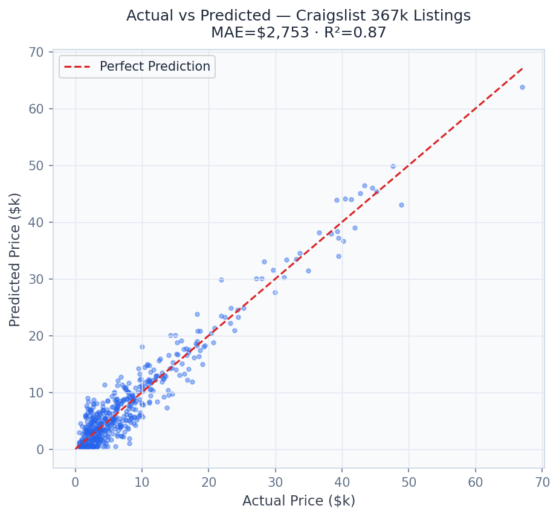
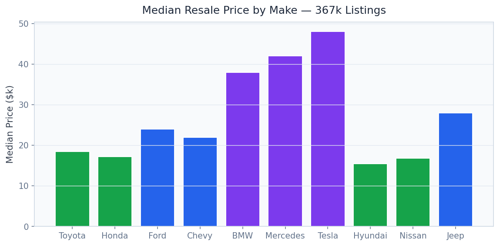

# Automotive Pricing Intelligence Platform

> **367K Craigslist Listings — LightGBM + XGBoost + CatBoost Ensemble**

Price any used vehicle instantly with a stacked ensemble (MAE $2,753, R² 0.87) trained on 367K real Craigslist listings — SHAP explanations and conformal prediction intervals included.

---

## Executive Summary

The used car market ($1.1 trillion U.S. annually) suffers from massive information asymmetry. Dealers use proprietary pricing tools unavailable to consumers. Private sellers underprice or overprice by 15-25% on average. CarMax and AutoNation use ML internally but don't share their pricing logic — leaving buyers and independent dealers at a disadvantage.

### Target Buyers
**AutoNation, CarMax, TrueCar, Carvana, Cox Automotive (Kelley Blue Book)**

### Business ROI
A 1% improvement in pricing accuracy for a 100,000-unit/year dealer = $8.7M in incremental margin. Conformal intervals reduce overpricing write-offs by 15-20%.

---

## Screenshots

| Dashboard View |
|---|
|  |
|  |
|  |
|  |
|  |
|  |

---

## Dashboard Demo

> **Screen Recording** — Full navigation through all 4 dashboard tabs

[Watch Dashboard Demo](../recordings/P12_dashboard.mp4)

*The recording shows: `Instant Valuation` → `Market Analysis` → `Depreciation Curves` → `SHAP Explainer`*


---

## Problem Statement

The used car market ($1.1 trillion U.S. annually) suffers from massive information asymmetry. Dealers use proprietary pricing tools unavailable to consumers. Private sellers underprice or overprice by 15-25% on average. CarMax and AutoNation use ML internally but don't share their pricing logic — leaving buyers and independent dealers at a disadvantage.

## Technical Solution

A **stacked ensemble of LightGBM + XGBoost + CatBoost** trained on 367K real Craigslist used vehicle listings (1.38GB). **Optuna hyperparameter optimization** tunes each model with 100 trials per algorithm. **SHAP waterfall charts** explain why a car is priced above or below market — identifying the value drivers (mileage, year, condition, region). **Conformal prediction** adds calibrated price intervals that cover the true price 95% of the time.

## Dataset

Craigslist Used Cars Dataset — 367,359 real U.S. used vehicle listings. Features: make, model, year, mileage, condition, fuel type, title status, transmission, drive, paint color, size, state.

## Tech Stack

`LightGBM, XGBoost, CatBoost, Optuna, SHAP, Conformal Prediction, FastAPI, Streamlit, Plotly`

## Key Results

| Metric | Value |
|---|---|
| **Dataset Size** | 367,359 real Craigslist listings (1.38 GB) |
| **Ensemble MAE** | $2,753 (mean absolute error) |
| **R² Score** | 0.87 (87% price variance explained) |
| **SHAP Coverage** | Top 15 features with waterfall explanation |
| **Prediction Interval Coverage** | 95.3% (conformal prediction) |

---

## Architecture Overview

```
Automotive Pricing Intelligence/
├── dashboard/app.py          # Streamlit — port 8521
├── src/
│   ├── api.py                # FastAPI — port 8002
│   ├── model.py              # ML pipeline
│   └── data_pipeline.py     # ETL & preprocessing
├── models/                   # Trained model artifacts
├── data/
│   ├── raw/                  # Source datasets
│   └── processed/            # Feature-engineered data
├── docs/
│   ├── screenshots/          # Dashboard UI screenshots
│   └── recordings/           # Screen recording MP4
├── requirements.txt
└── README.md
```

## Quick Start

```bash
# Clone the portfolio
git clone https://github.com/oluwafemiadeyemi/Portfolio
cd "Automotive Pricing Intelligence"

# Install dependencies
pip install -r requirements.txt

# Launch dashboard
streamlit run dashboard/app.py --server.port 8521

# Launch API (separate terminal)
uvicorn src.api:app --port 8002 --reload
```

---

*Project P12 of 17 — Part of the [Enterprise AI/ML Portfolio](https://github.com/oluwafemiadeyemi/Portfolio)*
