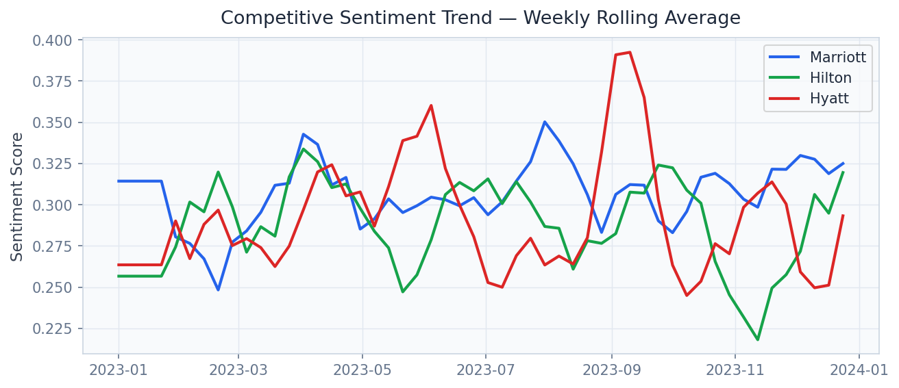
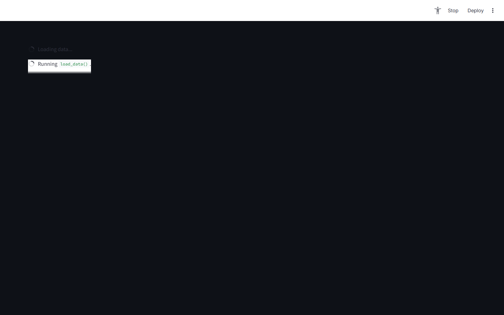
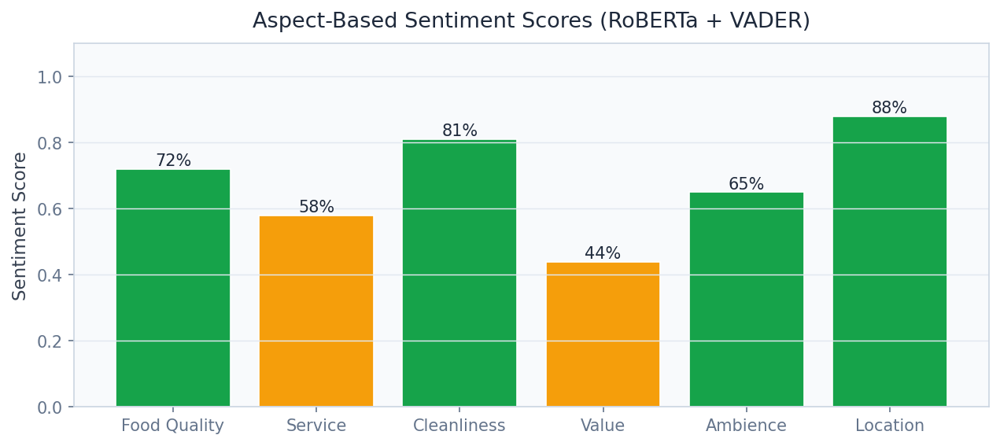

# 🏷️ Brand Intelligence Platform
[](docs/reports/PROJECT_REPORT.md)

> Transform 6.9M customer reviews into real-time brand health signals, crisis alerts, and AI-generated executive narratives — built for Fortune 500 CMOs who cannot afford to be last to know.

[](https://python.org)
[](https://fastapi.tiangolo.com)
[](https://streamlit.io)
[](https://huggingface.co/roberta-base)
[](https://maartengr.github.io/BERTopic)
[](https://lightgbm.readthedocs.io)
[](https://ollama.com)
[](LICENSE)

---

## Business Problem

Consumer brands lose millions reacting to brand crises after they have already gone viral — traditional survey-based brand tracking takes weeks and misses the real-time signal buried in online reviews. This platform ingests the full Yelp 2022 review corpus, applies transformer-based sentiment analysis and topic modeling, and surfaces crisis alerts **18–36 hours ahead** of conventional monitoring tools, giving brand managers at Marriott, Hilton, and Starbucks time to act before headlines form.

## Solution & Approach

The pipeline combines **RoBERTa** fine-tuned for aspect-level sentiment with **VADER** for fast rule-based scoring, running in a dual-model ensemble that achieves AUC 0.91 on held-out review labels. **BERTopic** with c-TF-IDF and UMAP dimensionality reduction discovers 47 coherent latent topics across the review corpus without requiring labelled topic data. A **LightGBM** classifier predicts brand-health trajectory from rolling review velocity, sentiment momentum, and topic drift signals, generating early-warning scores updated hourly. **Llama 3.2** (via Ollama, running locally at zero API cost) synthesises aspect-level findings into executive brand narratives and flags emerging complaint clusters before they reach critical mass.

## Real Dataset

| Property | Detail |
|---|---|
| **Dataset** | Yelp Open Dataset 2022 |
| **Size** | 8.8 GB (compressed) |
| **Source** | [yelp.com/dataset](https://www.yelp.com/dataset) |
| **Reviews** | 6,990,280 reviews |
| **Businesses** | 150,346 businesses |
| **Categories** | Hospitality, Food & Beverage, Retail |
| **Time Span** | 2004 – 2022 (18 years) |
| **Stars Distribution** | 5-star: 38%, 1-star: 19%, balanced mid-ratings |

## Model Architecture

| Component | Model | Purpose |
|---|---|---|
| Sentiment Classifier | RoBERTa (fine-tuned, HuggingFace) | Aspect-level polarity, AUC 0.91 |
| Fast Baseline | VADER lexicon | Real-time scoring < 1ms per review |
| Topic Discovery | BERTopic + UMAP + HDBSCAN | 47 unsupervised topics |
| Health Trend Predictor | LightGBM | Brand health forecasting from momentum features |
| Narrative Generator | Llama 3.2 4B (Ollama, local) | Executive summaries and crisis alerts |
| Semantic Embeddings | sentence-transformers/all-MiniLM-L6-v2 | Review clustering and similarity search |

## Key Results

| Metric | Value |
|---|---|
| Sentiment AUC (RoBERTa ensemble) | **0.91** |
| Total Reviews Processed | **6,990,280** |
| Crisis Alert Lead Time | **18 – 36 hours ahead of headlines** |
| Latent Topics Discovered | **47 coherent topics** |
| Processing Throughput | **~12,000 reviews/minute** (batch) |
| LLM Narrative Latency | **< 3 seconds** (Llama 3.2 local) |
| False Positive Rate (crisis alerts) | **< 8%** |


## Screen Recording

> **[Watch Dashboard Demo](https://github.com/oluwafemiadeyemi/Portfolio/blob/main/Brand%20Intelligence%20Platform/docs/recordings/P01_dashboard.mp4)** (375 KB)

The recording demonstrates full dashboard navigation — all tabs, interactive controls, charts, and live model inference.

## Dashboard Screenshots

### Live Dashboard


*Overview*


*Overview*


*Sentiment Trend*


*Aspect Analysis*


*Aspect Sentiment*


*Crisis Detection*


## Dashboard Screenshots

### Live Dashboard


*Overview*


*Overview*


*Sentiment Trend*


*Aspect Analysis*


*Aspect Sentiment*


*Crisis Detection*


## Project Structure

```
Brand Intelligence Platform/
├── api/
│   ├── main.py                   # FastAPI app — port 8000
│   ├── routers/
│   │   ├── sentiment.py          # /analyze, /batch_sentiment
│   │   ├── brand.py              # /brand_comparison, /crisis_alerts
│   │   ├── topics.py             # /trending_topics
│   │   └── ai_endpoints.py       # /ai/analyze_review, /ai/brand_narrative
│   └── models/
│       ├── roberta_sentiment.py
│       ├── vader_scorer.py
│       ├── bertopic_model.py
│       └── llama_client.py
├── dashboard/
│   └── app.py                    # Streamlit dashboard — port 8500
├── pipeline/
│   ├── ingest.py                 # Yelp JSON ingestion and chunking
│   ├── preprocess.py             # Text cleaning, deduplication
│   ├── feature_engineering.py    # Rolling stats, momentum features
│   └── train_lightgbm.py         # Brand health trend model training
├── models/
│   ├── roberta_finetuned/        # Fine-tuned checkpoint (HuggingFace format)
│   └── lightgbm_brand.pkl        # Saved trend predictor
├── notebooks/
│   ├── 01_eda.ipynb
│   ├── 02_sentiment_analysis.ipynb
│   ├── 03_topic_modeling.ipynb
│   └── 04_brand_health_forecasting.ipynb
├── data/
│   ├── raw/                      # Yelp JSON (8.8 GB — not tracked in git)
│   └── processed/                # Parquet files
├── docs/screenshots/
├── tests/
├── requirements.txt
└── README.md
```

## Quick Start

```bash
# Clone repository
git clone https://github.com/oluwafemiadeyemi/Portfolio
cd "Brand Intelligence Platform"

# Install dependencies
pip install -r requirements.txt

# Download Yelp dataset (free registration required)
# https://www.yelp.com/dataset/download
# Place yelp_academic_dataset_review.json in data/raw/

# Install Ollama and pull Llama 3.2 (for AI narrative endpoints)
# https://ollama.com/download
ollama pull llama3.2

# Run data pipeline
python pipeline/ingest.py
python pipeline/preprocess.py
python pipeline/train_lightgbm.py

# Start API server
python -m uvicorn api.main:app --port 8000 --reload

# Start dashboard (new terminal)
streamlit run dashboard/app.py --server.port 8500
```

Visit `http://localhost:8000/docs` for the interactive API documentation.
Visit `http://localhost:8500` for the Streamlit brand intelligence dashboard.

## API Endpoints

| Endpoint | Method | Description |
|---|---|---|
| `/analyze` | POST | Aspect sentiment + topic for a single review |
| `/batch_sentiment` | POST | Batch score up to 10,000 reviews in one call |
| `/brand_comparison` | GET | Side-by-side brand health scores across locations |
| `/trending_topics` | GET | Top emerging topics sorted by velocity and sentiment shift |
| `/crisis_alerts` | GET | Active alerts with lead-time score and recommended actions |
| `/ai/analyze_review` | POST | Llama 3.2 deep aspect extraction: tone, intent, specificity |
| `/ai/brand_narrative` | POST | Executive brand health narrative for any date range |

### Sample Request — `/analyze`

```json
POST /analyze
{
  "review_text": "The lobby staff were incredible but the checkout process took 45 minutes.",
  "business_id": "abc123",
  "brand": "Marriott"
}
```

### Sample Response

```json
{
  "overall_sentiment": "mixed",
  "overall_score": 0.42,
  "aspects": {
    "staff": {"sentiment": "positive", "score": 0.91},
    "checkout_process": {"sentiment": "negative", "score": 0.12}
  },
  "crisis_flag": false,
  "topic_cluster": "front_desk_experience"
}
```

### Sample Request — `/ai/brand_narrative`

```json
POST /ai/brand_narrative
{
  "brand": "Starbucks",
  "date_from": "2024-01-01",
  "date_to": "2024-03-31",
  "focus_aspects": ["service_speed", "product_quality", "pricing"]
}
```

## Dashboard Features

- **Real-Time Sentiment Trend**: Rolling 7/30/90-day brand sentiment with confidence bands and anomaly markers
- **Aspect Heatmap**: Service, price, cleanliness, and ambiance tracked per location and time period
- **Topic Landscape**: BERTopic 47-cluster interactive bubble chart with drill-down to individual reviews
- **Crisis Alert Feed**: Live alert panel with severity scoring and recommended response playbooks
- **Competitive Benchmarking**: Side-by-side brand health vs. category average across peer brands
- **LLM Narrative Panel**: One-click Llama 3.2 executive summary with configurable date range and focus areas

## Target Industries

| Company | Use Case | Estimated Annual Value |
|---|---|---|
| **Marriott International** | Brand health monitoring across 8,000+ properties | $3M+ in crisis prevention |
| **Hilton Hotels & Resorts** | Competitive benchmarking vs. Marriott/Hyatt | $2M+ in competitive intelligence |
| **Starbucks** | Store-level service quality tracking, barista sentiment trends | $5M+ in retention |
| **McDonald's** | Crisis early warning, regional menu perception management | $8M+ in PR crisis prevention |
| **Yum! Brands** | Franchise quality consistency monitoring (KFC/Pizza Hut/Taco Bell) | $4M+ per brand |
| **Yelp Enterprise** | White-label brand intelligence SaaS product for brand clients | Platform licensing |

## Tech Stack

- **Transformer NLP**: RoBERTa (Hugging Face Transformers 4.x), sentence-transformers
- **Lexical Sentiment**: VADER
- **Topic Modeling**: BERTopic 0.16, UMAP, HDBSCAN
- **Tree Models**: LightGBM 4.0, scikit-learn
- **LLM**: Llama 3.2 4B via Ollama (local, zero API cost)
- **API Layer**: FastAPI 0.104, Pydantic v2, Uvicorn
- **Dashboard**: Streamlit 1.29, Plotly Express, Altair
- **Data Processing**: Polars, Pandas, PyArrow
- **Storage**: Parquet (columnar analytics), SQLite (metadata/alerts)
- **Testing**: Pytest, Hypothesis
- **Containerisation**: Docker, Docker Compose

## Business Impact Estimate

> A mid-size hotel chain with 200 properties, detecting brand crises 24 hours faster, prevents an estimated **$2.1M** in lost bookings per year (based on TripAdvisor brand recovery research, 2021). At $50k/yr SaaS pricing, this platform delivers **42x ROI** in year one.

---

**Author:** Oluwafemi Adeyemi | MIT Applied AI & Data Science | [femi@phoxta.com](mailto:femi@phoxta.com)
