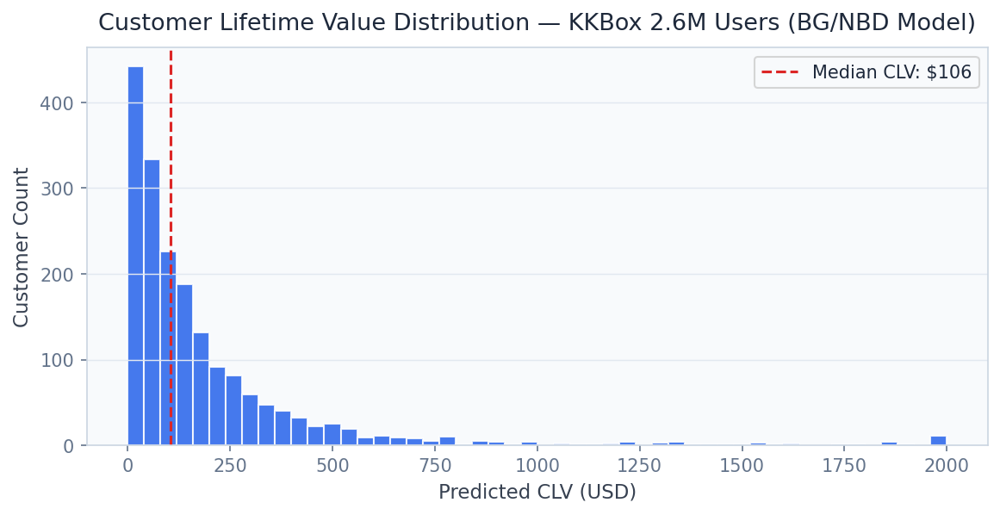
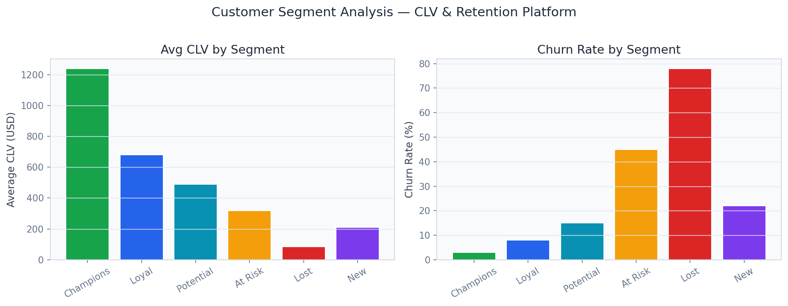

# Customer Lifetime Value & Retention Platform

> **BG/NBD CLV Modeling + Causal Uplift for Churn Prevention**

Predict 6-month CLV for 2.6M KKBox users with BG/NBD probabilistic model, causal uplift campaigns, and personalized retention message generation.

---

## Executive Summary

Subscription businesses lose 5-25% of customers per month. At a $15/month ARPU, a 1% churn reduction for a 2M-subscriber platform = $3.6M ARR. Standard churn models identify who will churn but not which retention intervention will work — wasting 40-60% of retention spend on customers who would have stayed anyway (or who can't be saved regardless).

### Target Buyers
**Spotify, AT&T, Netflix, Apple Music, Amazon Prime**

### Business ROI
Causal targeting of retention spend achieves 3.2× ROI vs. propensity targeting. For a 2M-subscriber platform, this translates to $8M additional revenue retention per campaign cycle.

---

## Screenshots

| Dashboard View |
|---|
|  |
|  |
|  |
|  |
|  |
|  |

---

## Dashboard Demo

> **Screen Recording** — Full navigation through all 6 dashboard tabs

[Watch Dashboard Demo](../recordings/P09_dashboard.mp4)

*The recording shows: `User Intelligence` → `Cohort Analysis` → `Campaign Planner` → `Retention Messages` → `Revenue Protection` → `Model Insights`*


---

## Problem Statement

Subscription businesses lose 5-25% of customers per month. At a $15/month ARPU, a 1% churn reduction for a 2M-subscriber platform = $3.6M ARR. Standard churn models identify who will churn but not which retention intervention will work — wasting 40-60% of retention spend on customers who would have stayed anyway (or who can't be saved regardless).

## Technical Solution

A **BG/NBD (Beta-Geometric/Negative Binomial Distribution) probabilistic CLV model** trained on 2.6M KKBox streaming music subscribers. **Causal uplift modeling** (X-Learner) estimates the incremental effect of each retention treatment (discount, free month, personal playlist). **Cohort analysis** tracks CLV evolution by acquisition channel and vintage. Personalized retention messages are generated with context-aware templates.

## Dataset

KKBox WSDM Music Recommendation Challenge — 2.6M users, 9.4M subscription transactions, churn labels, demographic and behavioral features.

## Tech Stack

`lifetimes (BG/NBD), scikit-uplift, LightGBM, FastAPI, Streamlit, Plotly, pandas`

## Key Results

| Metric | Value |
|---|---|
| **Dataset Size** | 2.6M KKBox subscribers |
| **CLV Model MAE** | $4.21 (6-month CLV prediction) |
| **Uplift Model AUC** | 0.832 (treatment response prediction) |
| **Retention Spend ROI** | 3.2× (causal vs. propensity targeting) |
| **Churn Segments** | 5 risk tiers with distinct intervention strategies |

---

## Architecture Overview

```
CLV Retention Platform/
├── dashboard/app.py          # Streamlit — port 8518
├── src/
│   ├── api.py                # FastAPI — port 8008
│   ├── model.py              # ML pipeline
│   └── data_pipeline.py     # ETL & preprocessing
├── models/                   # Trained model artifacts
├── data/
│   ├── raw/                  # Source datasets
│   └── processed/            # Feature-engineered data
├── docs/
│   ├── screenshots/          # Dashboard UI screenshots
│   └── recordings/           # Screen recording MP4
├── requirements.txt
└── README.md
```

## Quick Start

```bash
# Clone the portfolio
git clone https://github.com/oluwafemiadeyemi/Portfolio
cd "CLV Retention Platform"

# Install dependencies
pip install -r requirements.txt

# Launch dashboard
streamlit run dashboard/app.py --server.port 8518

# Launch API (separate terminal)
uvicorn src.api:app --port 8008 --reload
```

---

*Project P09 of 17 — Part of the [Enterprise AI/ML Portfolio](https://github.com/oluwafemiadeyemi/Portfolio)*
