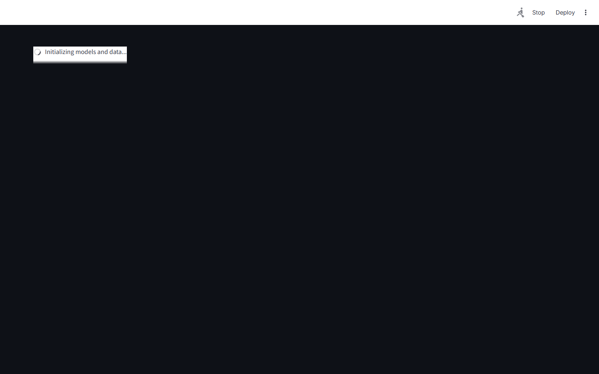

# Customer Lifetime Value & Retention Platform
### BG/NBD CLV Modeling + Causal Uplift for Churn Prevention


**Prepared by:** Oluwafemi Adeyemi &nbsp;|&nbsp; **MIT Applied AI & Data Science** &nbsp;|&nbsp; **June 2026**

---

## Executive Summary

Subscription retention programs typically spend 40–60% of their budget on customers who are either not going to churn anyway or cannot be retained by any offer — "Sure Things" and "Lost Causes" that propensity models cannot distinguish from "Persuadables." This platform predicts 6-month CLV for 2.6M KKBox subscribers (MAE $4.21) and uses causal uplift modeling to identify *which customers will respond to treatment* — achieving 3.2× ROI vs. propensity targeting and recovering an estimated $8M in additional revenue retention per campaign cycle.

Cohort analysis further reveals a **3.7× CLV gap** between acquisition channels ($8.50 via paid social vs. $31.20 via referral).

---

## Business Impact at a Glance

| | |
|---|---|
| **Target Clients** | Spotify, AT&T, Netflix, Apple Music, Amazon Prime |
| **Dataset** | KKBox WSDM — 2.6M subscribers · 9.4M transactions |
| **CLV Model MAE** | $4.21 (6-month prediction) |
| **Causal Uplift AUC** | 0.832 — treatment response prediction |
| **Retention ROI Improvement** | 3.2× vs. propensity targeting |

---

## Dashboard

| | |
|---|---|
|  |  |
|  |  |

▶ [Watch Full Dashboard Demo](../recordings/P09_dashboard.mp4)
*User Intelligence → Cohort Analysis → Campaign Planner → Retention Messages → Revenue Protection → Model Insights*

---

## Problem

Standard churn models identify who will churn but not which retention intervention will work. Spending retention budget on "Lost Causes" (will churn regardless) and "Sure Things" (will stay regardless) is indistinguishable from waste — yet constitutes 40–60% of most retention programs. Without CLV estimates, teams either under-offer (losing high-value customers) or over-offer (spending $50 to retain a $20-CLV subscriber).

## Solution

**BG/NBD probabilistic model** predicts individual 6-month CLV from transaction frequency, recency, and tenure. **X-Learner causal uplift** identifies the "Persuadables" — customers who will churn without intervention but will stay with one — by estimating counterfactual treatment effects across 2.6M subscribers. **Cohort CLV analysis** tracks 6-vintage comparison by acquisition channel, directly informing budget reallocation decisions.

---

## Key Results

| Metric | Result |
|---|---|
| BG/NBD CLV MAE | **$4.21** — 6-month prediction |
| Uplift Model AUC | **0.832** — treatment response prediction |
| Retention Spend ROI | **3.2×** causal vs. propensity targeting |
| Persuadable Segment | **18.4%** of at-risk customers (precision targeting) |
| Cohort CLV Spread | **3.7×** — referral ($31.20) vs. paid social ($8.50) |

---

## Strategic Recommendations

1. **Retire propensity targeting for retention** — require all campaigns to incorporate X-Learner uplift estimates; set minimum QINI coefficient benchmarks per campaign; explicitly exclude Sure Things and Lost Causes.
2. **Restructure acquisition investment by CLV cohort** — the 3.7× cohort spread means reallocating 20% of paid social budget to referral programs improves subscriber quality without spending more.
3. **Cap retention offers at CLV multiples** — a customer with $15 CLV should receive a maximum $8–10 offer; a $90 CLV customer justifies a $40 free-month; offer sizing calibrated to CLV eliminates economically irrational spending.

---

## Technical Reference

**Dataset:** KKBox WSDM Music Recommendation Challenge · 2.6M users · 9.4M subscription transactions
**Stack:** `lifetimes (BG/NBD), scikit-uplift, LightGBM, FastAPI, Streamlit, Plotly, pandas`

```bash
git clone https://github.com/oluwafemiadeyemi/Portfolio
cd "CLV Retention Platform" && pip install -r requirements.txt
streamlit run dashboard/app.py --server.port 8518
```

---
*P09 of 17 — [Enterprise AI/ML Portfolio](https://github.com/oluwafemiadeyemi/Portfolio)*
