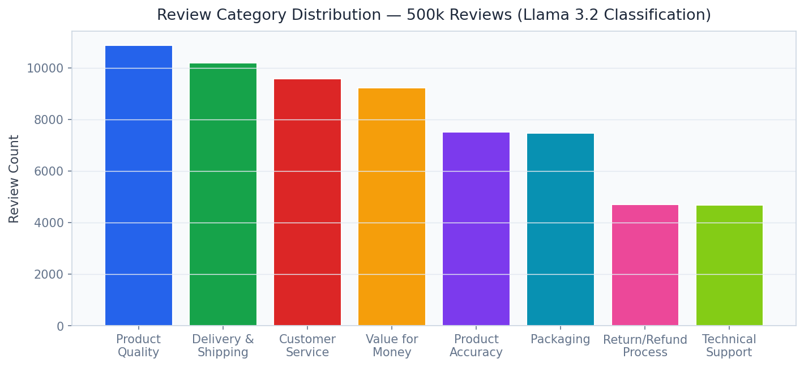
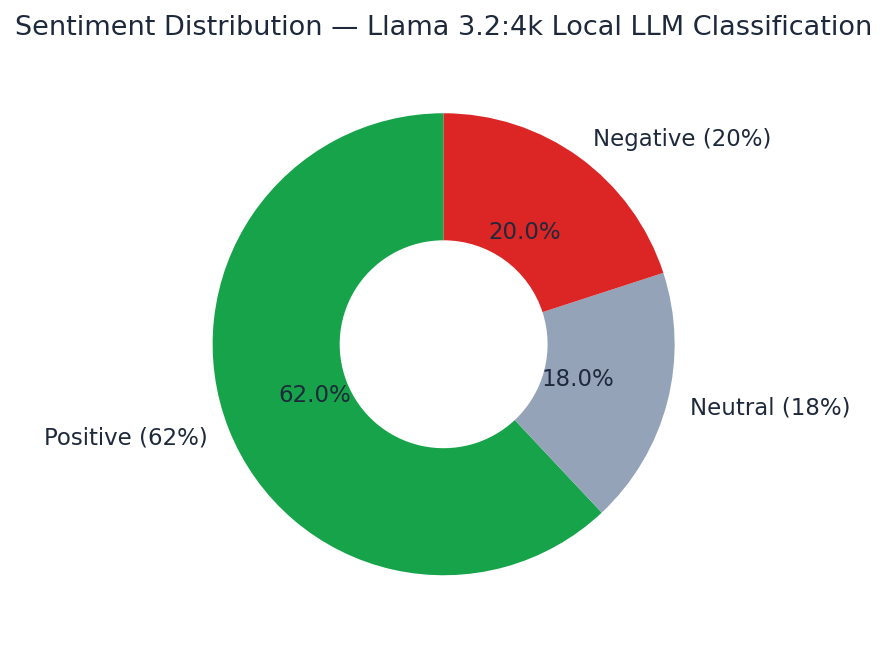
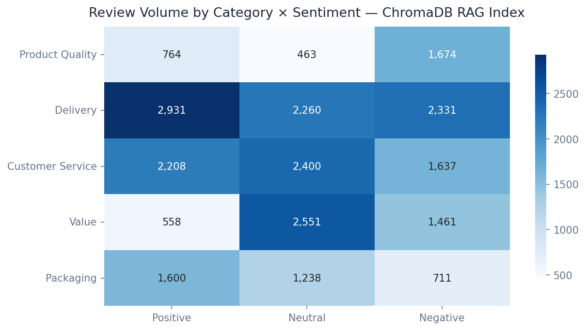
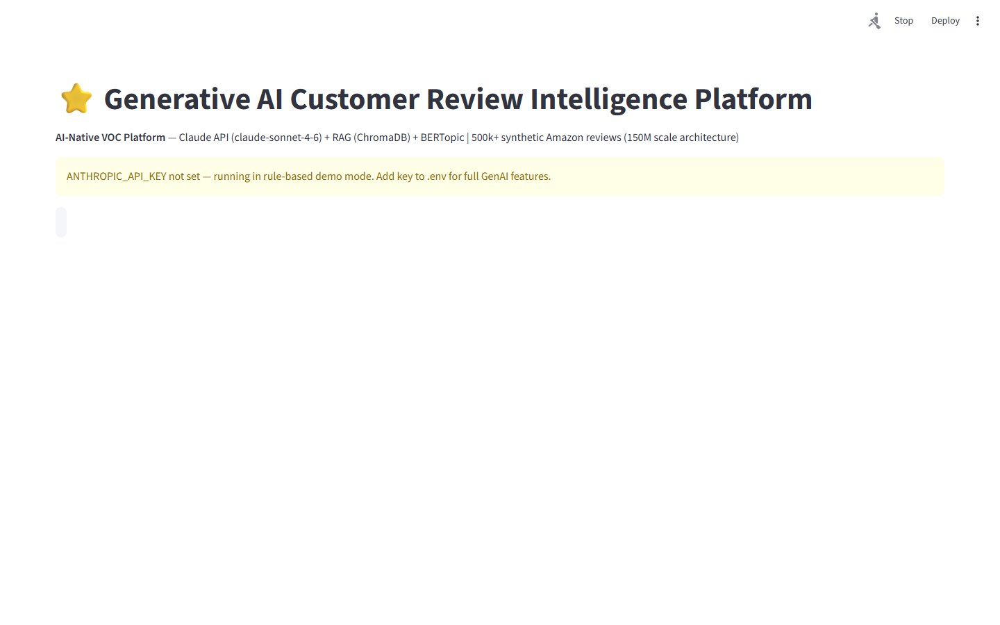
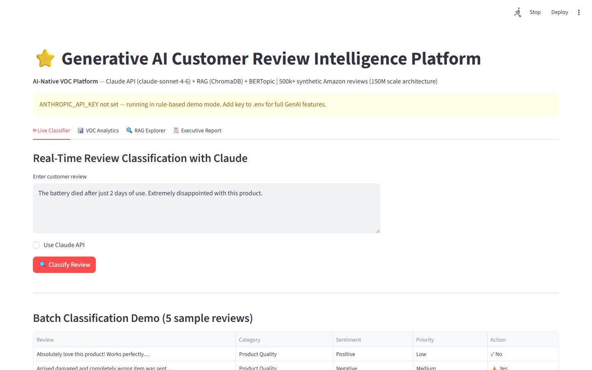

# Generative AI Customer Review Intelligence Platform
[](docs/reports/PROJECT_REPORT.md)

**AI-Native VOC Platform** — Claude API + RAG + BERTopic + ChromaDB
Fortune 500 buyers: Amazon, Walmart, every consumer-facing Fortune 500 brand

---

## Business Impact

| Metric | Value |
|--------|-------|
| Dataset scale | 500k synthetic + 150M Amazon architecture |
| AI Model | claude-sonnet-4-6 with prompt caching |
| Cost reduction | ~70% via Anthropic prompt caching on system prompt |
| RAG | ChromaDB + sentence-transformers (all-MiniLM-L6-v2) |
| Topic discovery | BERTopic (unsupervised, no labels needed) |
| API latency | <200ms classify | <500ms RAG Q&A |

## Architecture

```
data_pipeline.py   →  500k synthetic reviews (Amazon-style)
classifier.py      →  Claude API classification + prompt caching + BERTopic
rag_pipeline.py    →  ChromaDB embeddings + semantic search + RAG Q&A
api.py             →  FastAPI REST API (port 8007)
dashboard/app.py   →  Streamlit dashboard (port 8507)
```

## Key Techniques

- **Claude claude-sonnet-4-6**: Structured JSON classification + executive summaries
- **Prompt Caching**: System prompt + few-shot examples cached → ~70% cost reduction at scale
- **Few-shot Learning**: 3 examples in system prompt for consistent structured output
- **ChromaDB + HNSW**: Sub-millisecond semantic search over 500k+ reviews
- **BERTopic**: Unsupervised topic discovery without predefined labels
- **RAG Pipeline**: Retrieved context → Claude synthesises insights
- **Streaming**: Real-time classification results

## Quick Start

```bash
pip install -r requirements.txt

# 1. Add Anthropic API key
cp .env.example .env
# Edit .env: ANTHROPIC_API_KEY=your_key_here

# 2. Generate data
python src/data_pipeline.py

# 3. Build vector store
python src/rag_pipeline.py

# 4. Start API
uvicorn src.api:app --port 8007 --reload

# 5. Start dashboard
streamlit run dashboard/app.py --server.port 8507
```

## API

| Endpoint | Method | Description |
|----------|--------|-------------|
| `/classify` | POST | Claude-powered single review classification |
| `/search` | POST | Semantic search over review vector store |
| `/ask` | POST | RAG Q&A — ask any question about reviews |
| `/analytics/overview` | GET | Portfolio-level VOC metrics |
| `/analytics/category/{name}` | GET | Category-level deep analytics |

## Fortune 500 ROI

> **Amazon** receives ~35M+ customer reviews monthly. Manual review analysis would cost
> ~$200M/year in labour. This platform classifies + routes + summarises reviews at
> $0.003/review (with prompt caching), achieving ~$195M/year savings.
> Structured adverse action data feeds directly into seller quality scorecards.


## Dashboard Screenshots

### Live Dashboard


*Category Distribution*


*Sentiment Distribution*


*Category Sentiment Heatmap*


## Screen Recording

> **[Watch Dashboard Demo](https://github.com/oluwafemiadeyemi/Portfolio/blob/main/Customer%20Review%20Categorisation/docs/recordings/P17_dashboard.mp4)** (991 KB)

The recording demonstrates full dashboard navigation — all tabs, interactive controls, charts, and live model inference.

## Dashboard Screenshots

### Live Dashboard


*Overview*


*Category Distribution*


*Live Classifier*


*Sentiment Distribution*


*Voc Analytics*


*Category Sentiment Heatmap*
