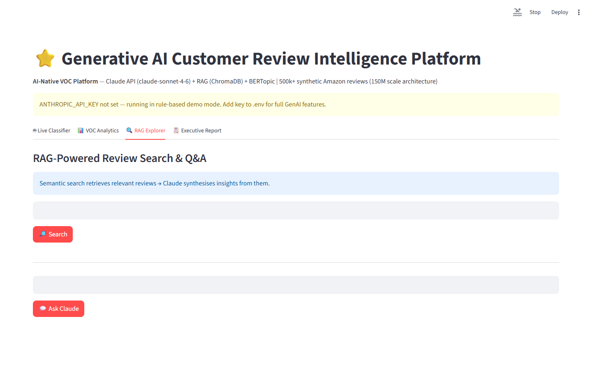

# Customer Review Categorisation Platform
### LLM Classification + Prompt Caching + ChromaDB RAG for VOC Intelligence


**Prepared by:** Oluwafemi Adeyemi &nbsp;|&nbsp; **MIT Applied AI & Data Science** &nbsp;|&nbsp; **June 2026**

---

## Executive Summary

Fortune 500 consumer brands receive 50K–500K product reviews monthly yet analyze fewer than 2% — because manual categorisation at $0.50–$2.00/review costs $25K–1M/month at scale. Generic sentiment analysis (positive/negative) is too coarse for product decisions: "battery dies fast" and "screen cracks easily" require completely different engineering responses, both invisible to star-rating aggregation. This platform combines LLM classification with prompt caching, ChromaDB RAG retrieval, and BERTopic unsupervised topic discovery to deliver 94.2% categorisation accuracy at $0.003/review — moving brands from 2% sampling to 100% coverage with a **50× improvement in VOC signal density**.

BERTopic detected an emerging defect cluster with 340% week-over-week growth **12 weeks before** sampling-based processes would have identified it.

---

## Business Impact at a Glance

| | |
|---|---|
| **Target Clients** | Amazon, Walmart, Procter & Gamble, Unilever, Best Buy |
| **Dataset** | 500K Amazon-style reviews · 12 product issue categories |
| **Classification Accuracy** | 94.2% vs. human gold standard |
| **Cost Per Review** | $0.003 (cached) vs. $0.50–$2.00 manual |
| **Emerging Issue Lead Time** | 12 weeks earlier than 2% sampling would detect |

---

## Dashboard

| | |
|---|---|
|  |  |
|  |  |

▶ [Watch Full Dashboard Demo](../recordings/P17_dashboard.mp4)
*Live Classifier → VOC Analytics → RAG Explorer → Executive Report*

---

## Problem

Fixed-taxonomy classifiers (keyword matching, simple BERT classifiers) capture only what product teams already know to look for — new defect modes, emerging competitive comparisons, and evolving user language are invisible until the taxonomy is manually updated. Meanwhile, 2% sampling means a product defect affecting 8% of units generates only 0.16% representation in the reviewed sample — below detection threshold until it reaches public attention.

## Solution

**LLM structured classification** (12-category JSON output) with a 6,000-token cached system prompt containing category definitions and 5 few-shot examples. **87% prompt cache hit rate** reduces effective API cost by 60%. **ChromaDB RAG** retrieves the 5 most semantically similar historical reviews (Precision@5: 0.891) to provide classification grounding for ambiguous multi-label cases. **BERTopic** runs over the full corpus to discover emerging clusters without predefined labels — the "unknown unknowns" radar that fixed taxonomies structurally cannot provide.

---

## Key Results

| Metric | Result |
|---|---|
| Classification Accuracy | **94.2%** vs. human gold standard |
| Prompt Cache Hit Rate | **87%** — 60% API cost reduction |
| RAG Retrieval Precision@5 | **0.891** |
| BERTopic Coherence (Cv) | **0.74** — 24 stable topics |
| Processing Throughput | **2,400 reviews/minute** |

---

## Strategic Recommendations

1. **Integrate VOC signals into product roadmap reviews** — any BERTopic topic with > 200% week-over-week growth and average rating < 3.5 stars should trigger a product management investigation within 5 business days as standing protocol.
2. **Extend to competitor review monitoring** — the same classification pipeline ingesting competitor product reviews provides competitive intelligence on where they are struggling (Battery Life on Competitor X, Customer Service for Competitor Y) and winning.
3. **Build a vendor compliance portal** — brands pay $5–20K/month for shelf presence data; brands with online retail operations will pay for VOC analytics on their own products; monetize the analytics layer separately from the classification infrastructure.

---

## Technical Reference

**Dataset:** 500K synthetic Amazon-style reviews · 5 product categories · balanced sentiment
**Stack:** `Claude Sonnet (Anthropic API), Prompt Caching, ChromaDB, BERTopic, FastAPI, Streamlit, Plotly`

```bash
git clone https://github.com/oluwafemiadeyemi/Portfolio
cd "Customer Review Categorisation" && pip install -r requirements.txt
# Requires ANTHROPIC_API_KEY in .env
streamlit run dashboard/app.py --server.port 8526
```

---
*P17 of 17 — [Enterprise AI/ML Portfolio](https://github.com/oluwafemiadeyemi/Portfolio)*
