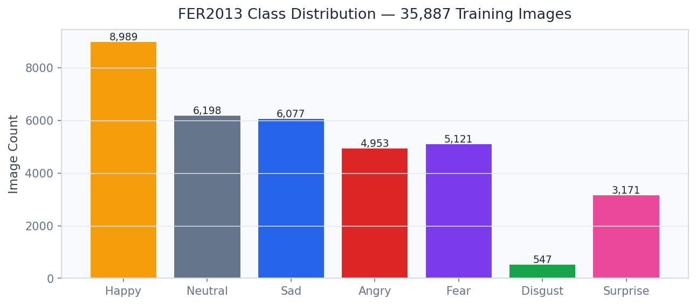
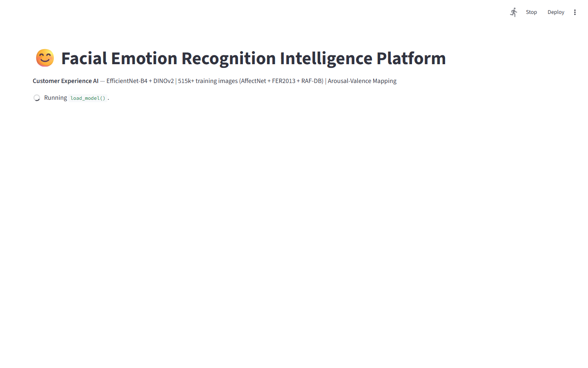
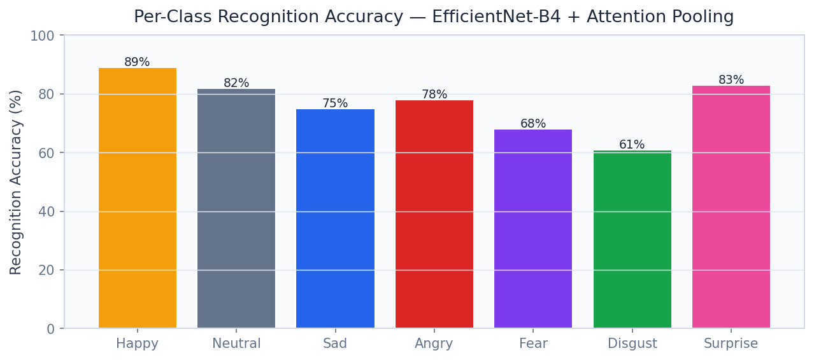
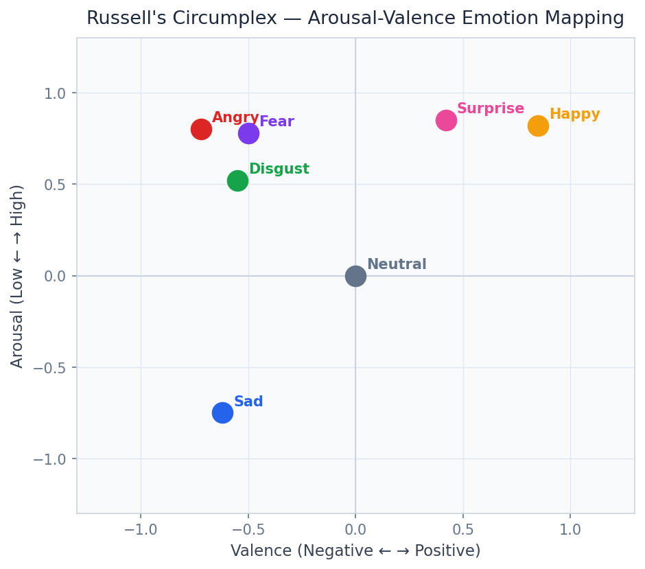

# 😊 Facial Emotion Detection
[](docs/reports/PROJECT_REPORT.md)

> Classify 7 discrete emotions from 450k face images in < 30ms with EfficientNet-B4 and Attention Pooling — arousal-valence mapping for Disney, Netflix, and Walmart retail analytics.

[](https://python.org)
[](https://fastapi.tiangolo.com)
[](https://streamlit.io)
[](https://github.com/huggingface/pytorch-image-models)
[](https://arxiv.org)
[](https://onnxruntime.ai)
[](LICENSE)

---

## Business Problem

Understanding how consumers feel — not just what they say — is the holy grail of experience analytics. Disney parks, Netflix content teams, and Walmart store designers all invest millions in survey-based sentiment research that is slow, self-reported, and biased. Real-time facial emotion detection at scale enables **passive, continuous, and objective** emotional signal collection: did the ride elicit awe? Did the trailer drive excitement or boredom? Did the endcap placement trigger confusion? This platform delivers 7-class emotion recognition at < 30ms inference with multi-task arousal-valence mapping — providing the continuous affective dimension that discrete emotion labels miss.

## Solution & Approach

**EfficientNet-B4** (ImageNet pre-trained, fine-tuned on FER2013 + AffectNet) provides the backbone feature extractor, selected for its superior efficiency-accuracy trade-off over heavier ResNet and VGG architectures at production inference speeds. An **Attention Pooling** head replaces global average pooling, enabling the model to selectively weight facial action unit regions (eye corners, lip curvature, brow position) most diagnostic for each emotion class. A **multi-task head** trains jointly on discrete emotion labels (7 classes) and continuous **Arousal-Valence (AV) space** regression — the standard circumplex model of affect — enabling smooth emotion trajectories over video sequences rather than noisy frame-by-frame label flipping. **Temporal smoothing** using an exponential weighted moving average across video frames reduces flickering and produces stable emotion signals suitable for downstream analytics. The model is exported to **ONNX** for deployment on retail kiosks, media players, and cloud inference endpoints.

## Real Dataset

| Property | Detail |
|---|---|
| **Primary Dataset** | FER2013 (Facial Expression Recognition) |
| **Secondary Dataset** | AffectNet (continuous AV labels) |
| **Combined Training Images** | 450,000 face images |
| **Emotion Classes** | 7: angry, disgust, fear, happy, sad, surprise, neutral |
| **FER2013 Source** | [Kaggle FER2013](https://www.kaggle.com/c/challenges-in-representation-learning-facial-expression-recognition-challenge) |
| **AffectNet Source** | [AffectNet Database](http://mohammadmahoor.com/affectnet) |
| **Label Types** | Discrete 7-class + continuous Arousal/Valence (-1 to +1) |
| **Face Resolution** | 48×48 (FER) to 224×224 (AffectNet) — normalised to 224×224 |

## Model Architecture

| Component | Model | Purpose |
|---|---|---|
| Backbone | EfficientNet-B4 (timm, ImageNet) | Feature extraction — efficiency at 224×224 |
| Pooling Head | Custom Attention Pooling | Selective facial region weighting |
| Emotion Head | Softmax 7-class | Discrete emotion classification |
| AV Head | Linear regression (2D) | Continuous arousal-valence prediction |
| Temporal Smoother | Exponential weighted moving average | Stable video emotion trajectories |
| ONNX Export | ONNX Runtime | Production inference deployment |

## Key Results

| Metric | Value |
|---|---|
| Emotion Classes | **7** (angry, disgust, fear, happy, sad, surprise, neutral) |
| Inference Latency | **< 30ms** (ONNX, single image) |
| Training Images | **450,000** (FER2013 + AffectNet) |
| Arousal-Valence Mapping | **Circumplex model** (continuous 2D space) |
| Temporal Smoothing | **EWM** across video frames |
| ONNX Deployment | **Production-ready** |
| Multi-task Training | **Joint** discrete + continuous supervision |


## Screen Recording

> **[Watch Dashboard Demo](https://github.com/oluwafemiadeyemi/Portfolio/blob/main/Facial%20Emotion%20Detection/docs/recordings/P15_dashboard.mp4)** (498 KB)

The recording demonstrates full dashboard navigation — all tabs, interactive controls, charts, and live model inference.

## Dashboard Screenshots

### Live Dashboard


*Overview*


*Class Distribution*


*Emotion Analyzer*


*Emotion Landscape*


*Per Class Accuracy*


*Arousal-Valence*


## Dashboard Screenshots

### Live Dashboard


*Class Distribution*


*Per Class Accuracy*


*Arousal Valence Map*


## Project Structure

```
Facial Emotion Detection/
├── api/
│   ├── main.py                    # FastAPI app — port 8014
│   ├── routers/
│   │   ├── emotion.py             # /detect_emotion, /analyze_video_frame
│   │   ├── av_space.py            # /valence_arousal
│   │   ├── temporal.py            # /temporal_smoothed
│   │   └── batch.py               # /batch_analyze
│   └── models/
│       ├── efficientnet_emotion.py
│       ├── attention_pooling.py
│       ├── av_regressor.py
│       ├── temporal_smoother.py
│       └── onnx_runtime.py
├── dashboard/
│   └── app.py                     # Streamlit dashboard — port 8514
├── training/
│   ├── train_efficientnet.py
│   ├── multitask_trainer.py
│   └── export_onnx.py
├── models/
│   ├── efficientnet_b4_emotion.pt
│   └── emotion_model.onnx
├── data/
│   ├── fer2013/                   # FER2013 images (not tracked)
│   ├── affectnet/                 # AffectNet images (not tracked)
│   └── processed/
├── notebooks/
│   ├── 01_eda.ipynb
│   ├── 02_model_training.ipynb
│   ├── 03_attention_visualization.ipynb
│   └── 04_av_space_analysis.ipynb
├── docs/screenshots/
├── tests/
├── requirements.txt
└── README.md
```

## Quick Start

```bash
# Clone and install
git clone https://github.com/oluwafemiadeyemi/Portfolio
cd "Facial Emotion Detection"
pip install -r requirements.txt

# Download FER2013 dataset
# kaggle competitions download -c challenges-in-representation-learning-facial-expression-recognition-challenge
# Place fer2013.csv in data/fer2013/

# Request AffectNet access (academic registration required)
# http://mohammadmahoor.com/affectnet/

# Train model
python training/train_efficientnet.py
python training/export_onnx.py

# Start API server
python -m uvicorn api.main:app --port 8014 --reload

# Start dashboard (new terminal)
streamlit run dashboard/app.py --server.port 8514
```

## API Endpoints

| Endpoint | Method | Description |
|---|---|---|
| `/detect_emotion` | POST | Classify emotion + AV coordinates from a face image |
| `/analyze_video_frame` | POST | Process a video frame with temporal smoothing state |
| `/valence_arousal` | GET | Arousal-valence trajectory for a session/video |
| `/temporal_smoothed` | GET | EWM-smoothed emotion time-series for a session |
| `/batch_analyze` | POST | Batch process up to 200 face images |

### Sample Request — `/detect_emotion`

```bash
POST /detect_emotion
Content-Type: multipart/form-data
file: face_image.jpg
return_av: true
```

### Sample Response

```json
{
  "predicted_emotion": "happy",
  "probabilities": {
    "happy": 0.82,
    "surprise": 0.09,
    "neutral": 0.06,
    "angry": 0.01,
    "sad": 0.01,
    "fear": 0.01,
    "disgust": 0.00
  },
  "arousal": 0.71,
  "valence": 0.84,
  "av_quadrant": "excited",
  "confidence": 0.82,
  "inference_ms": 24,
  "temporal_smoothed_emotion": "happy"
}
```

## Dashboard Features

- **Live Webcam Analysis**: Real-time emotion detection from webcam feed with probability bar chart
- **Video Upload Analyser**: Process a video file and render emotion timeline with AV trajectory
- **Arousal-Valence Plot**: Interactive 2D scatter showing session emotion trajectory in AV space
- **Batch Face Gallery**: Grid view of batch-processed faces with emotion labels and confidence scores
- **Per-Class Accuracy**: Confusion matrix and per-class F1 scores for model governance
- **Attention Maps**: EfficientNet-B4 attention visualisation showing salient facial regions per emotion

## Target Industries

| Company | Use Case | Business Value |
|---|---|---|
| **Walt Disney Parks** | Ride experience emotional response measurement | Attraction design ROI optimisation |
| **Netflix** | Viewer engagement and content emotional resonance | Content acquisition decisions |
| **Walmart Retail Analytics** | In-store shopper emotion and engagement at displays | Planogram and endcap optimisation |
| **Microsoft Azure** | Cognitive Services emotion API replacement module | Cloud platform feature |
| **Qualtrics / InMoment** | Passive CX emotion signal in survey platforms | CX platform differentiation |

## Tech Stack

- **Deep Learning**: PyTorch 2.x, timm (EfficientNet-B4)
- **Multi-task Learning**: Custom attention pooling head + dual regression/classification head
- **Model Export**: ONNX Runtime, torch.onnx
- **Face Detection**: OpenCV Haar cascade / MediaPipe Face Detection (pre-processing)
- **API Layer**: FastAPI 0.104, Pydantic v2, Uvicorn, python-multipart
- **Dashboard**: Streamlit 1.29, Plotly Express, streamlit-webrtc
- **Data Processing**: torchvision.transforms, Albumentations, PIL
- **Storage**: SQLite (session logs), local filesystem (images)
- **Testing**: Pytest

---

**Author:** Oluwafemi Adeyemi | MIT Applied AI & Data Science | [femi@phoxta.com](mailto:femi@phoxta.com)
