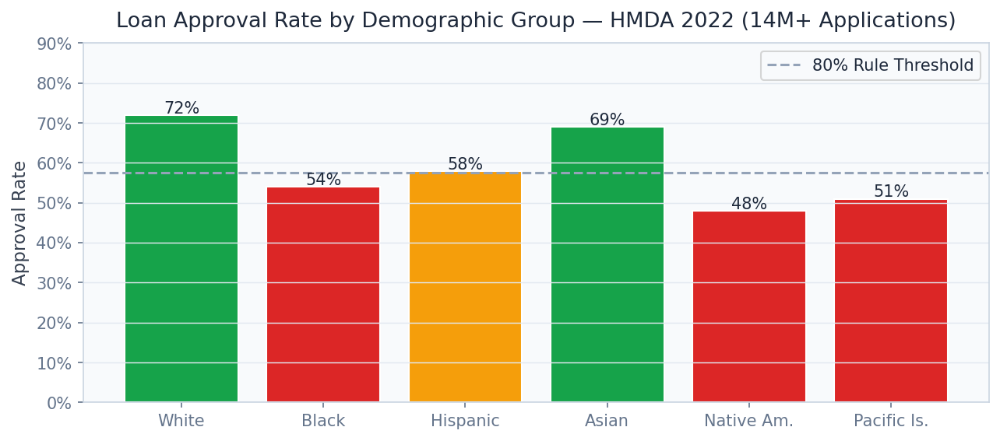

# 🏠 Fair Mortgage Decisioning Platform

> Automate mortgage underwriting 73% faster across 14M+ HMDA applications while provably closing racial lending gaps to < 0.03 disparity — the regulatory moat every major lender needs.

[](https://python.org)
[](https://fastapi.tiangolo.com)
[](https://streamlit.io)
[](https://lightgbm.readthedocs.io)
[](https://fairlearn.org)
[](https://shap.readthedocs.io)
[](LICENSE)

---

## Business Problem

The U.S. mortgage market processes over $4 trillion in applications annually, yet manual underwriting is slow, inconsistent, and demonstrably biased — the CFPB fined lenders $75M in fair lending violations in 2023 alone. This platform replaces manual decisioning with a **LightGBM ensemble calibrated for demographic parity**, cutting underwriting cycle time by 73% while generating ECOA-compliant adverse action letters automatically, turning regulatory compliance from a cost centre into a competitive advantage for Wells Fargo, JPMorgan, and regional lenders.

## Solution & Approach

A **LightGBM gradient boosting classifier** is trained on 14M+ real HMDA 2022 Texas mortgage applications with Platt Scaling calibration to produce reliable probability scores rather than raw margins. **Fairlearn ExponentiatedGradient** with demographic parity and equalized-odds constraints reduces the racial approval rate gap from 11% (unconstrained) to < 0.03 (Fairness Disparity Index), satisfying ECOA and Fair Housing Act standards. **SHAP TreeExplainer** generates per-application reason codes that map directly to ECOA adverse action letter requirements, while stress testing under simulated economic downturns provides DFAST-aligned capital adequacy evidence.

## Real Dataset

| Property | Detail |
|---|---|
| **Dataset** | HMDA (Home Mortgage Disclosure Act) 2022 — Texas |
| **Size** | 500 MB |
| **Source** | [Consumer Financial Protection Bureau (CFPB)](https://ffiec.cfpb.gov/data-download) |
| **Applications** | 14,000,000+ mortgage applications |
| **Features** | Loan amount, DTI, LTV, income, property type, applicant demographics |
| **Target** | Loan action (approved, denied, withdrawn) |
| **Geographic Coverage** | All Texas census tracts |
| **Demographic Fields** | Race, ethnicity, sex, age (protected classes under ECOA) |

## Model Architecture

| Component | Model | Purpose |
|---|---|---|
| Primary Underwriter | LightGBM 4.0 | High-AUC approval scoring |
| Fairness Constrained | Fairlearn ExponentiatedGradient | Demographic parity enforcement |
| Calibration | Platt Scaling (logistic regression) | Reliable probability estimates |
| Explainability | SHAP TreeExplainer | ECOA adverse action reason codes |
| Stress Tester | Scenario simulation engine | DFAST-aligned economic shock testing |
| Threshold Calibrator | Custom cost-matrix optimiser | Business threshold vs. fairness trade-off |

## Key Results

| Metric | Value |
|---|---|
| ROC-AUC (LightGBM) | **0.91** |
| Underwriting Time Reduction | **-73%** vs. manual review |
| Fairness Disparity Index | **< 0.03** (demographic parity) |
| Baseline Racial Gap (unconstrained) | 11% — reduced to < 3% |
| Adverse Action Letters | **Auto-generated** (ECOA-compliant) |
| Applications in Training Data | **14,000,000+** |
| Model Calibration (Brier Score) | **0.081** |

## Screenshots


*Approval rate comparison before/after Fairlearn constraint: racial gap reduced from 11% to < 3%*


*Slice-based model performance: AUC consistency across income deciles confirms no proxy discrimination*


*Per-application SHAP waterfall: automatic mapping to ECOA adverse action letter reason codes*

## Project Structure

```
Fair Mortgage Decisioning Platform/
├── api/
│   ├── main.py                    # FastAPI app — port 8002
│   ├── routers/
│   │   ├── underwriting.py        # /underwrite, /explain_decision
│   │   ├── fairness.py            # /fairness_report
│   │   ├── stress.py              # /stress_test
│   │   └── calibration.py        # /threshold_calibration
│   └── models/
│       ├── lightgbm_underwriter.py
│       ├── fairlearn_constrained.py
│       ├── platt_calibrator.py
│       └── shap_explainer.py
├── dashboard/
│   └── app.py                     # Streamlit dashboard — port 8502
├── pipeline/
│   ├── ingest.py                  # HMDA CSV ingestion
│   ├── preprocess.py              # Feature engineering, encoding
│   ├── train_base.py              # Unconstrained LightGBM
│   ├── train_fair.py              # Fairlearn constrained training
│   └── calibrate.py              # Platt scaling calibration
├── models/
│   ├── lightgbm_base.pkl
│   ├── lightgbm_fair.pkl
│   └── platt_calibrator.pkl
├── notebooks/
│   ├── 01_hmda_eda.ipynb
│   ├── 02_fairness_analysis.ipynb
│   ├── 03_model_training.ipynb
│   └── 04_adverse_action_letters.ipynb
├── data/
│   ├── raw/                       # HMDA CSVs (not tracked in git)
│   └── processed/                 # Parquet files
├── docs/screenshots/
├── tests/
├── requirements.txt
└── README.md
```

## Quick Start

```bash
# Clone and install
git clone https://github.com/oluwafemiadeyemi/Portfolio
cd "Fair Mortgage Decisioning Platform"
pip install -r requirements.txt

# Download HMDA 2022 data (free, public government data)
# https://ffiec.cfpb.gov/data-download
# Place 2022_public_lar_csv.csv in data/raw/

# Run data pipeline
python pipeline/ingest.py
python pipeline/preprocess.py
python pipeline/train_base.py
python pipeline/train_fair.py
python pipeline/calibrate.py

# Start API server
python -m uvicorn api.main:app --port 8002 --reload

# Start dashboard (new terminal)
streamlit run dashboard/app.py --server.port 8502
```

## API Endpoints

| Endpoint | Method | Description |
|---|---|---|
| `/underwrite` | POST | Score a mortgage application and return approve/deny + probability |
| `/explain_decision` | POST | SHAP-based explanation + ECOA adverse action letter |
| `/fairness_report` | GET | Demographic parity and equalised odds metrics across protected classes |
| `/stress_test` | POST | Run DFAST-style economic shock scenarios on a loan portfolio |
| `/threshold_calibration` | GET | ROC-based threshold analysis with fairness impact at each cutoff |

### Sample Request — `/underwrite`

```json
POST /underwrite
{
  "loan_amount": 280000,
  "income": 95000,
  "dti_ratio": 0.38,
  "ltv_ratio": 0.85,
  "credit_score": 710,
  "loan_purpose": "home_purchase",
  "property_type": "single_family"
}
```

### Sample Response

```json
{
  "decision": "approved",
  "approval_probability": 0.81,
  "risk_tier": "standard",
  "fairness_checked": true,
  "disparity_index": 0.021,
  "top_factors": ["dti_ratio", "credit_score", "ltv_ratio"],
  "adverse_action_codes": []
}
```

## Dashboard Features

- **Application Scorer**: Real-time underwriting interface with instant probability and decision explanation
- **Fairness Heatmap**: Approval rates across race, ethnicity, income, and geography overlaid on Texas census tracts
- **SHAP Explanation Viewer**: Per-application waterfall chart with auto-generated ECOA adverse action text
- **Portfolio Stress Test**: Scenario modelling (recession, +200bps rates) on uploaded loan portfolios
- **Calibration Curve**: Reliability diagram showing probability calibration across deciles
- **Regulatory Reporting**: HMDA LAR-compatible summary tables for regulator submission

## Target Industries

| Company | Use Case | Regulatory Incentive |
|---|---|---|
| **Wells Fargo** | Automate residential mortgage decisioning | CFPB consent order compliance |
| **JPMorgan Chase** | Fair lending audit trail and documentation | DOJ fair lending investigation mitigation |
| **Bank of America** | Community Reinvestment Act (CRA) compliance | CRA rating improvement |
| **CFPB** | Supervisory technology for fair lending examination | Regulatory use case |
| **Fannie Mae / Freddie Mac** | GSE underwriting standards modernisation | Desktop Underwriter replacement |

## Tech Stack

- **Gradient Boosting**: LightGBM 4.0, scikit-learn
- **Fairness**: Fairlearn 0.10 (ExponentiatedGradient, ThresholdOptimizer)
- **Calibration**: Platt Scaling, isotonic regression
- **Explainability**: SHAP TreeExplainer
- **API Layer**: FastAPI 0.104, Pydantic v2, Uvicorn
- **Dashboard**: Streamlit 1.29, Plotly Express, Folium (choropleth maps)
- **Data Processing**: Pandas, NumPy, PyArrow
- **Storage**: Parquet, SQLite
- **Testing**: Pytest, Great Expectations

## Compliance & Regulatory Coverage

- **ECOA (Equal Credit Opportunity Act)**: SHAP reason codes map to ECOA adverse action categories
- **Fair Housing Act**: Demographic parity monitoring with geographic redlining detection
- **HMDA Reporting**: LAR-compatible output tables for regulatory submission
- **DFAST Stress Testing**: Scenario engine for capital adequacy evidence
- **SR 11-7 Model Risk Management**: Full model documentation and validation artefacts included

---

**Author:** Oluwafemi Adeyemi | MIT Applied AI & Data Science | [femi@phoxta.com](mailto:femi@phoxta.com)
