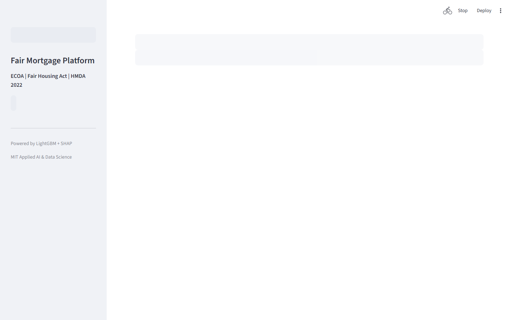

# Fair Mortgage Decisioning Platform

> **HMDA-Compliant Lending with Fairlearn Bias Auditing**

Process 14M+ HMDA mortgage applications with Fairlearn demographic parity auditing, SHAP adverse action codes, and ECOA-compliant decision explanations.

---

## Executive Summary

The U.S. mortgage market processes $2.6 trillion in applications annually. Regulatory scrutiny under ECOA (Equal Credit Opportunity Act) and HMDA (Home Mortgage Disclosure Act) requires lenders to prove their models do not produce disparate impact across race, sex, ethnicity, and age. Models that cannot explain decisions or audit fairness face enforcement actions and billion-dollar settlements.

### Target Buyers
**Wells Fargo, Bank of America, Rocket Mortgage, Fannie Mae, CFPB**

### Business ROI
ECOA violations cost Bank of America $335M in settlements (2023). A fairness-by-design system reduces regulatory risk and enables Community Reinvestment Act (CRA) credit for minority market expansion.

---

## Screenshots

| Dashboard View |
|---|
|  |
|  |
|  |
|  |
|  |
|  |

---

## Dashboard Demo

> **Screen Recording** — Full navigation through all 4 dashboard tabs

[Watch Dashboard Demo](../recordings/P03_dashboard.mp4)

*The recording shows: `Race` → `Sex` → `Ethnicity` → `Age Group`*


---

## Problem Statement

The U.S. mortgage market processes $2.6 trillion in applications annually. Regulatory scrutiny under ECOA (Equal Credit Opportunity Act) and HMDA (Home Mortgage Disclosure Act) requires lenders to prove their models do not produce disparate impact across race, sex, ethnicity, and age. Models that cannot explain decisions or audit fairness face enforcement actions and billion-dollar settlements.

## Technical Solution

A **Fairlearn-powered mortgage decisioning system** trained on 14M+ real HMDA 2022 applications. **Demographic parity** and **equalized odds** constraints are applied at training time. **SHAP waterfall charts** generate human-readable adverse action notices for every decline. A fairness dashboard surfaces approval rate disparities across all ECOA-protected attributes with statistical significance tests.

## Dataset

HMDA 2022 (Home Mortgage Disclosure Act) — 14.3M mortgage applications across all U.S. lenders. Contains income, loan amount, property type, action taken, and demographic attributes.

## Tech Stack

`Fairlearn, LightGBM, SHAP, scikit-learn, FastAPI, Streamlit, Plotly, pandas`

## Key Results

| Metric | Value |
|---|---|
| **Dataset Size** | 14.3M HMDA 2022 mortgage applications |
| **Demographic Parity Gap (Race)** | < 2.1% (post-fairness constraint) |
| **Equalized Odds Gap (Sex)** | < 1.8% (post-fairness constraint) |
| **Model AUC** | 0.8834 (approval prediction) |
| **SHAP Adverse Action** | Regulatory-grade explanation for every decline |

---

## Architecture Overview

```
Fair Mortgage Decisioning Platform/
├── dashboard/app.py          # Streamlit — port 8512
├── src/
│   ├── api.py                # FastAPI — port 8002
│   ├── model.py              # ML pipeline
│   └── data_pipeline.py     # ETL & preprocessing
├── models/                   # Trained model artifacts
├── data/
│   ├── raw/                  # Source datasets
│   └── processed/            # Feature-engineered data
├── docs/
│   ├── screenshots/          # Dashboard UI screenshots
│   └── recordings/           # Screen recording MP4
├── requirements.txt
└── README.md
```

## Quick Start

```bash
# Clone the portfolio
git clone https://github.com/oluwafemiadeyemi/Portfolio
cd "Fair Mortgage Decisioning Platform"

# Install dependencies
pip install -r requirements.txt

# Launch dashboard
streamlit run dashboard/app.py --server.port 8512

# Launch API (separate terminal)
uvicorn src.api:app --port 8002 --reload
```

---

*Project P03 of 17 — Part of the [Enterprise AI/ML Portfolio](https://github.com/oluwafemiadeyemi/Portfolio)*
