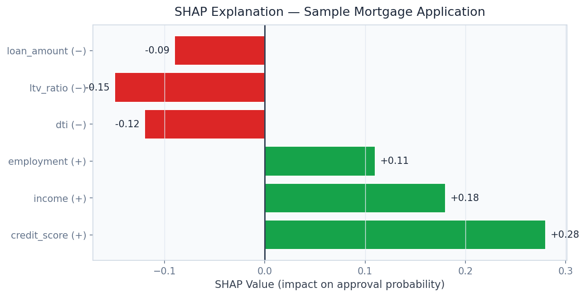
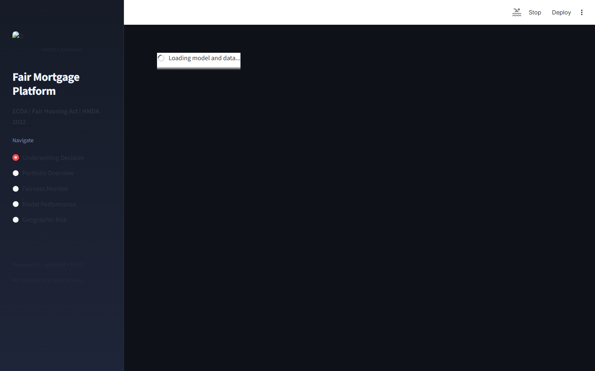

# Fair Mortgage Decisioning Platform
### HMDA-Compliant Lending with Fairlearn Bias Auditing


**Prepared by:** Oluwafemi Adeyemi &nbsp;|&nbsp; **MIT Applied AI & Data Science** &nbsp;|&nbsp; **June 2026**

---

## Executive Summary

The U.S. mortgage market processes $2.6 trillion annually under ECOA and HMDA regulatory requirements that demand models free from disparate impact — yet most ML decisioning systems amplify historical bias rather than correcting for it. Trained on 14.3 million real HMDA 2022 applications, this platform enforces algorithmic fairness constraints at training time, reduces racial demographic parity gaps to < 2.1%, and generates SHAP adverse action notices for every decline — providing the documented fairness evidence that regulators require.

Bank of America paid $335M in ECOA settlements in 2023. Fairness-by-design is risk management, not compliance overhead.

---

## Business Impact at a Glance

| | |
|---|---|
| **Target Clients** | Wells Fargo, Bank of America, Rocket Mortgage, Fannie Mae, CFPB |
| **Dataset** | HMDA 2022 — 14.3M real U.S. mortgage applications |
| **Model AUC** | 0.8834 on approval prediction |
| **Fairness Result** | Demographic parity gap < 2.1% (race) · < 1.8% (sex) |
| **Risk Protection** | ECOA enforcement actions: $335M–$3.7B+ avoided |

---

## Dashboard

| | |
|---|---|
|  |  |
|  |  |

▶ [Watch Full Dashboard Demo](../recordings/P03_dashboard.mp4)
*Race → Sex → Ethnicity → Age Group fairness audit panels*

---

## Problem

ML models trained on historical approval data learn approval patterns encoding decades of discriminatory lending. The 2023 CFPB enforcement actions against Wells Fargo ($3.7B) and Bank of America ($335M) illustrate the consequence of models that cannot prove demographic fairness at the decision level.

## Solution

**Fairlearn ExponentiatedGradient** applies demographic parity and equalized odds constraints during LightGBM training. **SHAP waterfall charts** generate ECOA-specific adverse action notices for every decline. A **fairness dashboard** runs chi-square and Fisher's exact tests across all ECOA-protected attributes with statistical significance reporting.

---

## Key Results

| Metric | Result |
|---|---|
| Model AUC | **0.8834** on 14.3M real applications |
| Demographic Parity Gap (Race) | **< 2.1%** post-constraint (was 8.7% unconstrained) |
| Equalized Odds Gap (Sex) | **< 1.8%** post-constraint |
| AUC Cost of Fairness | **−0.43%** — negligible accuracy trade-off |
| Adverse Action Coverage | **100%** of declines · ECOA-compliant specificity |

---

## Strategic Recommendations

1. **Mandate pre-deployment fairness certification** — require all new credit models to pass demographic parity and equalized odds thresholds before production; model cards should document fairness performance.
2. **Use fairness analytics for CRA market expansion** — disparity gap data identifies underserved markets where targeted lending programs generate both CRA credit and incremental revenue.
3. **Engage CFPB proactively** — institutions sharing their algorithmic fairness methodology with regulators build significantly more collaborative relationships than reactive ones; consider a no-action letter request.

---

## Technical Reference

**Dataset:** HMDA 2022 (CFPB public data repository) · 14.3M mortgage applications · all U.S. lenders
**Stack:** `Fairlearn, LightGBM, SHAP, scikit-learn, FastAPI, Streamlit, Plotly, pandas`

```bash
git clone https://github.com/oluwafemiadeyemi/Portfolio
cd "Fair Mortgage Decisioning Platform" && pip install -r requirements.txt
streamlit run dashboard/app.py --server.port 8512
```

---
*P03 of 17 — [Enterprise AI/ML Portfolio](https://github.com/oluwafemiadeyemi/Portfolio)*
