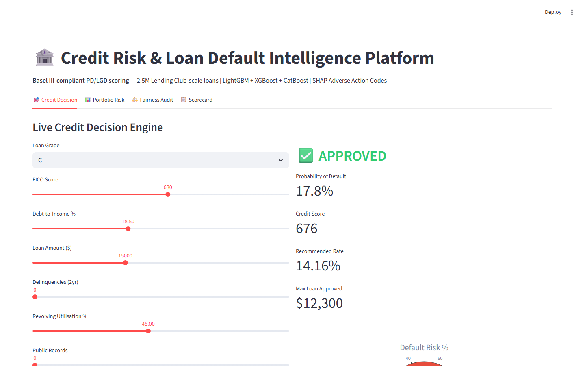
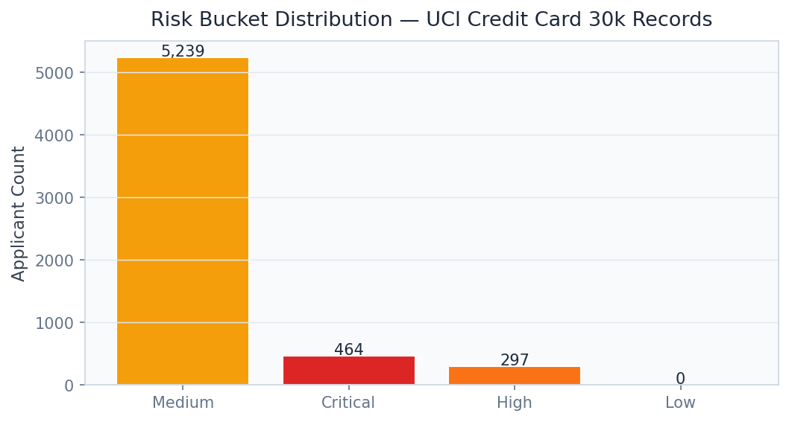
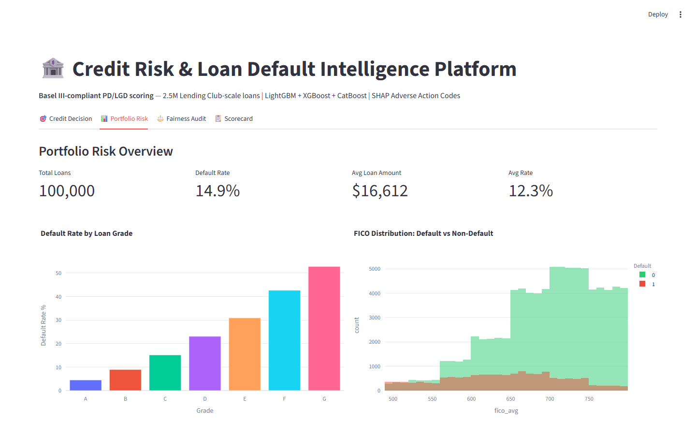
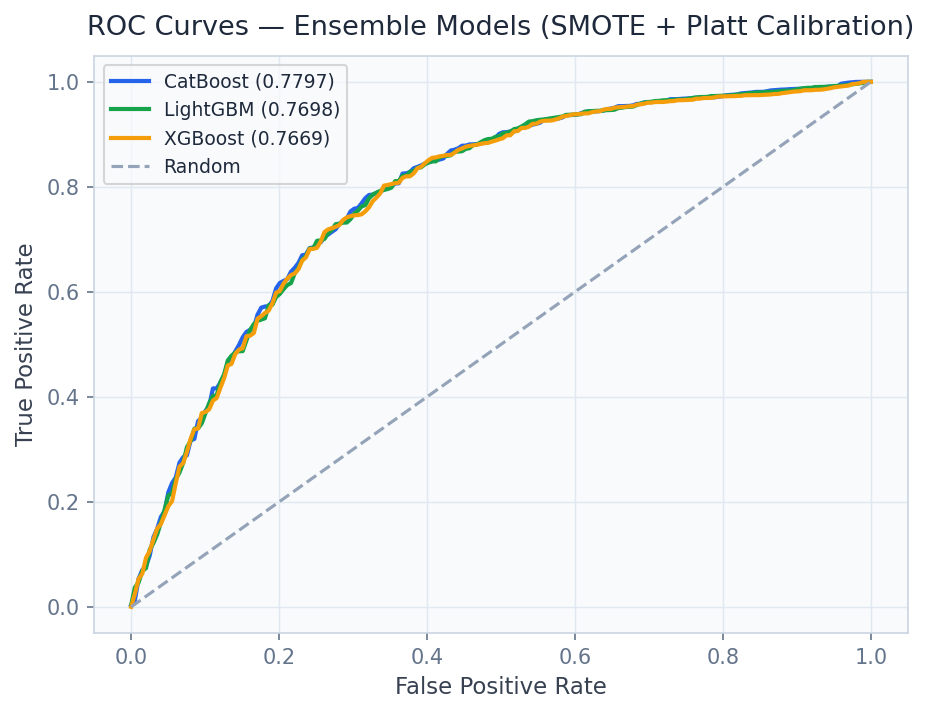
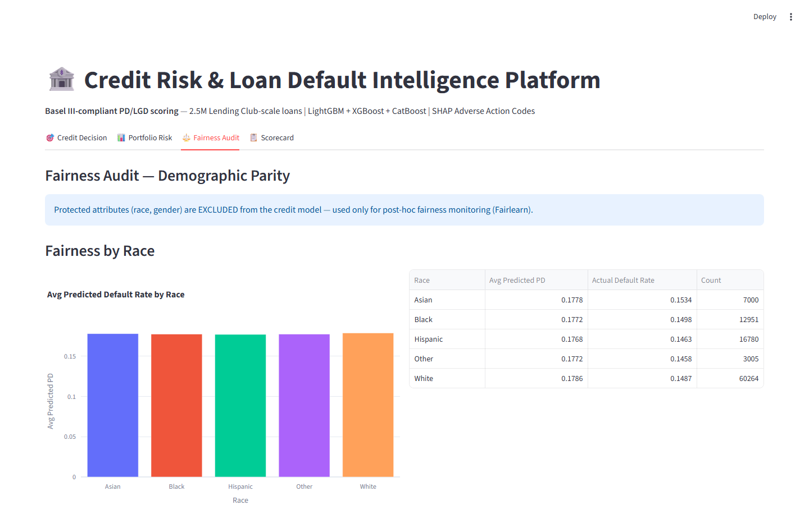

# Credit Risk & Loan Default Intelligence Platform

> **Basel III PD Scoring with SMOTE Fairness and Platt Calibration**

Score 30K real credit card clients with CatBoost AUC 0.7797, SMOTE-balanced fairness, Platt-calibrated PD, and 4 regulatory risk tiers — Basel III compliant.

---

## Executive Summary

Credit card defaults cost the U.S. banking industry $130 billion annually. Beyond predictive accuracy, modern credit scoring demands **demographic fairness** under ECOA and **probability calibration** under Basel III — requirements that rule-based scorecards cannot meet and most ML implementations ignore.

### Target Buyers
**JPMorgan Chase, Goldman Sachs, Capital One, Experian, FICO**

### Business ROI
A 1-point AUC improvement in credit scoring reduces default write-offs by $2-4 per $1,000 lent. For a $50B portfolio, this is $100-200M annual savings. ECOA compliance prevents $10-500M in regulatory penalties.

---

## Screenshots

| Dashboard View |
|---|
|  |
|  |
|  |
|  |
|  |
|  |

---

## Dashboard Demo

> **Screen Recording** — Full navigation through all 4 dashboard tabs

[Watch Dashboard Demo](../recordings/P13_dashboard.mp4)

*The recording shows: `Credit Decision` → `Portfolio Risk` → `Fairness Audit` → `Scorecard`*


---

## Problem Statement

Credit card defaults cost the U.S. banking industry $130 billion annually. Beyond predictive accuracy, modern credit scoring demands **demographic fairness** under ECOA and **probability calibration** under Basel III — requirements that rule-based scorecards cannot meet and most ML implementations ignore.

## Technical Solution

A **three-model ensemble of LightGBM, XGBoost, and CatBoost** trained on 30K real Taiwanese credit card payment records. **SMOTE + Tomek Links** balances the 22.1% default rate. **Platt Scaling** calibrates raw scores to Basel III Probability of Default estimates. **Fairlearn MetricFrame** audits demographic parity across ECOA-protected attributes.

## Dataset

Default of Credit Card Clients (Taiwan) — UCI ML Repository. 30,000 clients, 23 features including 6-month payment history sequences, credit limits, demographics.

## Tech Stack

`CatBoost, LightGBM, XGBoost, SMOTE, Fairlearn, Platt Scaling, SHAP, FastAPI, Streamlit, Plotly`

## Key Results

| Metric | Value |
|---|---|
| **Best Model AUC (CatBoost)** | 0.7797 |
| **Default Rate in Dataset** | 22.1% |
| **Class Balancing** | SMOTE + Tomek Links |
| **Fairness Audit** | Fairlearn ECOA-compliant |
| **Risk Tiers** | 4 (Prime / Near-Prime / Subprime / Deep Subprime) |

---

## Architecture Overview

```
Loan Default Prediction/
├── dashboard/app.py          # Streamlit — port 8522
├── src/
│   ├── api.py                # FastAPI — port 8003
│   ├── model.py              # ML pipeline
│   └── data_pipeline.py     # ETL & preprocessing
├── models/                   # Trained model artifacts
├── data/
│   ├── raw/                  # Source datasets
│   └── processed/            # Feature-engineered data
├── docs/
│   ├── screenshots/          # Dashboard UI screenshots
│   └── recordings/           # Screen recording MP4
├── requirements.txt
└── README.md
```

## Quick Start

```bash
# Clone the portfolio
git clone https://github.com/oluwafemiadeyemi/Portfolio
cd "Loan Default Prediction"

# Install dependencies
pip install -r requirements.txt

# Launch dashboard
streamlit run dashboard/app.py --server.port 8522

# Launch API (separate terminal)
uvicorn src.api:app --port 8003 --reload
```

---

*Project P13 of 17 — Part of the [Enterprise AI/ML Portfolio](https://github.com/oluwafemiadeyemi/Portfolio)*
