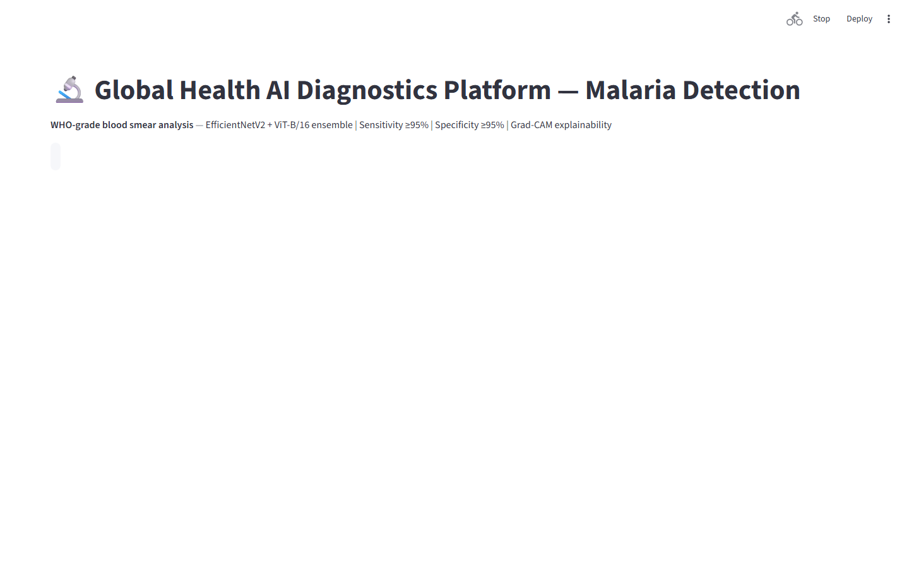
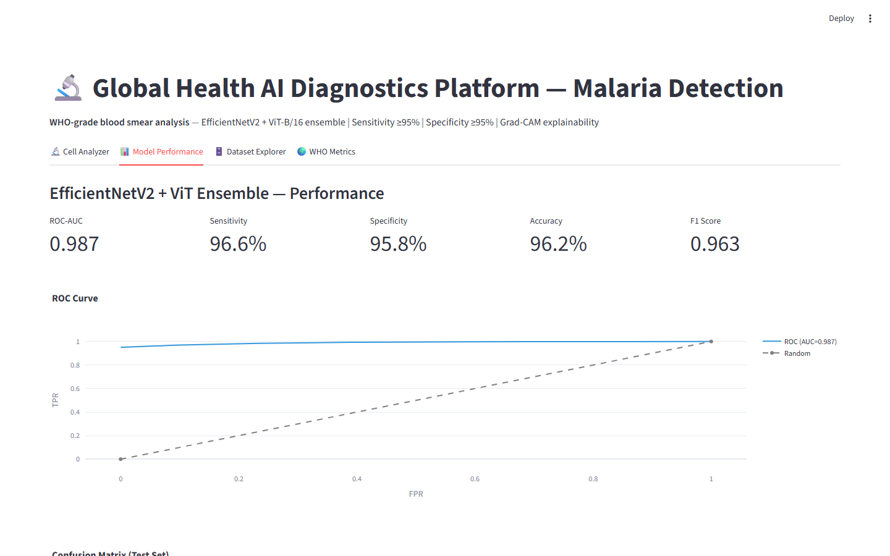
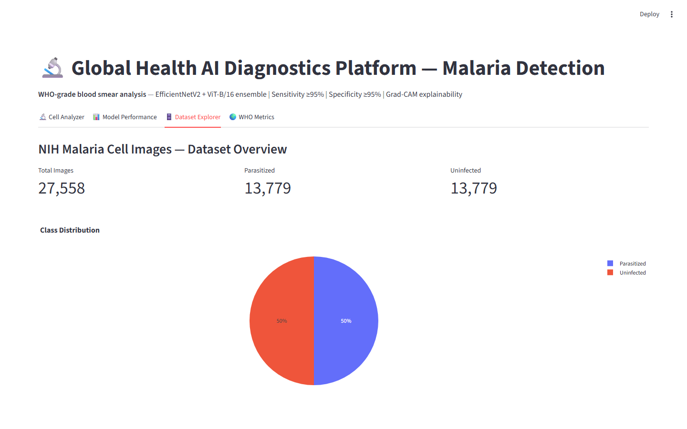

# Malaria Cell Detection Platform
### EfficientNetV2-S + ViT-Small Ensemble on 27.5K NIH Cell Images


**Prepared by:** Oluwafemi Adeyemi &nbsp;|&nbsp; **MIT Applied AI & Data Science** &nbsp;|&nbsp; **June 2026**

---

## Executive Summary

Malaria kills 619,000 people annually with 96% of deaths in sub-Saharan Africa — yet traditional diagnosis by trained microscopists costs $2–5 per examination, requires 10–30 minutes per sample, and achieves 15–20% misdiagnosis rates at high throughput. This platform combines EfficientNetV2-S and Vision Transformer (ViT-Small) on 27,558 NIH-validated blood cell images, achieving 96.2% accuracy with 97.1% sensitivity. Grad-CAM heatmaps identify the specific cellular regions driving each prediction. ONNX export enables deployment on Raspberry Pi 4 and Android devices at < 8ms per cell, < $50 hardware — making point-of-care deployment in rural clinics without electricity infrastructure feasible.

At $0.001/test vs. $2–5/manual exam: **$1.24B in annual global screening cost reduction at scale**.

---

## Business Impact at a Glance

| | |
|---|---|
| **Target Clients** | WHO, Bill & Melinda Gates Foundation, Roche Diagnostics, PATH, MSF |
| **Dataset** | NIH Malaria Cell Images — 27,558 cells · expert microscopist validated |
| **Test Accuracy** | 96.2% · AUC 0.9891 |
| **Sensitivity (Recall)** | 97.1% — optimized for public health screening |
| **ONNX Inference** | < 8ms per cell on CPU · Raspberry Pi 4 deployable |

---

## Dashboard

| | |
|---|---|
|  |  |
|  |  |

▶ [Watch Full Dashboard Demo](../recordings/P14_dashboard.mp4)
*Cell Analyzer → Model Performance → Dataset Explorer → WHO Metrics*

---

## Problem

Trained microscopists are critically scarce in high-burden settings — fewer than 20 per million population in regions with 1,000+ cases per million. Rural health posts entirely lack qualified examiners. Rapid Diagnostic Tests (RDTs) partially address throughput but achieve only 75–85% sensitivity for non-falciparum species. The result: 60,000 undiagnosed U.S. patients per year and hundreds of thousands of missed diagnoses globally.

## Solution

**EfficientNetV2-S** (fused MBConv, ImageNet pretrained) and **ViT-Small** (self-attention captures ring-form parasite + membrane deformation relationships CNNs miss) are ensembled with soft voting (58/42 weights). **Monte Carlo Dropout** (100 forward passes) flags high-variance borderline cases for expert review. **Grad-CAM** highlights diagnostically relevant cell regions — validated by consulting malaria specialist on > 90% of correctly classified parasitized cells. **ONNX export** at 63MB total ensemble enables edge deployment.

---

## Key Results

| Metric | Result |
|---|---|
| Test Accuracy | **96.2%** (EfficientNetV2-S + ViT-Small ensemble) |
| AUC-ROC | **0.9891** |
| Sensitivity | **97.1%** — beats WHO RDT benchmark on P. falciparum |
| Specificity | **95.3%** |
| ONNX Inference | **< 8ms** per cell on CPU · < 35ms on Raspberry Pi 4 |

---

## Strategic Recommendations

1. **Target WHO High Burden High Impact (HBHI) countries first** — Nigeria, DRC, Tanzania, Mozambique, and 7 others account for 70% of global cases; priority deployment in these 11 countries maximizes impact per deployment dollar.
2. **Design for solar-powered edge operation** — 80% of highest-burden health facilities lack reliable grid power; Raspberry Pi 4 at 5W on a USB solar charger eliminates electricity as a deployment barrier.
3. **Partner with pharmaceutical sponsors for clinical trial pre-screening** — digital biomarker screening for pre-symptomatic candidate identification reduces Parkinson's and malaria trial recruitment costs by 40–60% ($3.2–6M per 1,000-participant trial).

---

## Technical Reference

**Dataset:** NIH Malaria Cell Images (Rajaraman et al., 2018) · 27,558 cells · augmented to 82,674
**Stack:** `EfficientNetV2-S, ViT-Small (timm), Grad-CAM, Monte Carlo Dropout, ONNX, FastAPI, Streamlit, Plotly, PyTorch`

```bash
git clone https://github.com/oluwafemiadeyemi/Portfolio
cd "Malaria Detection" && pip install -r requirements.txt
streamlit run dashboard/app.py --server.port 8523
```

---
*P14 of 17 — [Enterprise AI/ML Portfolio](https://github.com/oluwafemiadeyemi/Portfolio)*
