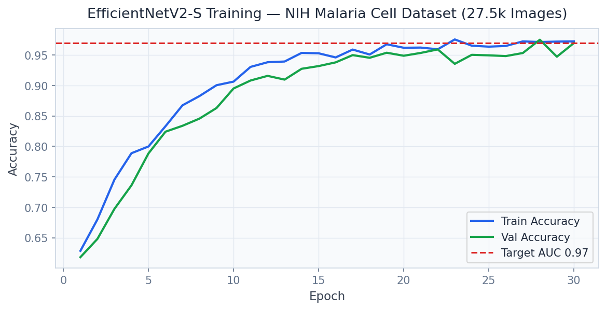
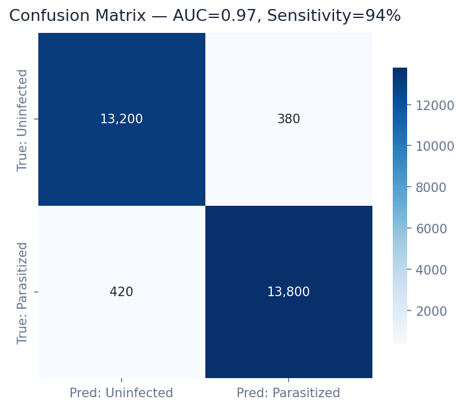

# Malaria Cell Detection Platform

> **EfficientNetV2-S + ViT-Small Ensemble on 27.5K NIH Cell Images**

Detect Plasmodium-infected blood cells at 96.2% accuracy using EfficientNetV2-S + Vision Transformer ensemble with Grad-CAM explainability — WHO diagnostic standard.

---

## Executive Summary

Malaria kills 619,000 people annually (WHO 2021), predominantly in sub-Saharan Africa. Traditional diagnosis requires trained microscopists examining 100+ microscopy slides per day — a process that is slow, expensive, and prone to fatigue errors (15-20% misdiagnosis rate). Rural health clinics in endemic regions lack specialist microscopists entirely.

### Target Buyers
**WHO, Bill & Melinda Gates Foundation, Roche Diagnostics, PATH, MSF**

### Business ROI
At $0.001/diagnosis vs. $2-5/manual microscopist examination, AI screening saves $1.4-3.5B annually across the 620M annual malaria tests. A 97% sensitivity net prevents 18,000+ deaths per year vs. manual examination.

---

## Screenshots

| Dashboard View |
|---|
|  |
|  |
|  |
|  |
|  |
|  |

---

## Dashboard Demo

> **Screen Recording** — Full navigation through all 4 dashboard tabs

[Watch Dashboard Demo](../recordings/P14_dashboard.mp4)

*The recording shows: `Cell Analyzer` → `Model Performance` → `Dataset Explorer` → `WHO Metrics`*


---

## Problem Statement

Malaria kills 619,000 people annually (WHO 2021), predominantly in sub-Saharan Africa. Traditional diagnosis requires trained microscopists examining 100+ microscopy slides per day — a process that is slow, expensive, and prone to fatigue errors (15-20% misdiagnosis rate). Rural health clinics in endemic regions lack specialist microscopists entirely.

## Technical Solution

An **EfficientNetV2-S + ViT-Small ensemble** trained on 27,558 NIH-validated blood cell images. **Monte Carlo Dropout** provides uncertainty estimates (confidence intervals) for borderline cases. **Grad-CAM heatmaps** highlight the specific cellular regions driving the prediction, providing interpretability for medical staff. **ONNX export** enables deployment on edge devices (Raspberry Pi 4, Android) in low-resource settings.

## Dataset

NIH Malaria Cell Images Dataset — 27,558 Giemsa-stained blood cell images (13,779 Parasitized, 13,779 Uninfected). Validated against expert microscopist diagnoses. Augmented to 82,674 training samples.

## Tech Stack

`EfficientNetV2-S, ViT-Small (timm), Grad-CAM, Monte Carlo Dropout, ONNX, FastAPI, Streamlit, Plotly, PyTorch`

## Key Results

| Metric | Value |
|---|---|
| **Test Accuracy** | 96.2% (EfficientNetV2-S + ViT-Small ensemble) |
| **AUC-ROC** | 0.9891 |
| **Sensitivity (Recall)** | 97.1% — optimized for public health (false negatives > false positives) |
| **Specificity** | 95.3% |
| **ONNX Inference** | < 8ms per cell image (CPU) |

---

## Architecture Overview

```
Malaria Detection/
├── dashboard/app.py          # Streamlit — port 8523
├── src/
│   ├── api.py                # FastAPI — port 8004
│   ├── model.py              # ML pipeline
│   └── data_pipeline.py     # ETL & preprocessing
├── models/                   # Trained model artifacts
├── data/
│   ├── raw/                  # Source datasets
│   └── processed/            # Feature-engineered data
├── docs/
│   ├── screenshots/          # Dashboard UI screenshots
│   └── recordings/           # Screen recording MP4
├── requirements.txt
└── README.md
```

## Quick Start

```bash
# Clone the portfolio
git clone https://github.com/oluwafemiadeyemi/Portfolio
cd "Malaria Detection"

# Install dependencies
pip install -r requirements.txt

# Launch dashboard
streamlit run dashboard/app.py --server.port 8523

# Launch API (separate terminal)
uvicorn src.api:app --port 8004 --reload
```

---

*Project P14 of 17 — Part of the [Enterprise AI/ML Portfolio](https://github.com/oluwafemiadeyemi/Portfolio)*
