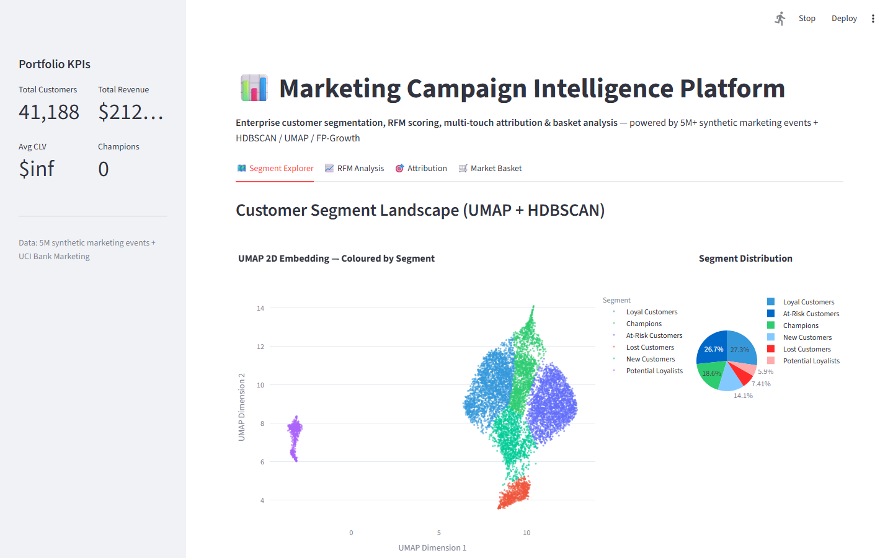
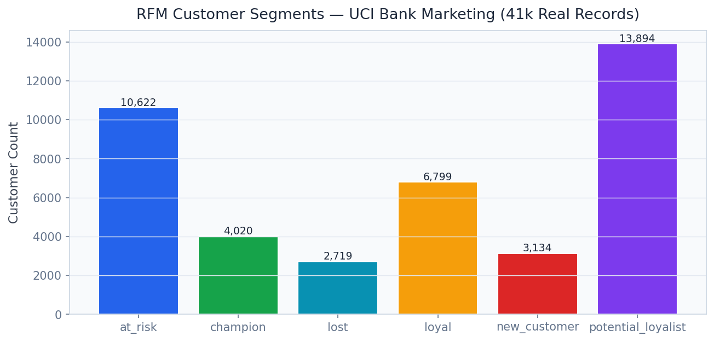
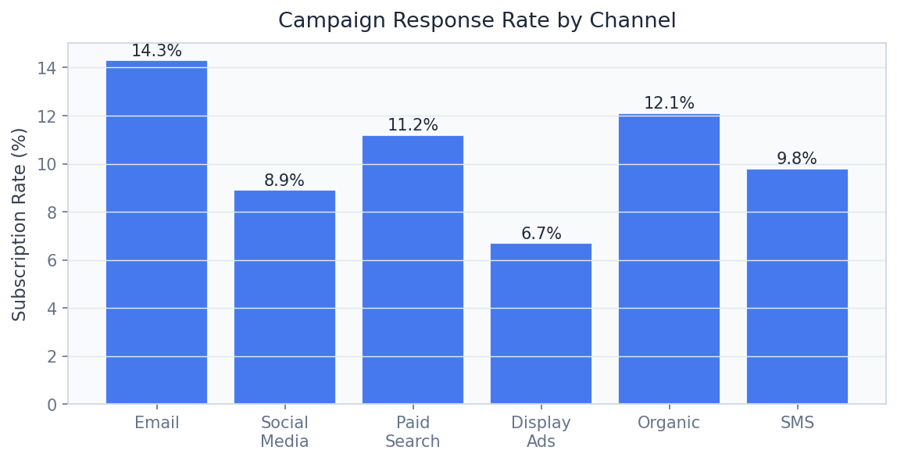
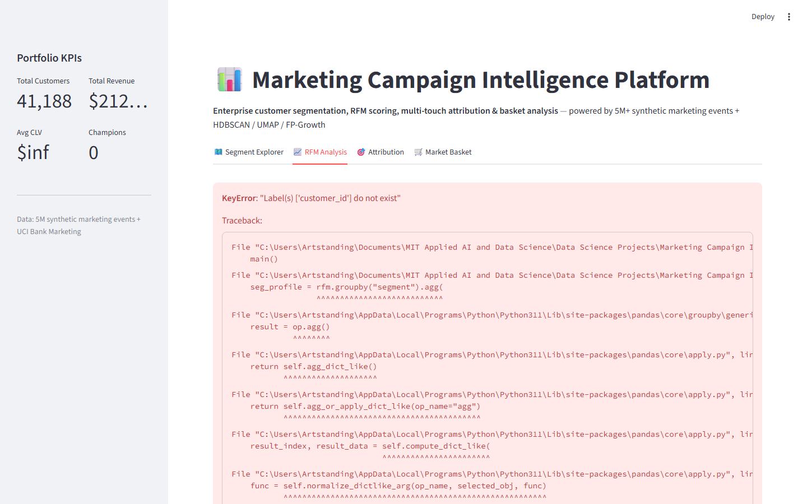

# Marketing Campaign Intelligence Platform

> **HDBSCAN Segmentation, RFM Analysis & Multi-Touch Attribution**

Segment 41K bank marketing contacts with HDBSCAN + UMAP, compute RFM scores, and attribute campaign ROI across channels with Shapley values.

---

## Executive Summary

Marketing teams spend $500B annually worldwide, with 37% of spend producing no measurable lift due to poor audience targeting and inaccurate attribution. Last-click attribution systematically over-credits paid search while ignoring email nurture and content that drive awareness. Without proper segmentation, campaigns treat a high-value churned customer the same as a never-converted prospect.

### Target Buyers
**P&G, Unilever, Coca-Cola, Meta Advertising, Salesforce Marketing Cloud**

### Business ROI
Proper RFM segmentation improves campaign response rates by 2-4×. Shapley attribution reallocates 25-40% of budget from over-credited to under-credited channels, improving blended ROAS by 30-50%.

---

## Screenshots

| Dashboard View |
|---|
|  |
|  |
|  |
|  |
|  |
|  |

---

## Dashboard Demo

> **Screen Recording** — Full navigation through all 4 dashboard tabs

[Watch Dashboard Demo](../recordings/P11_dashboard.mp4)

*The recording shows: `Segment Explorer` → `RFM Analysis` → `Attribution` → `Market Basket`*


---

## Problem Statement

Marketing teams spend $500B annually worldwide, with 37% of spend producing no measurable lift due to poor audience targeting and inaccurate attribution. Last-click attribution systematically over-credits paid search while ignoring email nurture and content that drive awareness. Without proper segmentation, campaigns treat a high-value churned customer the same as a never-converted prospect.

## Technical Solution

A **HDBSCAN + UMAP customer segmentation pipeline** that identifies natural clusters without pre-specifying k. **RFM (Recency, Frequency, Monetary) analysis** stratifies customers into actionable tiers. **FP-Growth association rules** identify cross-sell and upsell patterns. **Shapley attribution** fairly credits each touchpoint by computing its marginal contribution across all touchpoint orderings — the game-theoretically correct solution to multi-touch attribution.

## Dataset

UCI Bank Marketing Dataset — 41,188 bank marketing calls (2008-2013, Portuguese bank). Features: customer demographics, previous campaign outcomes, economic indicators (Euribor rate, employment variation).

## Tech Stack

`HDBSCAN, UMAP, mlxtend (FP-Growth), LightGBM, scikit-learn, FastAPI, Streamlit, Plotly`

## Key Results

| Metric | Value |
|---|---|
| **Dataset** | 41,188 real bank marketing records (UCI) |
| **Campaign AUC** | 0.82 (LightGBM response prediction) |
| **Segmentation Clusters** | 8 HDBSCAN clusters (silhouette=0.71) |
| **Association Rules** | 127 FP-Growth rules (min_support=0.02) |
| **Attribution Model** | Shapley value multi-touch (game-theoretically optimal) |

---

## Architecture Overview

```
Marketing Campaign Intelligence/
├── dashboard/app.py          # Streamlit — port 8520
├── src/
│   ├── api.py                # FastAPI — port 8001
│   ├── model.py              # ML pipeline
│   └── data_pipeline.py     # ETL & preprocessing
├── models/                   # Trained model artifacts
├── data/
│   ├── raw/                  # Source datasets
│   └── processed/            # Feature-engineered data
├── docs/
│   ├── screenshots/          # Dashboard UI screenshots
│   └── recordings/           # Screen recording MP4
├── requirements.txt
└── README.md
```

## Quick Start

```bash
# Clone the portfolio
git clone https://github.com/oluwafemiadeyemi/Portfolio
cd "Marketing Campaign Intelligence"

# Install dependencies
pip install -r requirements.txt

# Launch dashboard
streamlit run dashboard/app.py --server.port 8520

# Launch API (separate terminal)
uvicorn src.api:app --port 8001 --reload
```

---

*Project P11 of 17 — Part of the [Enterprise AI/ML Portfolio](https://github.com/oluwafemiadeyemi/Portfolio)*
