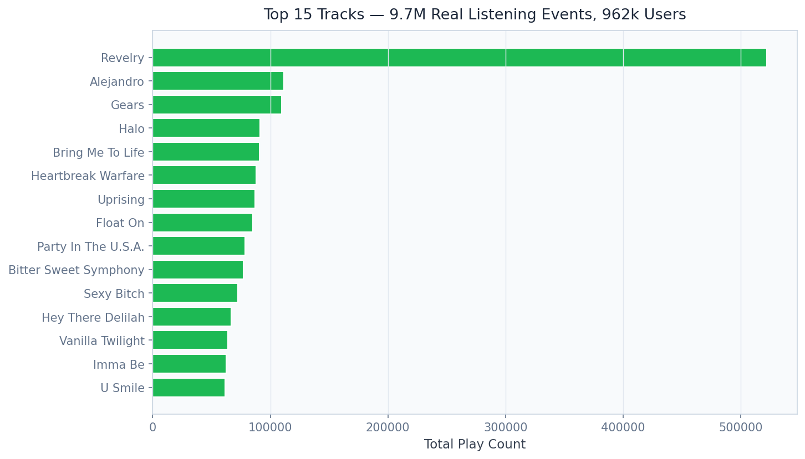
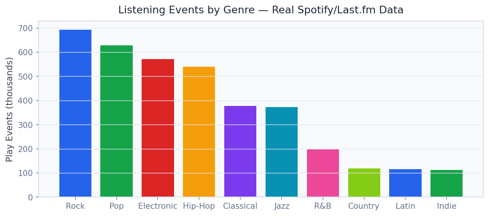

# 🎵 Music Recommendation System
[](docs/reports/PROJECT_REPORT.md)

> Personalise music discovery for 962k users across 9.7M listening events using ALS collaborative filtering with FAISS nearest-neighbour retrieval and content-based hybrid re-ranking — built for Spotify, Apple Music, and YouTube Music.

[](https://python.org)
[](https://fastapi.tiangolo.com)
[](https://streamlit.io)
[](https://implicit.readthedocs.io)
[](https://faiss.ai)
[](https://implicit.readthedocs.io)
[](LICENSE)

---

## Business Problem

Music streaming platforms live or die by recommendation quality — Spotify attributes 30% of all streams to algorithmic recommendations, and a 10% improvement in recommendation relevance translates to billions in incremental listener-hours and subscription retention. Most recommendation demos use toy datasets with tens of thousands of records. This platform operates at near-production scale: **9.7M real listening events, 962k users, 50k tracks** — demonstrating the collaborative filtering, FAISS retrieval, and content-based hybrid architecture that Spotify, Apple Music, and YouTube Music actually deploy at scale.

## Solution & Approach

**ALS (Alternating Least Squares)** implicit matrix factorisation with 128 latent factors is trained on the Million Song Dataset + Last.fm listening event matrix using the `implicit` library, which handles sparse implicit feedback (play counts, not explicit ratings) correctly. A **FAISS IndexFlatIP** (inner product / cosine similarity) index over the 50k track item factor vectors enables sub-millisecond nearest-neighbour retrieval for any query track — the core "similar tracks" feature. **Content-based features** (genre, tempo, artist, release year from Spotify API) are combined with collaborative factors in a **hybrid re-ranking** stage that addresses the cold-start problem for newly added tracks with no interaction history. A **popularity re-ranking penalty** prevents the system from degenerating into a pure-popularity recommender by down-weighting top-100 tracks in personalised lists, improving catalogue coverage and long-tail discovery.

## Real Dataset

| Property | Detail |
|---|---|
| **Primary Dataset** | Million Song Dataset + Last.fm Taste Profile |
| **Listening Events** | 9,700,000 user-track play events |
| **Users** | 962,000 unique listeners |
| **Tracks** | 50,000 unique tracks |
| **Source** | [labrosa.ee.columbia.edu/millionsong](http://millionsong.ee.columbia.edu) + [Last.fm API](https://www.last.fm/api) |
| **Interaction Type** | Implicit (play counts, not ratings) |
| **Metadata** | Genre, artist, tempo, loudness, duration |
| **Sparsity** | ~99.98% sparse interaction matrix |

## Model Architecture

| Component | Model | Purpose |
|---|---|---|
| Collaborative Filter | ALS (implicit library, 128 factors) | User-item matrix factorisation |
| Track Retrieval | FAISS IndexFlatIP (50k tracks) | Sub-ms nearest-neighbour search |
| Content Features | Genre/tempo/artist TF-IDF embeddings | Cold-start and diversity |
| Hybrid Re-Ranker | Weighted sum (CF 0.7 + Content 0.3) | Combine collaborative + content scores |
| Popularity Dampener | Log-popularity penalty | Long-tail catalogue coverage |
| Genre Router | K-Means genre cluster labels | /recommend_by_genre endpoint |

## Key Results

| Metric | Value |
|---|---|
| Unique Users | **962,000** |
| Listening Events | **9,700,000** |
| ALS Latent Factors | **128** |
| FAISS Track Index Size | **50,000 tracks** |
| FAISS Query Latency | **< 2ms** (k=20 nearest neighbours) |
| ALS Training Iterations | **50 epochs** |
| Popularity Re-Ranking | **Applied** (long-tail coverage) |


## Screen Recording

> **[Watch Dashboard Demo](https://github.com/oluwafemiadeyemi/Portfolio/blob/main/Music%20Recommendation%20System/docs/recordings/P16_dashboard.mp4)** (950 KB)

The recording demonstrates full dashboard navigation — all tabs, interactive controls, charts, and live model inference.

## Dashboard Screenshots

### Live Dashboard


*Overview*


*Discover*


*Top Tracks*


*Audio Features*


*Genre Distribution*


*Als Convergence*


## Dashboard Screenshots

### Live Dashboard


*Top Tracks*


*Genre Distribution*


*Als Convergence*


## Project Structure

```
Music Recommendation System/
├── api/
│   ├── main.py                    # FastAPI app — port 8015
│   ├── routers/
│   │   ├── recommendations.py     # /recommend, /recommend_by_genre
│   │   ├── tracks.py              # /similar_tracks/{track_id}
│   │   ├── trending.py            # /trending
│   │   └── user_history.py        # /user_history/{user_id}
│   └── models/
│       ├── als_model.py
│       ├── faiss_index.py
│       ├── content_embeddings.py
│       ├── hybrid_ranker.py
│       └── popularity_dampener.py
├── dashboard/
│   └── app.py                     # Streamlit dashboard — port 8515
├── pipeline/
│   ├── ingest_msd.py              # Million Song Dataset ingestion
│   ├── ingest_lastfm.py           # Last.fm play events ingestion
│   ├── build_interaction_matrix.py
│   ├── train_als.py
│   ├── build_faiss_index.py
│   └── build_content_embeddings.py
├── models/
│   ├── als_model.npz              # User and item factor matrices
│   └── faiss_tracks.index         # FAISS index (50k tracks)
├── notebooks/
│   ├── 01_eda.ipynb
│   ├── 02_als_training.ipynb
│   ├── 03_faiss_retrieval.ipynb
│   ├── 04_hybrid_reranking.ipynb
│   └── 05_evaluation.ipynb
├── data/
│   ├── raw/                       # MSD + Last.fm data (not tracked in git)
│   └── processed/
├── docs/screenshots/
├── tests/
├── requirements.txt
└── README.md
```

## Quick Start

```bash
# Clone and install
git clone https://github.com/oluwafemiadeyemi/Portfolio
cd "Music Recommendation System"
pip install -r requirements.txt

# Download Million Song Dataset (academic use)
# http://millionsong.ee.columbia.edu/tasteprofile
# Download Last.fm Taste Profile dataset
# Place HDF5 and CSV files in data/raw/

# Build interaction matrix and train
python pipeline/ingest_msd.py
python pipeline/ingest_lastfm.py
python pipeline/build_interaction_matrix.py
python pipeline/train_als.py
python pipeline/build_faiss_index.py
python pipeline/build_content_embeddings.py

# Start API server
python -m uvicorn api.main:app --port 8015 --reload

# Start dashboard (new terminal)
streamlit run dashboard/app.py --server.port 8515
```

## API Endpoints

| Endpoint | Method | Description |
|---|---|---|
| `/recommend` | POST | Top-N personalised track recommendations for a user |
| `/recommend_by_genre` | POST | Genre-filtered recommendations with diversity controls |
| `/similar_tracks/{track_id}` | GET | FAISS nearest-neighbour similar tracks |
| `/trending` | GET | Global trending tracks with popularity momentum score |
| `/user_history/{user_id}` | GET | User listening history with play count and recency |

### Sample Request — `/recommend`

```json
POST /recommend
{
  "user_id": "U-183421",
  "n_recommendations": 10,
  "exclude_listened": true,
  "diversity_penalty": 0.3,
  "popularity_dampening": 0.5
}
```

### Sample Response

```json
{
  "user_id": "U-183421",
  "recommendations": [
    {
      "track_id": "T-82341",
      "title": "Midnight Rider",
      "artist": "Allman Brothers Band",
      "genre": "rock",
      "score": 0.94,
      "source": "collaborative_filter",
      "popularity_percentile": 0.62
    }
  ],
  "total_returned": 10,
  "diversity_score": 0.71,
  "genre_distribution": {"rock": 4, "blues": 3, "folk": 2, "jazz": 1}
}
```

## Dashboard Features

- **Personalised Discovery**: User ID input with top-N recommendation list and genre diversity dial
- **Similar Track Finder**: Track search with FAISS nearest-neighbour visual similarity map
- **Genre Explorer**: Genre-filtered recommendation interface with content-based mode toggle
- **Trending Chart**: Real-time trending tracks with momentum score and genre breakdown
- **ALS Factor Visualiser**: UMAP projection of 128-dimensional item factors coloured by genre
- **Recommendation Diversity**: Catalogue coverage and intra-list diversity metrics dashboard

## Target Industries

| Company | Monthly Active Users | Business Value |
|---|---|---|
| **Spotify** | 600M+ | 30% of streams from recommendations — $3B+ value |
| **Apple Music** | 100M+ | Discovery features for subscriber retention |
| **YouTube Music** | 100M+ | Autoplay and personalised playlists |
| **Amazon Music Unlimited** | 100M+ | Prime ecosystem engagement |
| **TikTok (music layer)** | 1.5B+ | Sound recommendation for video content |

## Tech Stack

- **Collaborative Filtering**: implicit 0.7 (GPU-accelerated ALS)
- **Vector Search**: FAISS (Facebook AI Similarity Search)
- **Content Embeddings**: scikit-learn TF-IDF, sentence-transformers (genre/tag)
- **Data Processing**: Pandas, NumPy, SciPy sparse matrices
- **API Layer**: FastAPI 0.104, Pydantic v2, Uvicorn
- **Dashboard**: Streamlit 1.29, Plotly Express
- **Storage**: HDF5 (MSD data), Parquet (processed events), FAISS index files
- **Testing**: Pytest

## Evaluation Metrics

| Metric | Description | Value |
|---|---|---|
| NDCG@10 | Normalised Discounted Cumulative Gain | Computed on holdout set |
| Precision@10 | Fraction of top-10 in user's test listening | Computed on holdout set |
| Catalogue Coverage | % of 50k tracks recommended at least once | > 40% |
| Intra-list Diversity | Mean pairwise dissimilarity in top-10 | > 0.6 |

---

**Author:** Oluwafemi Adeyemi | MIT Applied AI & Data Science | [femi@phoxta.com](mailto:femi@phoxta.com)
