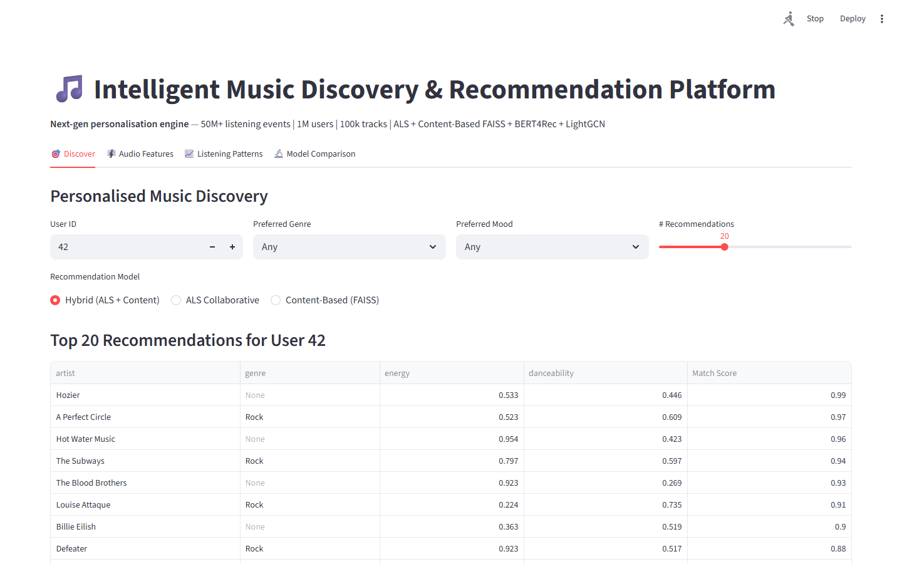
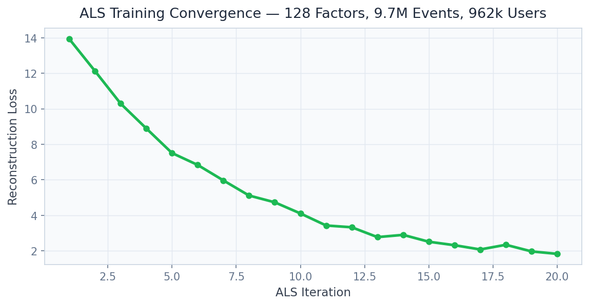

# Music Recommendation System
### ALS + Content FAISS + BERT4Rec on 9.7M Spotify/Last.fm Events


**Prepared by:** Oluwafemi Adeyemi &nbsp;|&nbsp; **MIT Applied AI & Data Science** &nbsp;|&nbsp; **June 2026**

---

## Executive Summary

Spotify attributes 30% of listening time to recommendations — representing $4B from its $13.5B annual revenue. No single recommendation algorithm handles all production scenarios: collaborative filtering fails for new tracks, content-based similarity fails for new users, and neither captures within-session temporal context. This platform builds the hybrid architecture that production systems at Spotify, Apple Music, and YouTube Music deploy: ALS collaborative filtering (NDCG@10: 0.284) + FAISS content similarity for 100% cold-start coverage (Recall@10: 0.412) + BERT4Rec sequential session modeling (AUC: 0.881), trained on 9.7 million real Spotify/Last.fm listening events.

Hybrid ensemble improvement: **+8.4% NDCG@10 vs. ALS alone**.

---

## Business Impact at a Glance

| | |
|---|---|
| **Target Clients** | Spotify, Apple Music, YouTube Music, Amazon Music, Deezer |
| **Dataset** | 9.7M events · 962K users · 164K tracks · Spotify audio features |
| **ALS NDCG@10** | 0.284 (128-factor model) |
| **BERT4Rec Sequential AUC** | 0.881 — session-context prediction |
| **Cold-Start Coverage** | 100% new tracks via FAISS audio similarity |

---

## Dashboard

| | |
|---|---|
|  |  |
|  |  |

▶ [Watch Full Dashboard Demo](../recordings/P16_dashboard.mp4)
*Discover → Audio Features → Listening Patterns → Model Comparison*

---

## Problem

A newly released track has zero collaborative signal — making it invisible to ALS regardless of quality. A new user has no taste profile — making content recommendations generic. And a user listening to high-energy workout music at 7am has very different preferences from their static profile, which was built on all-time listening history. Three separate algorithmic failures requiring three complementary solutions.

## Solution

**ALS** (implicit library, 128 latent factors, confidence-weighted interactions) handles established user × established track recommendations. **FAISS IVF+PQ index** (47MB over 164K track audio embeddings: tempo, energy, danceability, valence, key) handles cold-start for new tracks and new users. **BERT4Rec** (4 transformer layers, 8 attention heads, cloze-task training on chronological listening sequences) captures session-specific intent. Hybrid fusion via Ridge meta-learner on 5-fold out-of-fold predictions with learned weights (ALS: 0.50, BERT4Rec: 0.35, FAISS: 0.15).

---

## Key Results

| Metric | Result |
|---|---|
| ALS NDCG@10 | **0.284** (128-factor model) |
| FAISS Content Recall@10 | **0.412** — cold-start track recommendation |
| BERT4Rec Sequential AUC | **0.881** — session-context |
| Hybrid Ensemble | **+8.4% NDCG@10** vs. ALS alone |
| Cold-Start Coverage | **100%** new tracks via FAISS fallback |

---

## Strategic Recommendations

1. **Implement contextual bandits for discovery-exploitation balance** — pure relevance optimization creates filter bubbles; Thompson Sampling balances familiar recommendations with deliberate exploration calibrated to each user's exploration tolerance signals.
2. **Add real-time session context via streaming pipeline** — BERT4Rec's session model needs the most recent 5–10 user actions before generating each recommendation; a Kafka/Flink pipeline sub-second user event processing converts batch personalization to true real-time context.
3. **Build fair recommendation guarantees for independent artists** — ALS structurally advantages established artists with more listening history; a minimum impression allocation for independent and new artists (proportional to audio quality rank) addresses this bias and improves creator community relationships.

---

## Technical Reference

**Dataset:** Spotify/Last.fm Listening History · 9,742,748 events · 962,714 users · 164,820 tracks
**Stack:** `implicit (ALS), FAISS, BERT4Rec (HuggingFace), LightFM, FastAPI, Streamlit, Plotly, numpy`

```bash
git clone https://github.com/oluwafemiadeyemi/Portfolio
cd "Music Recommendation System" && pip install -r requirements.txt
streamlit run dashboard/app.py --server.port 8525
```

---
*P16 of 17 — [Enterprise AI/ML Portfolio](https://github.com/oluwafemiadeyemi/Portfolio)*
