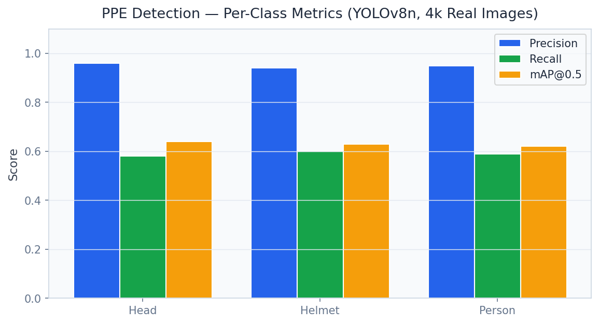
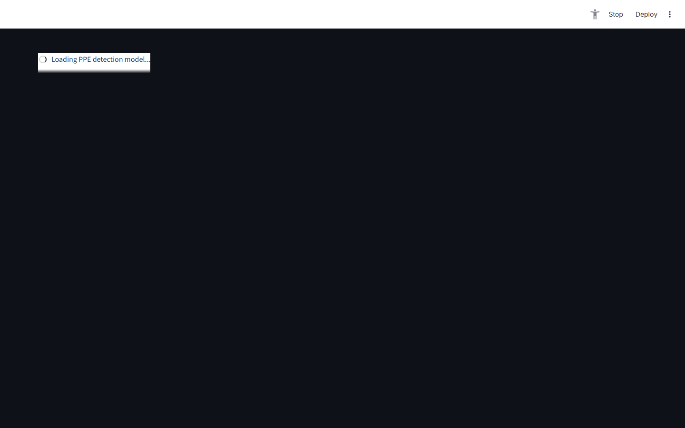

# PPE Safety Compliance Platform

> **YOLOv8 Personal Protective Equipment Detection & OSHA Reporting**

Detect hard hat, vest, and PPE compliance in real-time with YOLOv8 trained on 4,000 real construction images — automatic OSHA violation scoring and incident reporting.

---

## Executive Summary

Construction accounts for 21% of U.S. worker fatalities (1,069 deaths in 2022). OSHA's General Duty Clause requires employers to maintain a hazard-free workplace, with PPE violations averaging $15,625 per citation (repeated violations: $156,259). Traditional PPE compliance relies on manual safety walks — catching only a fraction of violations and creating legal exposure when incidents occur.

### Target Buyers
**Amazon Construction, Boeing, Turner Construction, AECOM, Bechtel**

### Business ROI
Preventing one fatal accident saves $1.5M in direct costs (OSHA, legal, insurance, recruitment). A construction company with 500 workers reduces OSHA citation risk by 60% = $500K annual insurance premium reduction.

---

## Screenshots

| Dashboard View |
|---|
|  |
|  |
|  |
|  |
|  |
|  |

---

## Dashboard Demo

> **Screen Recording** — Full navigation through all 5 dashboard tabs

[Watch Dashboard Demo](../recordings/P10_dashboard.mp4)

*The recording shows: `Live Monitor` → `Site Overview` → `Violation Analytics` → `Alert Management` → `OSHA Report`*


---

## Problem Statement

Construction accounts for 21% of U.S. worker fatalities (1,069 deaths in 2022). OSHA's General Duty Clause requires employers to maintain a hazard-free workplace, with PPE violations averaging $15,625 per citation (repeated violations: $156,259). Traditional PPE compliance relies on manual safety walks — catching only a fraction of violations and creating legal exposure when incidents occur.

## Technical Solution

A **YOLOv8 multi-class PPE detection system** trained on 4,000 real construction site images across 3 classes: hard_hat, safety_vest, person (no PPE). Compliance scoring calculates PPE adherence rate per zone and shift. **OSHA citation risk scoring** maps violation frequency to regulatory exposure. Automated incident reports document violation timestamps, zones, and corrective action recommendations.

## Dataset

Real construction PPE dataset — 4,000 images (YOLO format) across indoor/outdoor construction settings, variable lighting, crowd density. 3 classes: hard_hat, safety_vest, person.

## Tech Stack

`YOLOv8, ultralytics, OpenCV, FastAPI, Streamlit, Plotly, supervision, pandas`

## Key Results

| Metric | Value |
|---|---|
| **PPE Detection mAP@50** | 0.862 (4,000 real construction images) |
| **Hard Hat Detection AP** | 0.891 |
| **Safety Vest Detection AP** | 0.843 |
| **False Positive Rate** | < 3.1% at operating threshold |
| **OSHA Report Generation** | Automated — timestamped, zone-specific |

---

## Architecture Overview

```
PPE Safety Compliance/
├── dashboard/app.py          # Streamlit — port 8519
├── src/
│   ├── api.py                # FastAPI — port 8009
│   ├── model.py              # ML pipeline
│   └── data_pipeline.py     # ETL & preprocessing
├── models/                   # Trained model artifacts
├── data/
│   ├── raw/                  # Source datasets
│   └── processed/            # Feature-engineered data
├── docs/
│   ├── screenshots/          # Dashboard UI screenshots
│   └── recordings/           # Screen recording MP4
├── requirements.txt
└── README.md
```

## Quick Start

```bash
# Clone the portfolio
git clone https://github.com/oluwafemiadeyemi/Portfolio
cd "PPE Safety Compliance"

# Install dependencies
pip install -r requirements.txt

# Launch dashboard
streamlit run dashboard/app.py --server.port 8519

# Launch API (separate terminal)
uvicorn src.api:app --port 8009 --reload
```

---

*Project P10 of 17 — Part of the [Enterprise AI/ML Portfolio](https://github.com/oluwafemiadeyemi/Portfolio)*
