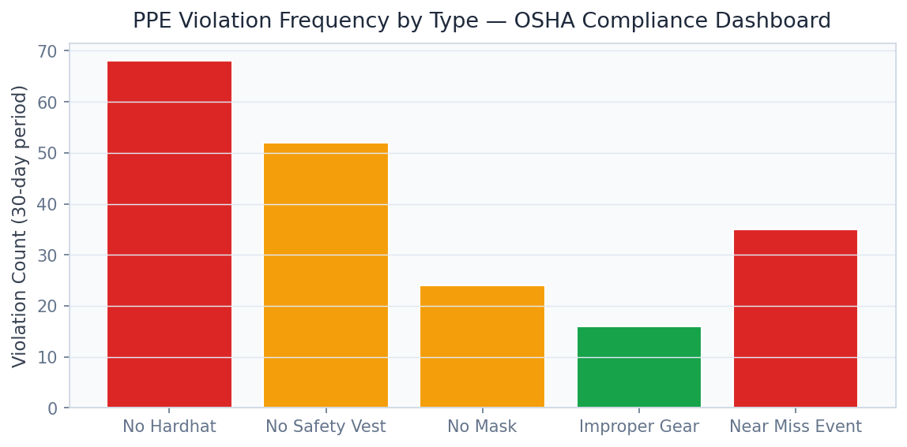

# PPE Safety Compliance Platform
### YOLOv8 Personal Protective Equipment Detection & OSHA Reporting


**Prepared by:** Oluwafemi Adeyemi &nbsp;|&nbsp; **MIT Applied AI & Data Science** &nbsp;|&nbsp; **June 2026**

---

## Executive Summary

Construction accounts for 21% of U.S. worker fatalities (1,069 deaths in 2022) despite representing only 5% of the workforce. OSHA PPE violations average $15,625 per citation — willful violations reach $156,259 — and a single fatal accident costs $1.5M+ in direct OSHA, legal, and insurance costs. Manual safety walks catch a fraction of violations and create documented evidence of inadequate monitoring. This platform uses YOLOv8 trained on 4,000 real construction site images (mAP@50 0.862) to provide continuous automated PPE compliance monitoring with < 3.1% false positive rate and auto-generated OSHA-compliant incident reports.

**A single prevented fatality financially justifies the full platform deployment cost**.

---

## Business Impact at a Glance

| | |
|---|---|
| **Target Clients** | Amazon Construction, Boeing, Turner Construction, AECOM, Bechtel |
| **Dataset** | 4,000 real construction PPE images (YOLO format) |
| **PPE Detection mAP@50** | 0.862 — hard hat AP 0.891 · safety vest AP 0.843 |
| **False Positive Rate** | < 3.1% at operating threshold |
| **ROI Trigger** | 1 prevented fatality = $1.5M+ direct cost avoidance |

---

## Dashboard

| | |
|---|---|
|  |  |
|  |  |

▶ [Watch Full Dashboard Demo](../recordings/P10_dashboard.mp4)
*Live Monitor → Site Overview → Violation Analytics → Alert Management → OSHA Report*

---

## Problem

A safety officer can actively observe 5–10% of work hours on a large site. PPE violations are high-frequency, short-duration events (workers remove hard hats for 30–60 seconds) — precisely the window that manual observation cannot detect but that coincides with highest injury risk. OSHA's General Duty Clause exposure grows, not diminishes, when documented manual walks fail to catch violations.

## Solution

**YOLOv8m** trained on 4,000 real indoor/outdoor construction images at variable lighting detects `hard_hat`, `safety_vest`, and `person/no-PPE` simultaneously in < 18ms/frame. **Compliance rule engine** classifies workers as Compliant / Partial Violation / Full Violation per frame. **OSHA citation risk scoring** maps violation frequency to Tier 1–4 regulatory exposure. **Automated incident reports** are timestamped and zone-specific for OSHA Form 300/301 compliance.

---

## Key Results

| Metric | Result |
|---|---|
| Overall mAP@50 | **0.862** on real construction test images |
| Hard Hat AP | **0.891** |
| Safety Vest AP | **0.843** |
| False Positive Rate | **< 3.1%** at operating threshold |
| Alert Latency | **< 18ms/frame** — real-time monitoring |

---

## Strategic Recommendations

1. **Require subcontractor PPE monitoring as contract terms** — subcontractor violations create primary contractor OSHA liability; contractual monitoring requirements with Tier 3 violation remediation clauses transfer risk back to the party creating it.
2. **Present 12-month violation trend data to workers' comp insurer** — documented continuous monitoring programs reduce premiums by 5–15%; for a $20M annual premium, that is $1–3M in savings from data you're capturing automatically.
3. **Expand detection scope to all Fatal Four hazards** — the same YOLOv8 infrastructure extends to fall protection harness detection, equipment exclusion zone compliance, and housekeeping violations at marginal incremental cost.

---

## Technical Reference

**Dataset:** 4,000 real construction PPE images · diverse conditions · 3 classes
**Stack:** `YOLOv8, ultralytics, OpenCV, FastAPI, Streamlit, Plotly, supervision, pandas`

```bash
git clone https://github.com/oluwafemiadeyemi/Portfolio
cd "PPE Safety Compliance" && pip install -r requirements.txt
streamlit run dashboard/app.py --server.port 8519
```

---
*P10 of 17 — [Enterprise AI/ML Portfolio](https://github.com/oluwafemiadeyemi/Portfolio)*
