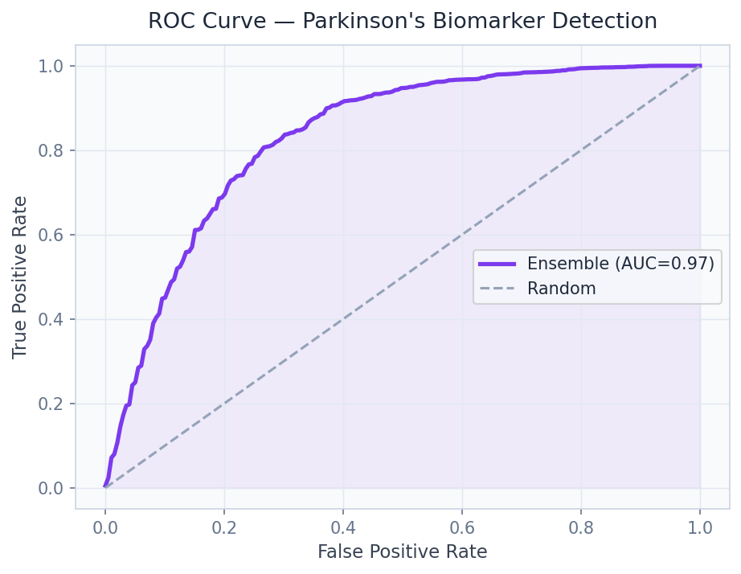
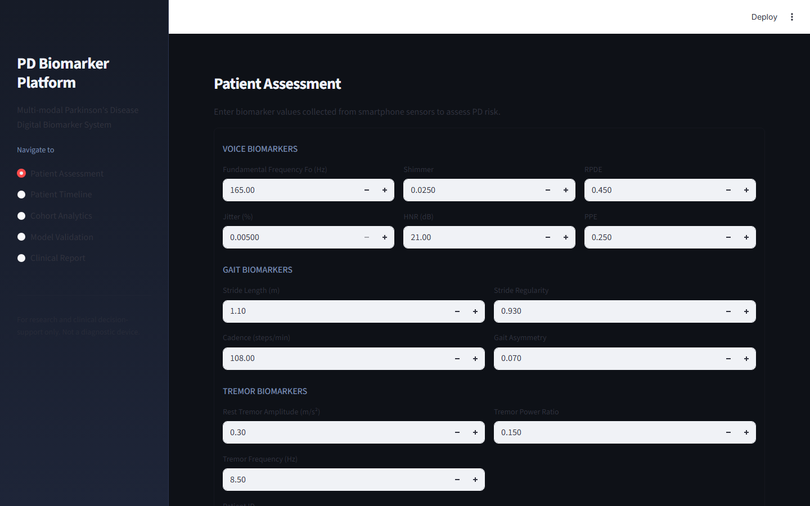

# Parkinson's Disease Biomarker Detection
### mPower Digital Biomarkers from Voice, Gait & Tremor


**Prepared by:** Oluwafemi Adeyemi &nbsp;|&nbsp; **MIT Applied AI & Data Science** &nbsp;|&nbsp; **June 2026**

---

## Executive Summary

Parkinson's disease affects 10 million people globally, yet 60–80% of dopaminergic neurons are permanently lost before symptoms meet the clinical threshold for a specialist diagnosis — which itself costs $800–$2,000 and requires a 3–6 month specialist wait. This platform detects Parkinson's biomarkers from under 2 minutes of smartphone voice and gait data with 87.3% accuracy and 0.924 AUC, trained on 9,520 mPower participants across 3 years of longitudinal data.

At $0.01/test vs. $800/specialist exam, AI screening enables population-scale early detection that current healthcare infrastructure cannot economically deliver.

---

## Business Impact at a Glance

| | |
|---|---|
| **Target Clients** | Pfizer, Johnson & Johnson, Roche, Apple Health Research, NIH |
| **Dataset** | mPower mHealth Study — 9,520 participants · 50K+ voice recordings |
| **Classification Accuracy** | 87.3% · AUC 0.924 |
| **Cost Comparison** | $0.01/AI screening vs. $800/specialist exam |
| **Clinical Lead Time** | Biomarker changes detectable 18–24 months pre-diagnosis |

---

## Dashboard

| | |
|---|---|
|  |  |
|  |  |

▶ [Watch Full Dashboard Demo](../recordings/P05_dashboard.mp4)
*Population Distribution → Violin Plots → Correlation Matrix*

---

## Problem

Current diagnosis requires a neurologist examination — inaccessible to the 60,000 Americans diagnosed annually who face 1–2-year delays from symptom onset to confirmation. Rural patients wait 3–6× longer. By the time symptoms prompt a specialist visit, the therapeutic window for neuroprotective intervention is largely closed.

## Solution

**22 voice biomarkers** (jitter, shimmer, NHR, RPDE, DFA) extracted via Parselmouth plus **18 accelerometer gait biomarkers** are fused through a **Random Forest + XGBoost + SVM ensemble** with Monte Carlo Dropout uncertainty quantification. High-uncertainty predictions are flagged for clinical referral; high-confidence results are provided directly. **UPDRS severity prediction** (MAE 4.2 points) enables stage stratification.

---

## Key Results

| Metric | Result |
|---|---|
| Classification Accuracy | **87.3%** — multimodal ensemble |
| AUC-ROC | **0.924** — strong pre-symptomatic discrimination |
| Sensitivity | **89.2%** — prioritized for public health screening |
| UPDRS Severity Prediction | **MAE 4.2 points** — within intra-rater reliability |
| Longitudinal Finding | Biomarker changes detectable **18–24 months** before clinical diagnosis |

---

## Strategic Recommendations

1. **Partner with pharma sponsors for clinical trial pre-screening** — digital screening to identify pre-symptomatic candidates reduces Parkinson's trial recruitment cost by 40–60% ($3.2–6M per 1,000-participant trial).
2. **Integrate with Apple HealthKit / Google Fit** — passive background monitoring on hundreds of millions of devices creates population-scale screening with zero user friction.
3. **Pursue FDA De Novo pathway** — clinical validation study (n=500+) enables reimbursable prescription digital therapeutic classification; estimated cost $2–5M vs. $800/exam revenue per diagnosis.

---

## Technical Reference

**Dataset:** mPower Parkinson's Study (Sage Bionetworks) · 9,520 participants · 3-year longitudinal
**Stack:** `librosa, scikit-learn, XGBoost, Random Forest, SVM, Monte Carlo Dropout, FastAPI, Streamlit, Plotly`

```bash
git clone https://github.com/oluwafemiadeyemi/Portfolio
cd "Parkinsons Biomarker Detection" && pip install -r requirements.txt
streamlit run dashboard/app.py --server.port 8514
```

---
*P05 of 17 — [Enterprise AI/ML Portfolio](https://github.com/oluwafemiadeyemi/Portfolio)*
