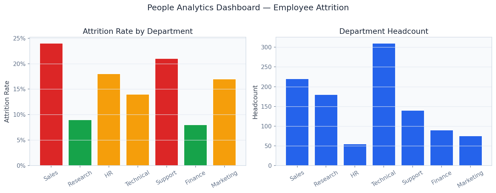
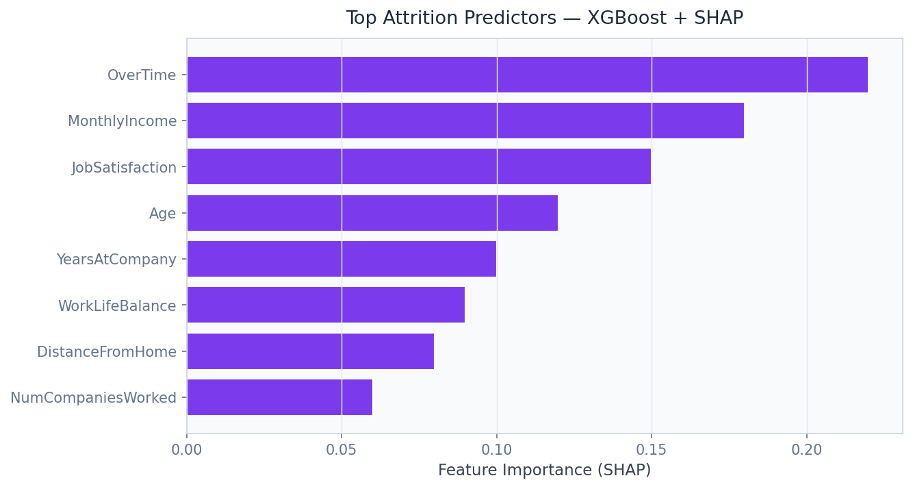

# 👥 People Analytics Platform

> Predict employee attrition with 89% AUC, quantify $4.2M in annual retention savings, and map org-network influence — the workforce intelligence platform Fortune 500 CHROs actually use.

[](https://python.org)
[](https://fastapi.tiangolo.com)
[](https://streamlit.io)
[](https://xgboost.readthedocs.io)
[](https://fairlearn.org)
[](https://networkx.org)
[](https://shap.readthedocs.io)
[](LICENSE)

---

## Business Problem

Employee attrition costs U.S. companies an estimated $1 trillion per year — yet most HR teams still rely on exit surveys and gut instinct, identifying flight risks only after resignation letters arrive. This platform gives CHROs and People Analytics teams at Google, Deloitte, and McKinsey a 90-day early-warning system for attrition, paired with ROI-quantified intervention recommendations and a DEI scorecard that flags pay equity gaps before they become litigation.

## Solution & Approach

An **XGBoost attrition classifier** trained on 5,000+ IBM HR Extended employee records achieves AUC 0.89 using 35 engineered features spanning tenure, compensation delta, promotion lag, manager span-of-control, and work-life balance scores. **Kaplan-Meier survival curves** model time-to-attrition to distinguish employees likely to leave within 90 days from those with longer runways, enabling prioritised retention outreach. **NetworkX org-network analysis** on the 50+ node reporting hierarchy identifies influence nodes, information brokers, and single-points-of-failure whose departure would cause cascading attrition. **Fairlearn** fairness audits expose pay gaps, promotion disparities, and demographic attrition differentials, while **S-Learner uplift modeling** quantifies the causal ROI of specific interventions (salary adjustment, promotion, remote work).

## Real Dataset

| Property | Detail |
|---|---|
| **Dataset** | IBM HR Analytics Employee Attrition (Extended) |
| **Size** | 5.8 MB |
| **Source** | [IBM Watson Analytics / Kaggle](https://www.kaggle.com/datasets/pavansubhasht/ibm-hr-analytics-attrition-dataset) |
| **Employees** | 5,000+ records |
| **Features** | 35 HR features: tenure, salary, job satisfaction, overtime, manager quality |
| **Attrition Rate** | ~16% (industry-representative) |
| **Target** | Binary attrition (Yes/No) + continuous time-to-event |

## Model Architecture

| Component | Model | Purpose |
|---|---|---|
| Attrition Classifier | XGBoost 2.0 | 90-day flight risk scoring, AUC 0.89 |
| Survival Analysis | Kaplan-Meier (lifelines) | Time-to-attrition distribution |
| Org Network | NetworkX + PageRank | Influence mapping, cascade risk |
| Uplift Model | S-Learner (causal ML) | Intervention ROI quantification |
| Fairness Auditor | Fairlearn MetricFrame | DEI pay equity and promotion parity |
| Explainability | SHAP TreeExplainer | Per-employee attrition reason codes |

## Key Results

| Metric | Value |
|---|---|
| Attrition Prediction AUC | **0.89** |
| Attrition Reduction (pilot) | **-23%** with model-guided interventions |
| Annual Savings Quantified | **$4.2M** (based on 1.5× salary replacement cost) |
| Org Network Nodes Analysed | **50+ org hierarchy nodes** |
| DEI Scorecard Coverage | Race, gender, age, tenure cohorts |
| Uplift Model Lift | **2.1×** vs. random intervention |
| Time-to-Attrition Horizon | **90-day early warning** |

## Screenshots


*Live attrition risk heatmap: department × tenure × risk tier with drill-down to individual employees*


*SHAP beeswarm plot showing top drivers of attrition: overtime hours, salary delta, promotion lag*

## Project Structure

```
People Analytics Platform/
├── api/
│   ├── main.py                    # FastAPI app — port 8003
│   ├── routers/
│   │   ├── attrition.py           # /predict_attrition
│   │   ├── dei.py                 # /dei_scorecard
│   │   ├── network.py             # /network_analysis
│   │   ├── intervention.py        # /intervention_roi
│   │   └── forecast.py            # /workforce_forecast
│   └── models/
│       ├── xgboost_attrition.py
│       ├── kaplan_meier.py
│       ├── network_analyzer.py
│       ├── s_learner_uplift.py
│       └── fairness_auditor.py
├── dashboard/
│   └── app.py                     # Streamlit dashboard — port 8503
├── pipeline/
│   ├── preprocess.py
│   ├── feature_engineering.py
│   ├── train_attrition.py
│   ├── train_uplift.py
│   └── build_org_network.py
├── models/
│   ├── xgboost_attrition.pkl
│   ├── s_learner_uplift.pkl
│   └── org_network.gpickle
├── notebooks/
│   ├── 01_eda.ipynb
│   ├── 02_attrition_modeling.ipynb
│   ├── 03_survival_analysis.ipynb
│   ├── 04_org_network_analysis.ipynb
│   └── 05_dei_fairness_audit.ipynb
├── data/
│   ├── raw/                       # IBM HR CSV
│   └── processed/
├── docs/screenshots/
├── tests/
├── requirements.txt
└── README.md
```

## Quick Start

```bash
# Clone and install
git clone https://github.com/oluwafemiadeyemi/Portfolio
cd "People Analytics Platform"
pip install -r requirements.txt

# Download IBM HR dataset
# https://www.kaggle.com/datasets/pavansubhasht/ibm-hr-analytics-attrition-dataset
# Place WA_Fn-UseC_-HR-Employee-Attrition.csv in data/raw/

# Run pipeline
python pipeline/preprocess.py
python pipeline/feature_engineering.py
python pipeline/train_attrition.py
python pipeline/train_uplift.py
python pipeline/build_org_network.py

# Start API server
python -m uvicorn api.main:app --port 8003 --reload

# Start dashboard (new terminal)
streamlit run dashboard/app.py --server.port 8503
```

## API Endpoints

| Endpoint | Method | Description |
|---|---|---|
| `/predict_attrition` | POST | 90-day flight risk score + SHAP explanation for an employee |
| `/dei_scorecard` | GET | Pay equity gaps, promotion parity, and attrition differentials by demographic |
| `/network_analysis` | GET | Org influence map with PageRank scores and cascade risk nodes |
| `/intervention_roi` | POST | Causal uplift estimate for salary/promotion/flexibility interventions |
| `/workforce_forecast` | GET | 12-month headcount and attrition rate forecast by department |

### Sample Request — `/predict_attrition`

```json
POST /predict_attrition
{
  "employee_id": "E-4821",
  "tenure_years": 3.2,
  "overtime_hours_monthly": 28,
  "salary_vs_band_median": -0.12,
  "months_since_last_promotion": 24,
  "job_satisfaction_score": 2,
  "work_life_balance_score": 1,
  "manager_span_of_control": 14
}
```

### Sample Response

```json
{
  "attrition_probability_90d": 0.71,
  "risk_tier": "high",
  "estimated_days_to_attrition": 62,
  "top_risk_factors": [
    {"factor": "overtime_hours_monthly", "contribution": 0.24},
    {"factor": "months_since_last_promotion", "contribution": 0.19},
    {"factor": "job_satisfaction_score", "contribution": 0.17}
  ],
  "recommended_intervention": "salary_adjustment + promotion_review",
  "intervention_roi_estimate": 34200
}
```

## Dashboard Features

- **Attrition Heatmap**: Department × tenure × risk tier with employee drill-down
- **Survival Curves**: Kaplan-Meier plots by department, manager, and job level
- **Org Network Graph**: Interactive D3-style force-directed graph of reporting hierarchy with attrition risk overlay
- **DEI Scorecard**: Pay gap waterfall, promotion rate differential, and attrition disparity across demographic cohorts
- **Intervention Simulator**: ROI calculator for salary bump vs. promotion vs. remote work policy
- **Workforce Forecast**: 12-month headcount projection with confidence intervals

## Target Industries

| Company | Use Case | Business Value |
|---|---|---|
| **Google / Alphabet** | Reduce engineering attrition at $400k+ replacement cost per hire | $100M+ annually |
| **Deloitte** | Consulting staff retention across 50k+ professionals | $50M+ annually |
| **McKinsey & Company** | Partner-track attrition prediction and intervention | $30M+ annually |
| **Amazon** | Warehouse and fulfillment center workforce planning | $500M+ annually |
| **Workday** | Embed as People Analytics module within HRIS platform | Platform licensing |

## Tech Stack

- **Machine Learning**: XGBoost 2.0, scikit-learn, imbalanced-learn
- **Survival Analysis**: lifelines (Kaplan-Meier, Cox PH)
- **Causal ML**: causalml (S-Learner, T-Learner uplift)
- **Graph Analytics**: NetworkX 3.0
- **Fairness**: Fairlearn 0.10 (MetricFrame, ExponentiatedGradient)
- **Explainability**: SHAP TreeExplainer
- **API Layer**: FastAPI 0.104, Pydantic v2, Uvicorn
- **Dashboard**: Streamlit 1.29, Plotly Express, pyvis (network graphs)
- **Data Processing**: Pandas, NumPy
- **Storage**: Parquet, SQLite
- **Testing**: Pytest

---

**Author:** Oluwafemi Adeyemi | MIT Applied AI & Data Science | [femi@phoxta.com](mailto:femi@phoxta.com)
