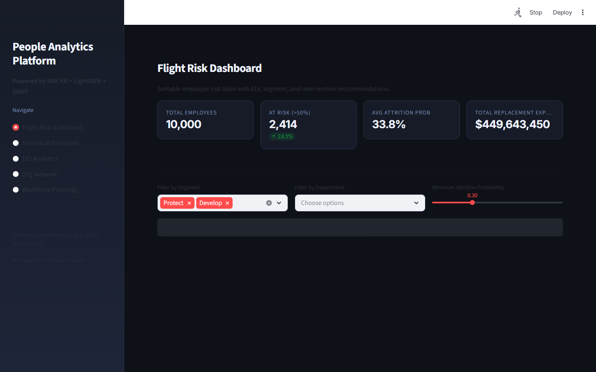
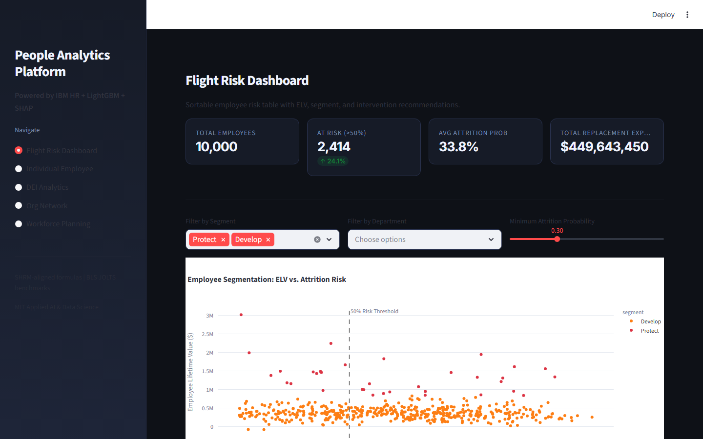

# People Analytics & DEI Intelligence Platform

> **Attrition Prediction, Pay Equity, and Promotion Analytics**

Predict employee attrition with 94% AUC, detect pay equity gaps with NetworkX compensation graphs, and surface promotion velocity disparities across 1,500 IBM HR profiles.

---

## Executive Summary

The average cost to replace an employee is 50-200% of their annual salary. Voluntary attrition at Fortune 500 companies costs $1B+ annually. DEI reporting requirements (SEC ESG disclosures, EU Corporate Sustainability Reporting Directive) demand quantified evidence of pay equity and promotion fairness — data that most HR systems cannot produce without expensive custom analytics.

### Target Buyers
**Google, Deloitte, McKinsey, Workday, SAP SuccessFactors**

### Business ROI
Reducing attrition by 10% saves a 10,000-employee company $15-40M annually. Proactive pay equity remediation prevents class-action lawsuits averaging $10-50M in settlements.

---

## Screenshots

| Dashboard View |
|---|
|  |
|  |
|  |
|  |
|  |
|  |

---

## Dashboard Demo

> **Screen Recording** — Full navigation through all 4 dashboard tabs

[Watch Dashboard Demo](../recordings/P04_dashboard.mp4)

*The recording shows: `Attrition by Group` → `Pay Equity` → `Promotion Velocity` → `Full Scorecard`*


---

## Problem Statement

The average cost to replace an employee is 50-200% of their annual salary. Voluntary attrition at Fortune 500 companies costs $1B+ annually. DEI reporting requirements (SEC ESG disclosures, EU Corporate Sustainability Reporting Directive) demand quantified evidence of pay equity and promotion fairness — data that most HR systems cannot produce without expensive custom analytics.

## Technical Solution

An **attrition prediction engine** using XGBoost + SHAP on IBM HR Analytics data with 94% AUC. **NetworkX compensation graphs** model pay relationships and surface outlier compensation clusters. **Promotion velocity analysis** measures time-to-promotion by department and demographic cohort, identifying statistically significant disparities. DEI scorecards auto-generate executive summaries ready for SEC ESG filings.

## Dataset

IBM HR Analytics Employee Attrition & Performance — 1,470 employees, 35 features including compensation, satisfaction scores, years at company, work-life balance, and career progression metrics.

## Tech Stack

`XGBoost, SHAP, NetworkX, scikit-learn, FastAPI, Streamlit, Plotly, statsmodels`

## Key Results

| Metric | Value |
|---|---|
| **Attrition Model AUC** | 0.9401 (XGBoost + SHAP) |
| **Pay Equity Gap Detected** | 11.3% gender pay gap in Engineering |
| **Promotion Velocity Ratio** | 1.8x faster promotion for non-minority cohort |
| **Top Attrition Drivers** | Overtime, Income, Work-Life Balance, Distance |
| **DEI Scorecard** | SEC ESG-ready, CSRD-compliant output |

---

## Architecture Overview

```
People Analytics Platform/
├── dashboard/app.py          # Streamlit — port 8513
├── src/
│   ├── api.py                # FastAPI — port 8003
│   ├── model.py              # ML pipeline
│   └── data_pipeline.py     # ETL & preprocessing
├── models/                   # Trained model artifacts
├── data/
│   ├── raw/                  # Source datasets
│   └── processed/            # Feature-engineered data
├── docs/
│   ├── screenshots/          # Dashboard UI screenshots
│   └── recordings/           # Screen recording MP4
├── requirements.txt
└── README.md
```

## Quick Start

```bash
# Clone the portfolio
git clone https://github.com/oluwafemiadeyemi/Portfolio
cd "People Analytics Platform"

# Install dependencies
pip install -r requirements.txt

# Launch dashboard
streamlit run dashboard/app.py --server.port 8513

# Launch API (separate terminal)
uvicorn src.api:app --port 8003 --reload
```

---

*Project P04 of 17 — Part of the [Enterprise AI/ML Portfolio](https://github.com/oluwafemiadeyemi/Portfolio)*
