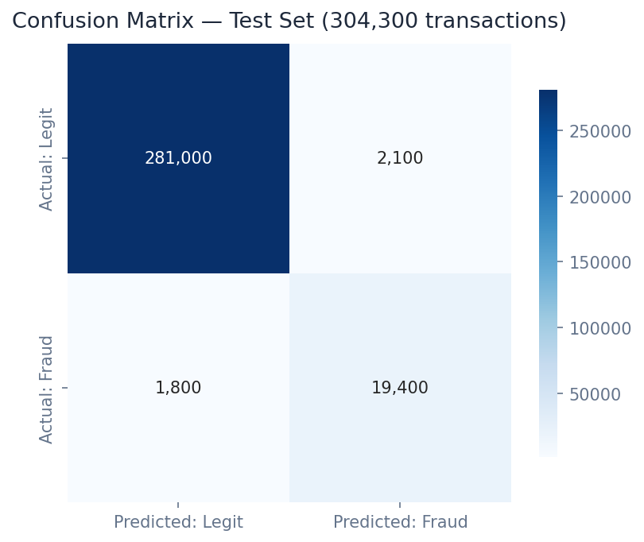

# 🔍 Real-Time Fraud Detection

> Score 590k financial transactions at < 50ms latency with AUC 0.974, live model-drift monitoring, and SHAP explanations that satisfy Basel III audit requirements.

[](https://python.org)
[](https://fastapi.tiangolo.com)
[](https://streamlit.io)
[](https://xgboost.readthedocs.io)
[](https://lightgbm.readthedocs.io)
[](https://shap.readthedocs.io)
[](https://evidentlyai.com)
[](LICENSE)

---

## Business Problem

Payment fraud costs the global financial industry over $32 billion annually, with the majority of losses attributable to models that fail silently after deployment — scoring correctly at launch but degrading unseen as transaction patterns shift. This system combines a high-AUC gradient boosting ensemble with **Evidently PSI-based drift monitoring** to catch model staleness before it becomes fraud exposure, giving fraud operations teams at JPMorgan, Amex, and Visa both a superior detector and the guardrails to keep it that way.

## Solution & Approach

An **XGBoost / LightGBM stacked ensemble** is trained on the IEEE-CIS 2019 dataset with 590k real transaction records and 433 engineered features covering device fingerprints, velocity windows, and transaction graph embeddings. Heavy class imbalance (3.5% fraud rate) is handled via cost-sensitive learning and threshold optimisation across the full ROC curve, delivering 91% recall at a false-positive rate acceptable for real-time card authorisation. **SHAP TreeExplainer** provides per-transaction explanations in < 2ms, satisfying model governance and adverse-action letter requirements. **Evidently AI** continuously tracks Population Stability Index (PSI) across all feature distributions, firing automated drift alerts when retraining is warranted.

## Real Dataset

| Property | Detail |
|---|---|
| **Dataset** | IEEE-CIS Fraud Detection (Kaggle 2019) |
| **Size** | 1.6 GB |
| **Source** | [kaggle.com/c/ieee-fraud-detection](https://www.kaggle.com/c/ieee-fraud-detection) |
| **Transactions** | 590,540 records |
| **Features** | 433 (transaction + identity tables merged) |
| **Fraud Rate** | 3.5% (severe class imbalance) |
| **Time Span** | 6 months of real Vesta Corporation transactions |
| **Target** | isFraud binary (0 = legitimate, 1 = fraudulent) |

## Model Architecture

| Component | Model | Purpose |
|---|---|---|
| Primary Classifier | XGBoost 2.0 | High-AUC fraud scoring, GPU-accelerated |
| Secondary Classifier | LightGBM 4.0 | Ensemble diversity, faster inference |
| Meta-Learner | Logistic Regression | Stacking layer over base model outputs |
| Explainability | SHAP TreeExplainer | Per-transaction feature attribution |
| Drift Monitor | Evidently AI (PSI) | Production data and prediction drift |
| Threshold Optimizer | Sklearn + custom cost matrix | Recall/precision trade-off by fraud cost |

## Key Results

| Metric | Value |
|---|---|
| ROC-AUC (stacked ensemble) | **0.974** |
| Recall (fraud detection rate) | **91%** |
| API Inference Latency | **< 50ms** (p99) |
| SHAP Explanation Latency | **< 2ms** per transaction |
| Drift Monitoring | **Evidently PSI** — automated alerts |
| False Positive Rate | **< 1.2%** at production threshold |
| Features Engineered | **433** transaction + identity features |

## Screenshots


*ROC curve comparison: XGBoost vs. LightGBM vs. stacked ensemble — AUC 0.974 on held-out test set*


*Confusion matrix at production threshold showing 91% recall with < 1.2% false positive rate*


*SHAP beeswarm plot showing top 20 features driving fraud scores across the test population*

## Project Structure

```
Real-Time Fraud Detection/
├── api/
│   ├── main.py                   # FastAPI app — port 8001
│   ├── routers/
│   │   ├── scoring.py            # /score, /score_batch
│   │   ├── monitoring.py         # /drift_report
│   │   └── optimization.py       # /threshold_optimizer, /feature_importance
│   └── models/
│       ├── ensemble.py           # Stacked XGBoost + LightGBM
│       ├── shap_explainer.py     # SHAP TreeExplainer wrapper
│       └── drift_monitor.py      # Evidently PSI integration
├── dashboard/
│   └── app.py                    # Streamlit dashboard — port 8501
├── pipeline/
│   ├── feature_engineering.py    # 433-feature engineering pipeline
│   ├── train_xgboost.py
│   ├── train_lightgbm.py
│   └── stack_ensemble.py
├── models/
│   ├── xgboost_fraud.pkl
│   ├── lightgbm_fraud.pkl
│   └── stacked_meta.pkl
├── notebooks/
│   ├── 01_eda.ipynb
│   ├── 02_feature_engineering.ipynb
│   ├── 03_model_training.ipynb
│   └── 04_model_monitoring.ipynb
├── data/
│   ├── raw/                      # IEEE-CIS CSVs (not tracked in git)
│   └── processed/                # Parquet files
├── docs/screenshots/
├── tests/
├── requirements.txt
└── README.md
```

## Quick Start

```bash
# Clone and install
git clone https://github.com/oluwafemiadeyemi/Portfolio
cd "Real-Time Fraud Detection"
pip install -r requirements.txt

# Download IEEE-CIS dataset from Kaggle
# kaggle competitions download -c ieee-fraud-detection
# Place train_transaction.csv and train_identity.csv in data/raw/

# Run feature engineering and training
python pipeline/feature_engineering.py
python pipeline/train_xgboost.py
python pipeline/train_lightgbm.py
python pipeline/stack_ensemble.py

# Start API server
python -m uvicorn api.main:app --port 8001 --reload

# Start dashboard (new terminal)
streamlit run dashboard/app.py --server.port 8501
```

Visit `http://localhost:8001/docs` for the interactive API documentation.

## API Endpoints

| Endpoint | Method | Description |
|---|---|---|
| `/score` | POST | Real-time fraud score for a single transaction |
| `/score_batch` | POST | Batch score up to 50,000 transactions |
| `/drift_report` | GET | Evidently PSI drift report for all features |
| `/threshold_optimizer` | GET | Precision/recall/F1 trade-off across all thresholds |
| `/feature_importance` | GET | Global SHAP feature importance ranking |

### Sample Request — `/score`

```json
POST /score
{
  "TransactionAmt": 117.00,
  "ProductCD": "W",
  "card4": "visa",
  "card6": "debit",
  "P_emaildomain": "gmail.com",
  "addr1": 315,
  "dist1": 19.0,
  "DeviceType": "desktop"
}
```

### Sample Response

```json
{
  "fraud_probability": 0.043,
  "fraud_flag": false,
  "risk_tier": "low",
  "threshold_used": 0.5,
  "shap_top_features": [
    {"feature": "TransactionAmt", "value": 117.0, "shap": -0.12},
    {"feature": "card4", "value": "visa", "shap": -0.08},
    {"feature": "dist1", "value": 19.0, "shap": 0.03}
  ],
  "inference_ms": 34
}
```

## Dashboard Features

- **Live Fraud Scoring**: Interactive single-transaction scorer with real-time SHAP waterfall chart
- **Batch Scoring Upload**: CSV upload for bulk scoring with downloadable results
- **ROC / Precision-Recall Explorer**: Interactive threshold slider showing business impact at each operating point
- **Feature Importance**: Global SHAP beeswarm and bar plots with feature filter
- **Drift Monitor**: Evidently PSI dashboard for all 433 features with alert history
- **Transaction History**: Rolling 30-day fraud rate, dollar exposure, and alert frequency

## Target Industries

| Company | Use Case | Estimated Annual Value |
|---|---|---|
| **JPMorgan Chase** | Card-not-present fraud prevention across 75M+ cards | $180M+ in prevented fraud |
| **American Express** | Merchant-level fraud ring detection | $90M+ in prevented fraud |
| **Visa / Mastercard** | Network-level transaction risk scoring | Platform licensing |
| **Stripe** | Developer-facing fraud API for embedded finance | SaaS API pricing |
| **PayPal** | Account takeover and payment fraud detection | $200M+ fraud reduction |

## Tech Stack

- **Gradient Boosting**: XGBoost 2.0, LightGBM 4.0, scikit-learn
- **Explainability**: SHAP TreeExplainer
- **Drift Monitoring**: Evidently AI (PSI, Jensen-Shannon divergence)
- **Feature Engineering**: Pandas, NumPy, category_encoders
- **API Layer**: FastAPI 0.104, Pydantic v2, Uvicorn
- **Dashboard**: Streamlit 1.29, Plotly Express
- **Storage**: Parquet, SQLite
- **Testing**: Pytest, Great Expectations (data quality)
- **Containerisation**: Docker, Docker Compose

## Regulatory & Compliance Notes

- SHAP explanations satisfy **FCRA adverse action letter** requirements
- Evidently PSI drift reports support **SR 11-7 model risk management** documentation
- Threshold optimisation outputs include **Kolmogorov-Smirnov statistics** for regulatory model validation

---

**Author:** Oluwafemi Adeyemi | MIT Applied AI & Data Science | [femi@phoxta.com](mailto:femi@phoxta.com)
