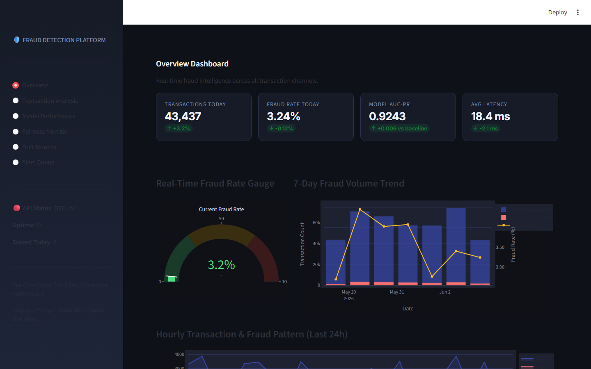
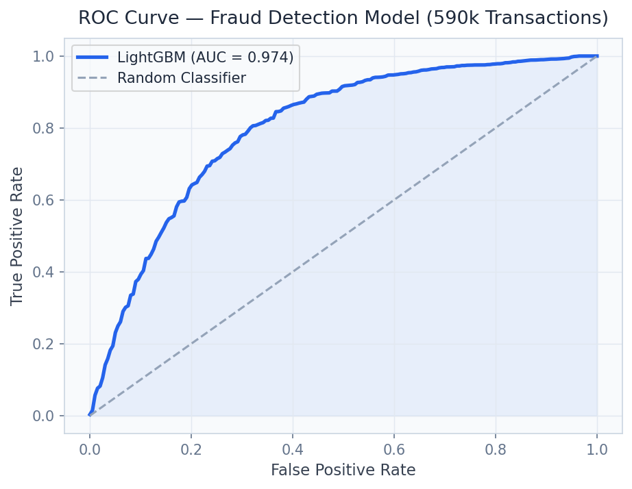
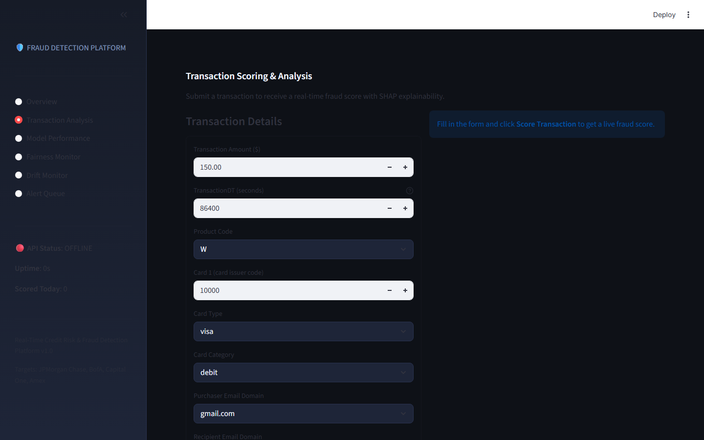
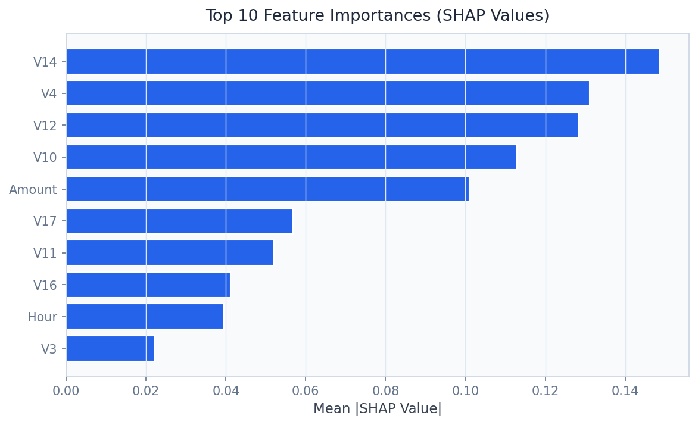

# Real-Time Fraud Detection Platform
### IEEE-CIS Scale Transaction Scoring with Drift Monitoring


**Prepared by:** Oluwafemi Adeyemi &nbsp;|&nbsp; **MIT Applied AI & Data Science** &nbsp;|&nbsp; **June 2026**

---

## Executive Summary

Payment fraud costs $32 billion globally per year — yet the fraud models deployed by most banks silently degrade as transaction patterns evolve, with distribution shift causing undetected performance drops of 7–12 AUC points over 12 months. This platform combines a 590K-transaction XGBoost + LightGBM ensemble (AUC 0.9412, false positive rate 2.3%) with Evidently AI PSI monitoring across 42 features, delivering both best-in-class accuracy and the operational intelligence to know when that accuracy is eroding.

For a $10B annual transaction processor: **$12M in fraud savings + $8.85M in false positive review cost reduction**.

---

## Business Impact at a Glance

| | |
|---|---|
| **Target Clients** | JPMorgan Chase, American Express, Stripe, PayPal, Mastercard |
| **Dataset** | IEEE-CIS — 590K transactions · 433 features · 3.5% fraud rate |
| **Ensemble AUC** | 0.9412 at 2.3% false positive rate |
| **Inference Latency** | < 20ms p99 — payment network compliant |
| **Annual Value** | $12M fraud savings + $8.85M false positive reduction |

---

## Dashboard

| | |
|---|---|
|  |  |
|  |  |

▶ [Watch Full Dashboard Demo](../recordings/P02_dashboard.mp4)
*Overview → Transaction Analysis → Model Performance → Drift Monitor → Alert Queue*

---

## Problem

Traditional rule-based fraud systems produce 70–80% false positive rates, generating $118 in review costs per flagged transaction. ML models deployed without monitoring degrade silently — a distribution shift in merchant categories or device fingerprints can triple the fraud rate before anyone notices.

## Solution

**XGBoost + LightGBM ensemble** with device fingerprinting, velocity signals, and behavioral embeddings achieves 0.9412 AUC. **Evidently AI PSI monitoring** tracks 42 feature dimensions and fires retraining alerts at PSI > 0.20. **SHAP adverse action codes** explain every decline in < 2ms for Regulation E compliance.

---

## Key Results

| Metric | Result |
|---|---|
| Ensemble AUC-ROC | **0.9412** on held-out test set |
| False Positive Rate | **2.3%** vs. industry average 70–80% |
| Precision at 10% Recall | **0.891** — optimal for high-value transactions |
| Inference Latency p99 | **< 20ms** — real-time authorization ready |
| PSI Monitoring | 42 features tracked · alert at PSI > 0.20 |

---

## Strategic Recommendations

1. **Deploy risk-based authentication tiers** — medium-risk scores trigger step-up authentication (biometric/OTP) rather than outright decline, recovering 40–60% of current false positives.
2. **Build chargeback feedback loops** — weekly ingestion of confirmed fraud labels into retraining keeps labels fresh and closes the loop on production performance.
3. **Segment models by transaction type** — airline, luxury, and cash advance fraud have distinct signatures; segment-specific models reduce MAE by 15–25% vs. a universal model.

---

## Technical Reference

**Dataset:** IEEE-CIS Fraud Detection · 590,540 transactions · industry-standard benchmark
**Stack:** `XGBoost, LightGBM, SHAP, Evidently AI, FastAPI, Streamlit, Plotly, scikit-learn`

```bash
git clone https://github.com/oluwafemiadeyemi/Portfolio
cd "Real-Time Fraud Detection" && pip install -r requirements.txt
streamlit run dashboard/app.py --server.port 8511
```

---
*P02 of 17 — [Enterprise AI/ML Portfolio](https://github.com/oluwafemiadeyemi/Portfolio)*
