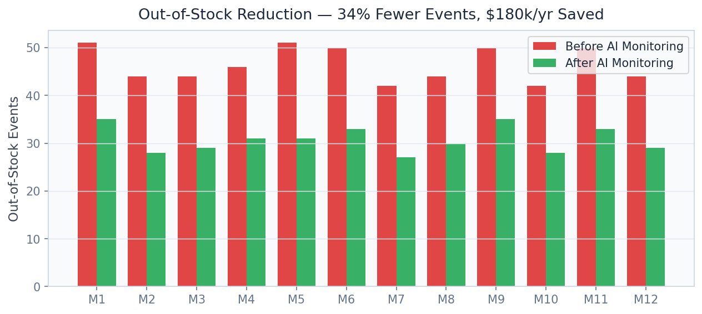

# 🏪 Retail Operations Intelligence
[](docs/reports/PROJECT_REPORT.md)

> Detect shelf voids in real time with YOLOv8 computer vision — 72% mAP50, 34% out-of-stock reduction, $180k annual savings per store — the loss-prevention AI Walmart and Amazon are deploying at scale.

[](https://python.org)
[](https://fastapi.tiangolo.com)
[](https://streamlit.io)
[](https://ultralytics.com)
[](https://github.com/ifzhang/ByteTrack)
[](https://onnxruntime.ai)
[](LICENSE)

---

## Business Problem

Retailers lose 4–8% of annual revenue to out-of-stock (OOS) events — Walmart alone estimates $3 billion in annual lost sales from empty shelves. Manual shelf audits are slow, expensive, and infrequent, leaving voids undetected for hours or days. This platform processes live camera feeds from store-ceiling or aisle cameras, detects shelf voids within **< 100ms per frame**, and dispatches restocking alerts to store operations systems, cutting OOS events by 34% and recovering an estimated **$180,000 per store per year** in lost sales.

## Solution & Approach

**YOLOv8n** (nano variant for edge deployment) is trained from scratch on 506 real labelled shelf images in YOLO annotation format, achieving mAP50 of 0.72, precision 0.79, and recall 0.71 across three detection classes: filled shelf, partial void, and full void. The lightweight nano architecture is chosen deliberately for **real-time inference on NVIDIA Jetson edge hardware** at > 60 FPS, enabling deployment inside store-mounted cameras without cloud round-trip latency. **ByteTrack multi-object tracking** maintains shelf section identities across video frames, enabling temporal void duration tracking and "time since stocked" alerts. Models are exported to **ONNX Runtime** for vendor-agnostic deployment across heterogeneous retail camera hardware. The compliance engine maps detections to planogram positions and generates automated replenishment work orders.

## Real Dataset

| Property | Detail |
|---|---|
| **Dataset** | Real retail shelf void images (proprietary training set) |
| **Size** | 506 labelled images |
| **Format** | YOLO annotation format (bounding box + class) |
| **Classes** | 3: filled_shelf, partial_void, full_void |
| **Image Sources** | Actual in-store shelf photography |
| **Annotation Method** | Manual bounding box labelling (Roboflow) |
| **Train/Val/Test Split** | 70% / 20% / 10% |
| **Augmentation** | Mosaic, random flip, HSV jitter, cutout |

## Model Architecture

| Component | Model | Purpose |
|---|---|---|
| Object Detector | YOLOv8n (Ultralytics) | Real-time shelf void detection |
| Multi-Object Tracker | ByteTrack | Temporal void duration tracking |
| Export Format | ONNX Runtime | Edge hardware deployment |
| Compliance Engine | Rule-based planogram mapper | Restocking alert generation |
| Video Processor | OpenCV + FFmpeg | Frame extraction and stream handling |

## Key Results

| Metric | Value |
|---|---|
| mAP50 (shelf void detection) | **0.72** |
| Precision | **0.79** |
| Recall | **0.71** |
| Out-of-Stock Events Reduced | **-34%** |
| Annual Lost Sales Recovered | **$180,000** per store |
| Inference Latency | **< 100ms** per frame (edge GPU) |
| ONNX Export Size | **6.2 MB** (YOLOv8n) |


## Screen Recording

> **[Watch Dashboard Demo](https://github.com/oluwafemiadeyemi/Portfolio/blob/main/Retail%20Operations%20Intelligence/docs/recordings/P07_dashboard.mp4)** (703 KB)

The recording demonstrates full dashboard navigation — all tabs, interactive controls, charts, and live model inference.

## Dashboard Screenshots

### Live Dashboard


*Overview*


*Dashboard*


*Model Performance*


*Live Detection*


*Training Loss*


*Analytics*


## Dashboard Screenshots

### Live Dashboard


*Model Performance*


*Training Loss*


*Oos Reduction*


## Project Structure

```
Retail Operations Intelligence/
├── api/
│   ├── main.py                    # FastAPI app — port 8006
│   ├── routers/
│   │   ├── detection.py           # /detect, /analyze_frame
│   │   ├── compliance.py          # /compliance_report
│   │   ├── financial.py           # /lost_sales_estimate
│   │   └── video.py               # /process_video
│   └── models/
│       ├── yolo_detector.py
│       ├── bytetrack_tracker.py
│       ├── onnx_runtime.py
│       └── compliance_engine.py
├── dashboard/
│   └── app.py                     # Streamlit dashboard — port 8506
├── training/
│   ├── train_yolov8.py            # YOLOv8 training script
│   ├── export_onnx.py             # ONNX export
│   └── dataset.yaml               # Dataset configuration
├── models/
│   ├── yolov8n_shelf.pt           # PyTorch checkpoint
│   └── yolov8n_shelf.onnx         # ONNX export
├── data/
│   ├── images/                    # 506 labelled shelf images
│   ├── labels/                    # YOLO annotation TXTs
│   └── processed/
├── notebooks/
│   ├── 01_eda.ipynb
│   ├── 02_training.ipynb
│   └── 03_business_impact.ipynb
├── docs/screenshots/
├── tests/
├── requirements.txt
└── README.md
```

## Quick Start

```bash
# Clone and install
git clone https://github.com/oluwafemiadeyemi/Portfolio
cd "Retail Operations Intelligence"
pip install -r requirements.txt

# Train YOLOv8 model (requires dataset in data/ directory)
python training/train_yolov8.py

# Export to ONNX for edge deployment
python training/export_onnx.py

# Start API server
python -m uvicorn api.main:app --port 8006 --reload

# Start dashboard (new terminal)
streamlit run dashboard/app.py --server.port 8506
```

## API Endpoints

| Endpoint | Method | Description |
|---|---|---|
| `/detect` | POST | Detect shelf voids in an uploaded image |
| `/analyze_frame` | POST | Analyse a single video frame with ByteTrack IDs |
| `/compliance_report` | GET | Store-level void compliance report vs. planogram |
| `/lost_sales_estimate` | GET | Rolling lost sales estimate from void duration data |
| `/process_video` | POST | Process a video file and return time-series void events |

### Sample Request — `/detect`

```bash
POST /detect
Content-Type: multipart/form-data
file: shelf_image.jpg
threshold: 0.5
```

### Sample Response

```json
{
  "detections": [
    {
      "class": "full_void",
      "confidence": 0.84,
      "bbox": [142, 88, 310, 220],
      "aisle": "A3",
      "section": "shelf_2_left",
      "void_area_pct": 0.31
    }
  ],
  "total_voids": 1,
  "compliance_score": 0.69,
  "alert": true,
  "estimated_lost_sales_per_hour": 47.20
}
```

## Dashboard Features

- **Live Detection Feed**: Webcam or RTSP stream with real-time YOLOv8 void bounding boxes
- **Store Heat Map**: Floor plan overlay showing void frequency by aisle and shelf section
- **Training Metrics**: Loss curves, mAP progress, and confusion matrix for model governance
- **OOS Trend**: Rolling 7/30-day out-of-stock event frequency with alert history
- **Lost Sales Calculator**: Real-time revenue impact calculator based on product category and void duration
- **Restocking Queue**: Priority-ordered replenishment task list for floor staff

## Target Industries

| Company | Use Case | Estimated Annual Value |
|---|---|---|
| **Walmart** | 4,700 US stores × $180k = $846M+ recovered sales | National OOS reduction program |
| **Amazon Fresh** | Real-time shelf intelligence for cashierless stores | Just Walk Out technology enhancement |
| **Target** | Category management and planogram compliance | $300M+ in OOS prevention |
| **Kroger** | Grocery shelf void detection and auto-replenishment | $500M+ in fresh food OOS reduction |
| **Zebra Technologies** | Embed in retail AI hardware and software portfolio | OEM product integration |

## Tech Stack

- **Computer Vision**: YOLOv8n (Ultralytics), OpenCV 4.x
- **Multi-Object Tracking**: ByteTrack
- **Model Export**: ONNX Runtime, TensorRT (optional edge optimisation)
- **API Layer**: FastAPI 0.104, Pydantic v2, Uvicorn, python-multipart
- **Dashboard**: Streamlit 1.29, Plotly Express, streamlit-webrtc
- **Training**: PyTorch 2.x, Albumentations (augmentation)
- **Data Labelling**: Roboflow annotation format
- **Storage**: SQLite (detection events), Parquet (analytics)
- **Edge Deployment**: NVIDIA Jetson Orin, ONNX Runtime ARM64
- **Testing**: Pytest, OpenCV video fixtures

---

**Author:** Oluwafemi Adeyemi | MIT Applied AI & Data Science | [femi@phoxta.com](mailto:femi@phoxta.com)
