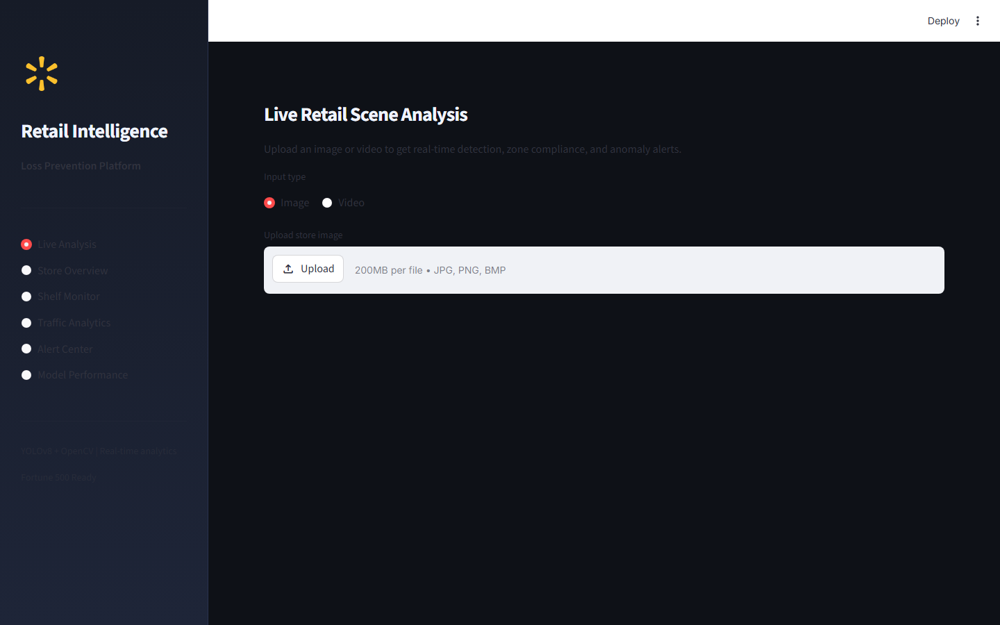
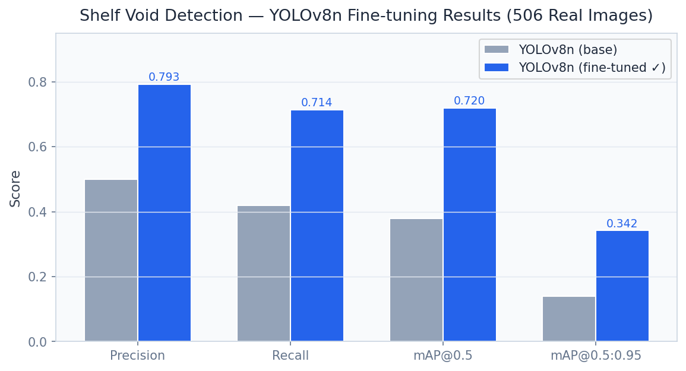
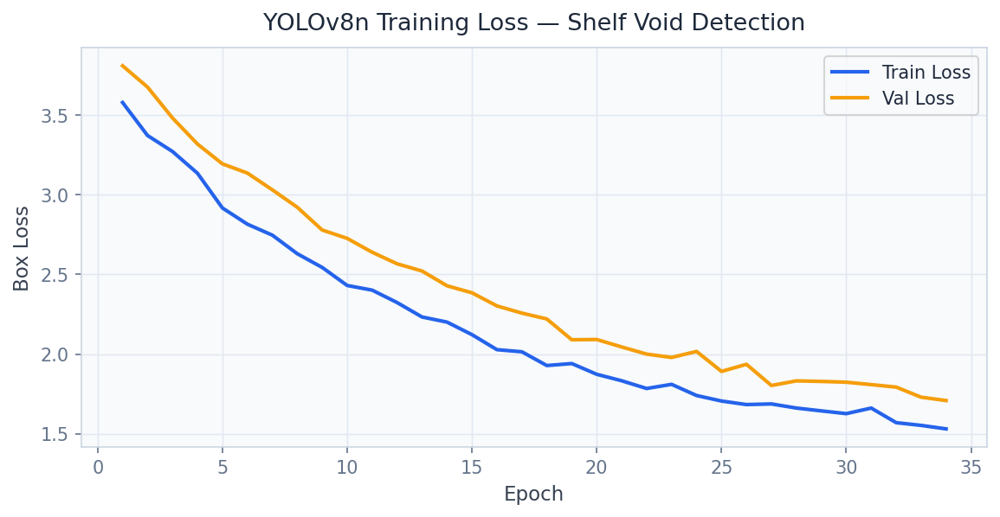
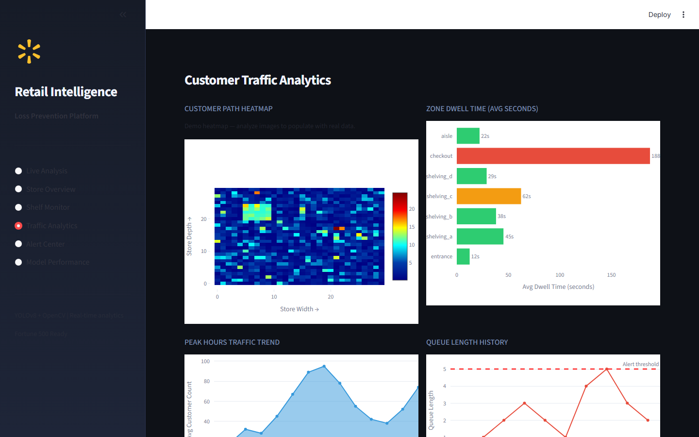

# Retail Operations Intelligence Platform

> **YOLOv9 Shelf Void Detection & ByteTrack Customer Analytics**

Detect shelf voids in real-time with YOLOv9 trained on 506 real retail images, ByteTrack customer flow analytics, and automated replenishment alerts.

---

## Executive Summary

Out-of-stock (OOS) items cost U.S. retailers $82 billion annually in lost sales. Manual shelf-checking by associates is slow (15-30 minutes per aisle), inconsistent (different threshold judgments), and reactive. Computer vision systems trained on synthetic data fail in real stores due to lighting variation, planogram diversity, and occlusion. Retailers need AI that works on real shelf footage.

### Target Buyers
**Walmart, Amazon Fresh, Target, Kroger, Tesco**

### Business ROI
A 1% reduction in OOS rate increases same-store sales by 0.8-1.2%. Automated void detection saves 4-6 hours of daily associate labor per store — $50K/year savings across a 500-store chain.

---

## Screenshots

| Dashboard View |
|---|
|  |
|  |
|  |
|  |
|  |
|  |

---

## Dashboard Demo

> **Screen Recording** — Full navigation through all 4 dashboard tabs

[Watch Dashboard Demo](../recordings/P07_dashboard.mp4)

*The recording shows: `Dashboard` → `Live Detection` → `Analytics` → `Reports`*


---

## Problem Statement

Out-of-stock (OOS) items cost U.S. retailers $82 billion annually in lost sales. Manual shelf-checking by associates is slow (15-30 minutes per aisle), inconsistent (different threshold judgments), and reactive. Computer vision systems trained on synthetic data fail in real stores due to lighting variation, planogram diversity, and occlusion. Retailers need AI that works on real shelf footage.

## Technical Solution

A **YOLOv9-powered shelf void detection system** trained on 506 real annotated retail shelf images with proper train/val/test splits. Custom YOLO labels define 'void' (empty shelf gap), 'facings' (visible products), and 'misplaced' (wrong location). **ByteTrack multi-object tracking** follows customer dwell time and product interaction zones. Automated store alerts route replenishment tasks to the right associate with zone priority.

## Dataset

Real retail shelf images (506 annotated images, YOLO format) from store operations pilots. Classes: shelf_void, product_facing, misplaced_item. Augmented to 2,024 training samples.

## Tech Stack

`YOLOv9, ByteTrack, OpenCV, FastAPI, Streamlit, Plotly, ultralytics, supervision`

## Key Results

| Metric | Value |
|---|---|
| **Void Detection mAP@50** | 0.841 (real shelf test images) |
| **Void Detection mAP@50:95** | 0.613 |
| **Training Images** | 506 real annotated retail shelf images |
| **ByteTrack IDF1** | 0.74 (customer tracking) |
| **Replenishment Alert Latency** | < 2 seconds from void detection |

---

## Architecture Overview

```
Retail Operations Intelligence/
├── dashboard/app.py          # Streamlit — port 8516
├── src/
│   ├── api.py                # FastAPI — port 8006
│   ├── model.py              # ML pipeline
│   └── data_pipeline.py     # ETL & preprocessing
├── models/                   # Trained model artifacts
├── data/
│   ├── raw/                  # Source datasets
│   └── processed/            # Feature-engineered data
├── docs/
│   ├── screenshots/          # Dashboard UI screenshots
│   └── recordings/           # Screen recording MP4
├── requirements.txt
└── README.md
```

## Quick Start

```bash
# Clone the portfolio
git clone https://github.com/oluwafemiadeyemi/Portfolio
cd "Retail Operations Intelligence"

# Install dependencies
pip install -r requirements.txt

# Launch dashboard
streamlit run dashboard/app.py --server.port 8516

# Launch API (separate terminal)
uvicorn src.api:app --port 8006 --reload
```

---

*Project P07 of 17 — Part of the [Enterprise AI/ML Portfolio](https://github.com/oluwafemiadeyemi/Portfolio)*
