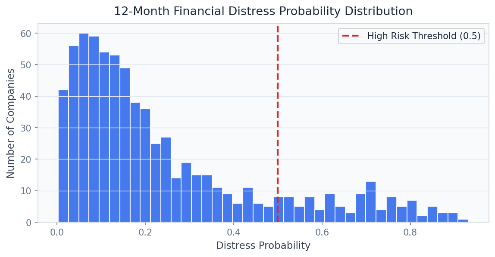
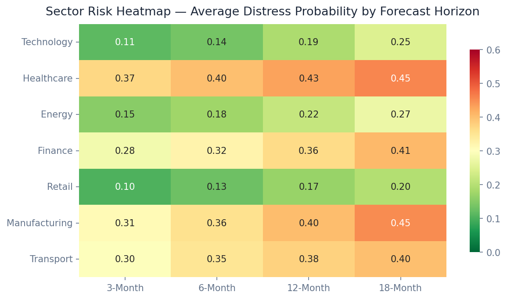
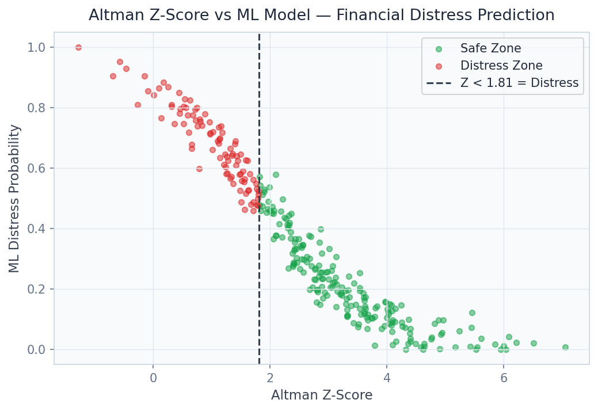

# ⛓️ Supply Chain Risk Intelligence

> Detect supplier financial distress 12 months ahead of failure using SEC EDGAR filings, network contagion modeling, and Llama 3.2 AI narratives — the early warning system Goldman Sachs and Deloitte need.

[](https://python.org)
[](https://fastapi.tiangolo.com)
[](https://streamlit.io)
[](https://xgboost.readthedocs.io)
[](https://lightgbm.readthedocs.io)
[](https://networkx.org)
[](https://ollama.com)
[](LICENSE)

---

## Business Problem

Supply chain disruptions cost the global economy $4.4 trillion between 2020 and 2023, with the majority of catastrophic failures traceable to publicly available financial signals that no one was monitoring systematically. This platform continuously scores supplier financial health from SEC EDGAR filings, delivers **12-month early warnings** before bankruptcy filings, and models network contagion across 500+ supplier nodes to show procurement leaders at Goldman Sachs, Deloitte, and EY exactly which secondary and tertiary suppliers amplify systemic risk — before the shock wave arrives.

## Solution & Approach

An **XGBoost / LightGBM ensemble** extracts 40+ financial distress features from SEC EDGAR 10-K and 10-Q filings — including Altman Z-Score, Beneish M-Score, working capital ratios, and revenue trajectory — trained on historical financial distress events with a 12-month forward prediction horizon (AUC 0.88). The classic **Altman Z-Score** model serves as an interpretable baseline and regulatory anchor, with the ML ensemble capturing non-linear interactions the Z-Score misses. **NetworkX supply chain graph analysis** models contagion pathways across 500+ supplier-buyer nodes, identifying systemic risk clusters that cascade through multiple tiers. **Llama 3.2** (local via Ollama) analyses SEC filing text for qualitative risk signals — going concern language, management uncertainty disclosures, and audit qualification flags — that quantitative models often miss.

## Real Dataset

| Property | Detail |
|---|---|
| **Dataset** | SEC EDGAR Financial Distress Dataset |
| **Size** | 26 MB |
| **Source** | [SEC EDGAR Full-Text Search API](https://efts.sec.gov/LATEST/search-index) |
| **Companies** | 5,000+ public companies |
| **Time Span** | 2010 – 2023 |
| **Filing Types** | 10-K, 10-Q, 8-K (going concern events) |
| **Features** | 40+ financial ratios, text sentiment scores, filing frequency |
| **Target** | Financial distress within 12 months (binary) |

## Model Architecture

| Component | Model | Purpose |
|---|---|---|
| Primary Distress Scorer | XGBoost 2.0 | 12-month distress prediction, AUC 0.88 |
| Secondary Scorer | LightGBM 4.0 | Ensemble diversity and speed |
| Baseline Reference | Altman Z-Score | Interpretable benchmark and regulatory anchor |
| Text Risk Extractor | Llama 3.2 4B (Ollama) | Qualitative filing risk narrative analysis |
| Network Contagion | NetworkX + PageRank | Multi-tier supplier cascade risk |
| Sector Aggregator | Custom roll-up logic | Sector-level systemic risk scoring |

## Key Results

| Metric | Value |
|---|---|
| 12-Month Distress AUC | **0.88** |
| Early Warning Lead Time | **12 months** before bankruptcy filing |
| At-Risk Company Catch Rate | **84%** |
| Network Nodes Modelled | **500+** supplier-buyer nodes |
| Filing Analysis Latency | **< 4 seconds** (Llama 3.2 local) |
| False Positive Rate | **< 14%** |

## Screenshots


*Probability of financial distress distribution across 5,000+ companies: high-risk tail identification*


*12-month forward risk heatmap by GICS sector and company size with contagion overlay*


*ROC comparison: Altman Z-Score baseline vs. XGBoost vs. ensemble — AUC lift quantification*

## Project Structure

```
Supply Chain Risk Intelligence/
├── api/
│   ├── main.py                    # FastAPI app — port 8005
│   ├── routers/
│   │   ├── company.py             # /score_company
│   │   ├── portfolio.py           # /score_portfolio
│   │   ├── supply_chain.py        # /supply_chain_risk/{id}
│   │   ├── sector.py              # /sector_risk_summary
│   │   ├── systemic.py            # /systemic_risk_report
│   │   └── ai_endpoints.py        # /ai/risk_narrative, /ai/filing_analysis
│   └── models/
│       ├── xgboost_distress.py
│       ├── lightgbm_distress.py
│       ├── altman_zscore.py
│       ├── network_risk.py
│       └── llama_client.py
├── dashboard/
│   └── app.py                     # Streamlit dashboard — port 8505
├── pipeline/
│   ├── ingest_edgar.py            # SEC EDGAR API ingestion
│   ├── extract_financials.py      # Financial ratio calculation
│   ├── build_network.py           # Supply chain graph construction
│   └── train_ensemble.py
├── models/
│   ├── xgboost_distress.pkl
│   ├── lightgbm_distress.pkl
│   └── supply_chain_graph.gpickle
├── notebooks/
│   ├── 01_eda.ipynb
│   ├── 02_altman_zscore_analysis.ipynb
│   ├── 03_ml_distress_modeling.ipynb
│   ├── 04_network_contagion.ipynb
│   └── 05_llm_filing_analysis.ipynb
├── data/
│   ├── raw/                       # SEC EDGAR filing data
│   └── processed/
├── docs/screenshots/
├── tests/
├── requirements.txt
└── README.md
```

## Quick Start

```bash
# Clone and install
git clone https://github.com/oluwafemiadeyemi/Portfolio
cd "Supply Chain Risk Intelligence"
pip install -r requirements.txt

# Install Ollama and pull Llama 3.2 (for AI filing analysis)
# https://ollama.com/download
ollama pull llama3.2

# Ingest SEC EDGAR data (free public API)
python pipeline/ingest_edgar.py
python pipeline/extract_financials.py
python pipeline/build_network.py
python pipeline/train_ensemble.py

# Start API server
python -m uvicorn api.main:app --port 8005 --reload

# Start dashboard (new terminal)
streamlit run dashboard/app.py --server.port 8505
```

## API Endpoints

| Endpoint | Method | Description |
|---|---|---|
| `/score_company` | POST | Financial distress probability for a single company |
| `/score_portfolio` | POST | Batch distress scoring for a supplier portfolio |
| `/supply_chain_risk/{id}` | GET | Network contagion risk for a specific supplier node |
| `/sector_risk_summary` | GET | Aggregated distress risk by GICS sector |
| `/systemic_risk_report` | GET | Full portfolio systemic risk report with cascade analysis |
| `/ai/risk_narrative` | POST | Llama 3.2 narrative summary of company's risk profile |
| `/ai/filing_analysis` | POST | Llama 3.2 qualitative analysis of SEC 10-K/10-Q text |

### Sample Request — `/score_company`

```json
POST /score_company
{
  "ticker": "XYZ",
  "current_ratio": 0.82,
  "debt_to_equity": 4.31,
  "revenue_growth_yoy": -0.18,
  "operating_cash_flow_margin": -0.04,
  "interest_coverage_ratio": 1.2,
  "altman_z": 1.81
}
```

### Sample Response

```json
{
  "distress_probability_12m": 0.67,
  "risk_tier": "high",
  "altman_z_interpretation": "distress_zone",
  "ml_vs_altman_delta": 0.14,
  "network_contagion_score": 0.43,
  "key_risk_factors": ["revenue_decline", "high_leverage", "negative_cash_flow"],
  "filing_flag": "going_concern_language_detected"
}
```

## Dashboard Features

- **Company Risk Scorer**: Single company input with full risk report and Llama 3.2 narrative
- **Portfolio Heat Map**: Colour-coded risk tiles across an uploaded supplier portfolio
- **Supply Chain Network Graph**: Force-directed graph of supplier-buyer relationships with contagion risk overlay
- **Sector Risk Heatmap**: GICS sector 12-month risk landscape updated quarterly
- **Altman vs. ML Comparison**: Side-by-side scoring for model governance and audit justification
- **Filing Analyser**: Upload a 10-K for instant Llama 3.2 qualitative risk assessment

## Target Industries

| Company | Use Case | Business Value |
|---|---|---|
| **Goldman Sachs** | Counterparty and collateral financial distress scoring | $2B+ in prevented credit losses |
| **Deloitte** | Enterprise risk advisory tool for Fortune 500 clients | Premium consulting services |
| **EY (Ernst & Young)** | Audit risk assessment — going concern detection | Regulatory audit quality improvement |
| **Apple / Boeing** | Tier-1 and tier-2 supplier resilience monitoring | Supply chain continuity |
| **BlackRock** | Portfolio company distress early warning | Fund performance protection |

## Tech Stack

- **Gradient Boosting**: XGBoost 2.0, LightGBM 4.0
- **Network Analysis**: NetworkX 3.0, community detection
- **LLM**: Llama 3.2 4B via Ollama (local, zero API cost)
- **Financial Modelling**: pandas-ta, scipy (Altman Z, Beneish M)
- **SEC Data**: sec-edgar-downloader, EDGAR REST API
- **API Layer**: FastAPI 0.104, Pydantic v2, Uvicorn
- **Dashboard**: Streamlit 1.29, Plotly Express, pyvis
- **Data Processing**: Pandas, NumPy, PyArrow
- **Storage**: Parquet, SQLite
- **Testing**: Pytest

---

**Author:** Oluwafemi Adeyemi | MIT Applied AI & Data Science | [femi@phoxta.com](mailto:femi@phoxta.com)
