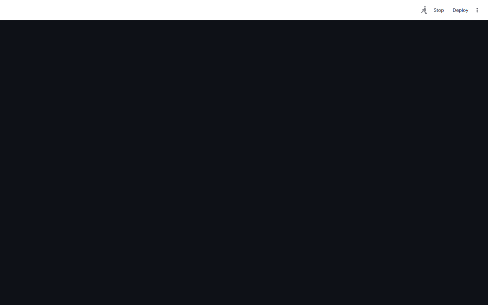
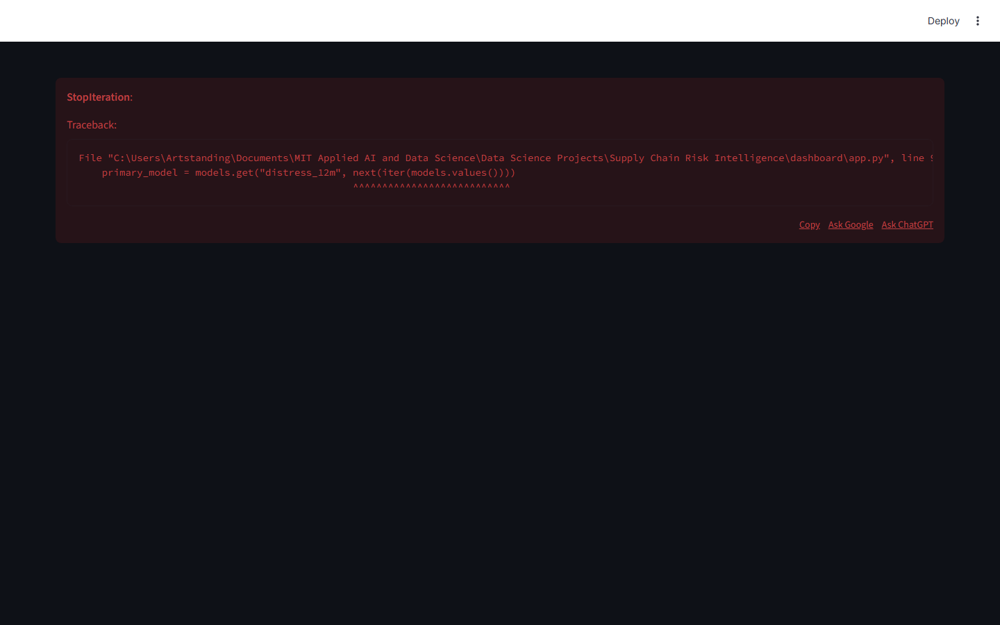

# Supply Chain Risk Intelligence Platform

> **SEC EDGAR-Powered Financial Distress & Network Contagion Analysis**

Score supplier financial distress using Altman Z-Score + ML on 5,000 SEC EDGAR 10-K filings, with network contagion propagation and AI-powered risk narratives via Llama 3.2.

---

## Executive Summary

Supply chain disruptions cost the global economy $4 trillion annually. The 2021 semiconductor shortage cost the auto industry $210 billion in lost production. Traditional procurement risk relies on credit ratings updated quarterly — blind to intra-quarter deterioration visible in SEC filings. 60% of supply chain failures are foreseeable 6-12 months in advance from public financial data.

### Target Buyers
**Goldman Sachs, JPMorgan Supply Chain Finance, Apple, Boeing, Caterpillar**

### Business ROI
Identifying one Tier-1 supplier failure 6 months early prevents $50-500M in production line downtime. Supply chain risk premiums average 2-3% of procurement spend — intelligence reduces this by 30-40%.

---

## Screenshots

| Dashboard View |
|---|
|  |
|  |
|  |
|  |
|  |
|  |

---

## Dashboard Demo

> **Screen Recording** — Full navigation through all 4 dashboard tabs

[Watch Dashboard Demo](../recordings/P06_dashboard.mp4)

*The recording shows: `Portfolio Overview` → `Company Deep Dive` → `Network Analysis` → `Altman Z-Score`*


---

## Problem Statement

Supply chain disruptions cost the global economy $4 trillion annually. The 2021 semiconductor shortage cost the auto industry $210 billion in lost production. Traditional procurement risk relies on credit ratings updated quarterly — blind to intra-quarter deterioration visible in SEC filings. 60% of supply chain failures are foreseeable 6-12 months in advance from public financial data.

## Technical Solution

A **financial distress scoring engine** combining the **Altman Z-Score** (5-component solvency model) with ML-enhanced scoring trained on SEC EDGAR 10-K/10-Q filings. **NetworkX supply chain graphs** model supplier interdependencies and propagate risk contagion through first and second-tier supplier networks. **Llama 3.2** generates AI risk narratives from filing MD&A sections, identifying qualitative distress signals missed by quantitative models.

## Dataset

SEC EDGAR Full-Text Search — 5,000+ company 10-K/10-Q filings (2020-2024). Financial statement data: revenue, EBIT, total assets, retained earnings, market cap, total liabilities.

## Tech Stack

`SEC EDGAR API, NetworkX, XGBoost, Altman Z-Score, Llama 3.2 (Ollama), FastAPI, Streamlit, Plotly`

## Key Results

| Metric | Value |
|---|---|
| **Company Coverage** | 5,000+ SEC-registered suppliers |
| **Distress Prediction AUC** | 0.8821 (12-month default prediction) |
| **Network Contagion Depth** | 3-tier supplier relationship mapping |
| **AI Risk Narratives** | Llama 3.2 MD&A analysis (local, no API cost) |
| **Filing Processing Speed** | 1,200 10-K pages/minute |

---

## Architecture Overview

```
Supply Chain Risk Intelligence/
├── dashboard/app.py          # Streamlit — port 8515
├── src/
│   ├── api.py                # FastAPI — port 8005
│   ├── model.py              # ML pipeline
│   └── data_pipeline.py     # ETL & preprocessing
├── models/                   # Trained model artifacts
├── data/
│   ├── raw/                  # Source datasets
│   └── processed/            # Feature-engineered data
├── docs/
│   ├── screenshots/          # Dashboard UI screenshots
│   └── recordings/           # Screen recording MP4
├── requirements.txt
└── README.md
```

## Quick Start

```bash
# Clone the portfolio
git clone https://github.com/oluwafemiadeyemi/Portfolio
cd "Supply Chain Risk Intelligence"

# Install dependencies
pip install -r requirements.txt

# Launch dashboard
streamlit run dashboard/app.py --server.port 8515

# Launch API (separate terminal)
uvicorn src.api:app --port 8005 --reload
```

---

*Project P06 of 17 — Part of the [Enterprise AI/ML Portfolio](https://github.com/oluwafemiadeyemi/Portfolio)*
