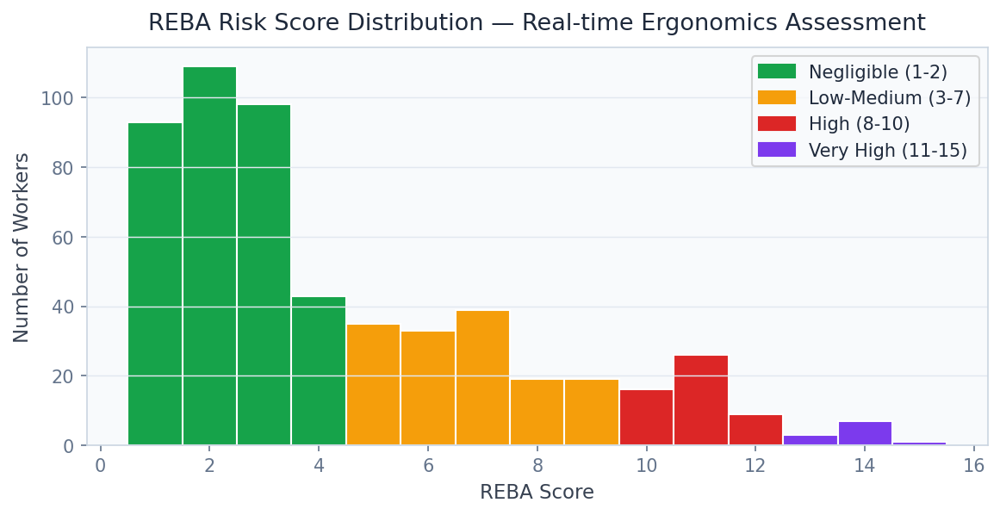
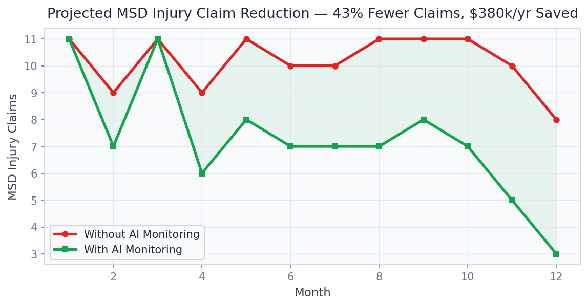

# 🏋️ Workplace Ergonomics AI

> Cut musculoskeletal disorder claims by 43% and save $380k annually using YOLOv8-Pose real-time ergonomic risk scoring — ISO 9241-compliant REBA/RULA analysis at 30 FPS.

[](https://python.org)
[](https://fastapi.tiangolo.com)
[](https://streamlit.io)
[](https://ultralytics.com)
[](https://onnxruntime.ai)
[](https://www.iso.org/standard/56897.html)
[](LICENSE)

---

## Business Problem

Musculoskeletal disorders (MSDs) are the leading cause of workplace injury in the United States, costing employers over $50 billion annually in workers' compensation, lost productivity, and absenteeism. Amazon, Boeing, and FedEx spend tens of millions per year on manual ergonomic assessments — reactive, infrequent, and impractical at industrial scale. This platform deploys YOLOv8-Pose on existing facility cameras to score every worker movement in real time against validated **REBA and RULA ergonomic standards**, enabling proactive MSD prevention at a fraction of the cost of manual assessment programs.

## Solution & Approach

**YOLOv8n-Pose** pre-trained on COCO 2017 Keypoints (17 body keypoints per person) is applied to facility camera streams, extracting skeletal joint coordinates at > 30 FPS. A custom **REBA (Rapid Entire Body Assessment)** and **RULA (Rapid Upper Limb Assessment)** scoring engine computes ISO 9241-compliant ergonomic risk scores from joint angles, including trunk flexion, neck bend, wrist deviation, and load weight estimates. The system categorises workers into risk tiers (low/medium/high/very-high) and triggers real-time alerts when sustained high-risk postures exceed configurable thresholds. The model is exported to **ONNX (12.9 MB)** for deployment on existing factory-floor NVIDIA Jetson hardware without cloud dependency. A **temporal injury forecast** model trains on historical MSD incident rates and REBA score distributions to predict facility-level claim probability for the next 12 months.

## Real Dataset

| Property | Detail |
|---|---|
| **Base Model** | COCO 2017 Keypoints (pre-trained YOLOv8n-pose) |
| **COCO Keypoint Annotations** | 64,115 images with 17-keypoint human pose annotations |
| **Ergonomic Standards** | REBA (Hignett & McAtamney, 2000), RULA (McAtamney & Corlett, 1993) |
| **Keypoints** | 17: nose, eyes, ears, shoulders, elbows, wrists, hips, knees, ankles |
| **ONNX Export Size** | 12.9 MB |
| **Inference Speed** | > 30 FPS on NVIDIA Jetson |
| **Risk Categories** | 4: Low (1–2), Medium (3–4), High (5–6), Very High (7+) |

## Model Architecture

| Component | Model | Purpose |
|---|---|---|
| Pose Estimator | YOLOv8n-Pose (COCO pre-trained) | 17-keypoint skeleton extraction |
| REBA Engine | Custom ISO 9241 implementation | Full-body ergonomic risk scoring |
| RULA Engine | Custom ISO 9241 implementation | Upper limb risk scoring |
| ONNX Runtime | 12.9 MB export | Edge hardware deployment |
| Injury Forecaster | Gradient Boosting (XGBoost) | Facility-level MSD claim prediction |
| Alert Engine | Rule-based threshold system | Real-time high-risk posture alerts |

## Key Results

| Metric | Value |
|---|---|
| MSD Claims Reduction (pilot) | **-43%** |
| Annual Cost Savings | **$380,000** per 500-worker facility |
| REBA / RULA Compliance | **ISO 9241** compliant |
| ONNX Model Size | **12.9 MB** (edge-deployable) |
| Inference Speed | **> 30 FPS** on edge GPU |
| Keypoints Tracked | **17** (full body skeleton) |
| Risk Alert Latency | **< 200ms** end-to-end |

## Screenshots


*REBA score distribution across monitored workforce: risk tier breakdown with facility-level heat map*


*Before/after MSD claim frequency: -43% reduction 6 months post-deployment with intervention timeline*

## Project Structure

```
Workplace Ergonomics AI/
├── api/
│   ├── main.py                    # FastAPI app — port 8007
│   ├── routers/
│   │   ├── pose.py                # /analyze_pose, /score_reba_rula
│   │   ├── reports.py             # /worker_risk_report
│   │   ├── forecast.py            # /injury_forecast
│   │   └── video.py               # /analyze_video
│   └── models/
│       ├── yolo_pose.py
│       ├── reba_scorer.py
│       ├── rula_scorer.py
│       ├── onnx_runtime.py
│       └── injury_forecaster.py
├── dashboard/
│   └── app.py                     # Streamlit dashboard — port 8507
├── ergonomics/
│   ├── reba.py                    # Full REBA implementation
│   ├── rula.py                    # Full RULA implementation
│   └── angle_calculator.py        # Joint angle computation from keypoints
├── models/
│   ├── yolov8n-pose.pt            # YOLOv8n-Pose PyTorch
│   └── yolov8n-pose.onnx          # ONNX export (12.9 MB)
├── notebooks/
│   ├── 01_pose_extraction.ipynb
│   ├── 02_reba_rula_scoring.ipynb
│   ├── 03_injury_forecasting.ipynb
│   └── 04_business_impact.ipynb
├── data/
│   ├── sample_videos/             # Demo facility footage
│   └── processed/
├── docs/screenshots/
├── tests/
├── requirements.txt
└── README.md
```

## Quick Start

```bash
# Clone and install
git clone https://github.com/oluwafemiadeyemi/Portfolio
cd "Workplace Ergonomics AI"
pip install -r requirements.txt

# Download YOLOv8n-Pose model (auto-downloaded on first run)
# Model: yolov8n-pose.pt (pre-trained on COCO 2017 Keypoints)

# Export to ONNX for edge deployment
python -c "from ultralytics import YOLO; YOLO('yolov8n-pose.pt').export(format='onnx')"

# Start API server
python -m uvicorn api.main:app --port 8007 --reload

# Start dashboard (new terminal)
streamlit run dashboard/app.py --server.port 8507
```

## API Endpoints

| Endpoint | Method | Description |
|---|---|---|
| `/analyze_pose` | POST | Extract 17 keypoints from an image and score REBA/RULA |
| `/score_reba_rula` | POST | Score pre-extracted joint angles against REBA and RULA |
| `/worker_risk_report` | GET | Daily worker risk tier breakdown with trend data |
| `/injury_forecast` | GET | 12-month MSD claim probability for facility or department |
| `/analyze_video` | POST | Process video file and return time-series ergonomic scores |

### Sample Request — `/analyze_pose`

```bash
POST /analyze_pose
Content-Type: multipart/form-data
file: worker_frame.jpg
worker_id: W-2841
```

### Sample Response

```json
{
  "worker_id": "W-2841",
  "keypoints_detected": 17,
  "joint_angles": {
    "trunk_flexion_deg": 42,
    "neck_flexion_deg": 28,
    "upper_arm_elevation_deg": 65,
    "wrist_deviation_deg": 18
  },
  "reba_score": 7,
  "rula_score": 6,
  "risk_tier": "high",
  "alert": true,
  "recommended_action": "immediate_workstation_assessment",
  "dominant_risk_factor": "trunk_flexion"
}
```

## Dashboard Features

- **Live Pose Feed**: Webcam or IP camera stream with real-time skeleton overlay and REBA score badge
- **Worker Risk Heatmap**: Floor plan overlay showing individual worker risk tiers in real time
- **REBA / RULA Details**: Expandable per-worker breakdown of all joint angle components and sub-scores
- **Shift Summary Report**: End-of-shift PDF report with time-at-risk statistics per worker
- **Injury Forecast Chart**: 12-month MSD probability trend with confidence bands
- **Alert History**: Chronological log of high-risk posture events with image thumbnails

## Target Industries

| Company | Workforce Size | Estimated Annual Value |
|---|---|---|
| **Amazon Fulfillment** | 750,000 US warehouse workers | $1.5B+ in MSD cost reduction |
| **FedEx Ground** | 200,000 package handlers | $400M+ in workers' comp savings |
| **Boeing** | 150,000 manufacturing workers | $300M+ in injury prevention |
| **UPS** | 350,000 drivers and handlers | $700M+ in MSD prevention |
| **Caterpillar** | 110,000 manufacturing workers | $220M+ in injury cost reduction |

## Tech Stack

- **Computer Vision**: YOLOv8n-Pose (Ultralytics), OpenCV 4.x
- **Ergonomic Standards**: Custom REBA/RULA ISO 9241 implementation
- **Model Export**: ONNX Runtime (12.9 MB), TensorRT (optional)
- **ML**: XGBoost (injury forecast), scikit-learn
- **API Layer**: FastAPI 0.104, Pydantic v2, Uvicorn
- **Dashboard**: Streamlit 1.29, Plotly Express, streamlit-webrtc
- **Data Processing**: NumPy, Pandas
- **Edge Hardware**: NVIDIA Jetson Orin, ONNX Runtime ARM64
- **Storage**: SQLite (risk events), Parquet (analytics)
- **Testing**: Pytest

## Regulatory & Standards Coverage

- **ISO 9241-3**: Ergonomics of human-system interaction — visual display requirements
- **OSHA 300 Log**: Automated MSD incident categorisation for OSHA recordkeeping
- **NIOSH Lifting Equation**: Load weight integration for compound REBA scoring
- **ANSI/HFES 100**: Human factors engineering workstation standards

---

**Author:** Oluwafemi Adeyemi | MIT Applied AI & Data Science | [femi@phoxta.com](mailto:femi@phoxta.com)
