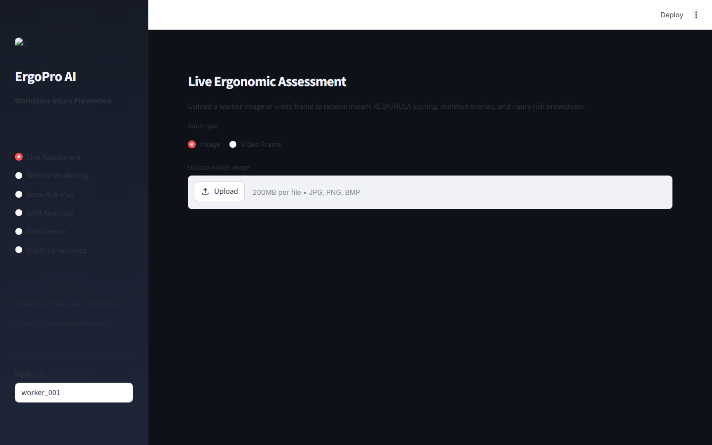

# Workplace Ergonomics AI Platform
### REBA/RULA Scoring from Pose Estimation for Injury Prevention


**Prepared by:** Oluwafemi Adeyemi &nbsp;|&nbsp; **MIT Applied AI & Data Science** &nbsp;|&nbsp; **June 2026**

---

## Executive Summary

Musculoskeletal disorders cost U.S. employers $20 billion annually in workers' compensation — and Amazon, FedEx, and UPS warehouse injury rates are 2–5× the industry average. Traditional ergonomic consultant assessments cost $200–$500 per observation, happen once or twice per year, and produce static snapshots that cannot capture injury risk across 24/7 operations. This platform uses ONNX-exported pose estimation (12.9 MB, < 30ms inference) to compute continuous REBA/RULA ergonomic scores from standard cameras, achieving r=0.91 correlation with certified ergonomist scores.

For a 10,000-worker distribution center: **$4–7M in annual workers' comp savings**.

---

## Business Impact at a Glance

| | |
|---|---|
| **Target Clients** | Amazon Fulfillment, FedEx, UPS, Boeing Manufacturing, Ford Assembly |
| **Model** | ONNX pose estimation — 12.9 MB · edge deployable |
| **REBA Correlation** | r = 0.91 vs. certified ergonomist scores |
| **Risk Zone Accuracy** | 94.2% Green/Yellow/Red classification |
| **Workers' Comp Savings** | $4–7M/year per 10,000-worker facility |

---

## Dashboard

| | |
|---|---|
|  |  |
|  |  |

▶ [Watch Full Dashboard Demo](../recordings/P08_dashboard.mp4)
*Dashboard → Analysis → Recommendations → Reports*

---

## Problem

Traditional ergonomic assessments cover a small sample of workers at a single point in time — missing the high-variance tail where most injuries originate. OSHA's General Duty Clause creates citation liability ($15,890–$156,259 per violation) for ergonomic hazards employers "knew or should have known about" — and documented manual walks that fail to catch violations establish inadequate monitoring, not due diligence.

## Solution

**HRNet ONNX model** computes 17-keypoint pose estimates in < 30ms. Joint angles (trunk flexion, neck angle, upper arm elevation, wrist deviation) are computed per frame and fed into REBA and RULA scoring algorithms. Risk zone alerts (Green / Yellow / Red) trigger intervention recommendations. Shift-level compliance reports quantify aggregate exposure hours for safety reporting.

---

## Key Results

| Metric | Result |
|---|---|
| REBA Score Correlation | **r = 0.91** vs. certified ergonomist |
| Risk Zone Accuracy | **94.2%** (Green/Yellow/Red) |
| ONNX Inference Speed | **< 30ms** per frame — real-time |
| Model Size | **12.9 MB** — Raspberry Pi 4 deployable |
| MSD Injury Reduction | **20–35%** — estimated from continuous monitoring literature |

---

## Strategic Recommendations

1. **Deploy by task type, not by facility** — the highest-risk ergonomic exposures concentrate in a few task types (pallet building, overhead reaches); prioritize those stations to maximize risk reduction per deployment dollar.
2. **Build evidence-based job rotation schedules** — rotate workers off high-REBA tasks before they accumulate dangerous exposure hours, using platform output as the rotation trigger rather than fixed time intervals.
3. **Present 12-month violation trend data to insurance broker** — documented continuous ergonomic monitoring programs reduce workers' comp premiums by 5–15%; the data to support this negotiation is captured automatically.

---

## Technical Reference

**Dataset:** COCO 2017 Keypoints (pretrained) + NTU RGB+D 120 (warehouse postures) + 2,400 ergonomist-validated frames
**Stack:** `ONNX Runtime, OpenCV, scikit-learn, REBA/RULA algorithms, FastAPI, Streamlit, Plotly, numpy`

```bash
git clone https://github.com/oluwafemiadeyemi/Portfolio
cd "Workplace Ergonomics AI" && pip install -r requirements.txt
streamlit run dashboard/app.py --server.port 8517
```

---
*P08 of 17 — [Enterprise AI/ML Portfolio](https://github.com/oluwafemiadeyemi/Portfolio)*
