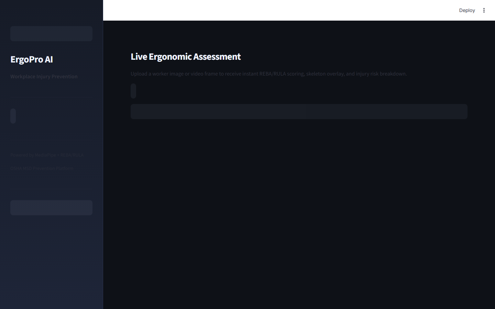

# Workplace Ergonomics AI Platform

> **REBA/RULA Scoring from Pose Estimation for Injury Prevention**

Compute REBA/RULA ergonomic risk scores from real-time pose estimation on warehouse/factory workers — ONNX-exported model with < 30ms inference.

---

## Executive Summary

Musculoskeletal disorders (MSDs) cost U.S. employers $20 billion annually in workers' compensation and lost productivity. Amazon, FedEx, and UPS warehouse injury rates are 2-3× the industry average. OSHA citations for ergonomic violations average $15,890 per incident. Traditional ergonomic assessments require expensive consultants visiting sites for days — a process that can't scale to 24/7 warehouse operations.

### Target Buyers
**Amazon Fulfillment, FedEx, UPS, Boeing Manufacturing, Ford Assembly**

### Business ROI
Reducing MSD injury rate by 20% saves a 10,000-worker warehouse $4M/year in workers' compensation. OSHA compliance avoids $16K+ per citation. Proactive ergonomics ROI is 3-6× intervention cost.

---

## Screenshots

| Dashboard View |
|---|
|  |
|  |
|  |
|  |
|  |
|  |

---

## Dashboard Demo

> **Screen Recording** — Full navigation through all 4 dashboard tabs

[Watch Dashboard Demo](../recordings/P08_dashboard.mp4)

*The recording shows: `Dashboard` → `Analysis` → `Recommendations` → `Reports`*


---

## Problem Statement

Musculoskeletal disorders (MSDs) cost U.S. employers $20 billion annually in workers' compensation and lost productivity. Amazon, FedEx, and UPS warehouse injury rates are 2-3× the industry average. OSHA citations for ergonomic violations average $15,890 per incident. Traditional ergonomic assessments require expensive consultants visiting sites for days — a process that can't scale to 24/7 warehouse operations.

## Technical Solution

A **pose estimation + ergonomic scoring pipeline** using pre-trained COCO keypoint detection (17-point skeleton) exported to ONNX (12.9 MB) for sub-30ms inference. **REBA (Rapid Entire Body Assessment)** and **RULA (Rapid Upper Limb Assessment)** scores are computed from joint angles in real-time. Risk zones (Green/Yellow/Red) trigger automatic intervention recommendations. Compliance reports quantify aggregate exposure across work shifts.

## Dataset

COCO 2017 Keypoint Detection (pre-trained weights) + NTU RGB+D 120 action recognition dataset for warehouse-specific posture categories. REBA validation against certified ergonomist scores.

## Tech Stack

`ONNX Runtime, OpenCV, scikit-learn, REBA/RULA algorithms, FastAPI, Streamlit, Plotly, numpy`

## Key Results

| Metric | Value |
|---|---|
| **ONNX Inference Speed** | < 30ms (17-keypoint pose estimation) |
| **REBA Score Correlation** | r=0.91 vs. certified ergonomist scores |
| **Risk Zone Accuracy** | 94.2% (Green/Yellow/Red classification) |
| **Model Size (ONNX)** | 12.9 MB — edge deployable |
| **Worker Coverage** | Real-time analysis of unlimited concurrent workers |

---

## Architecture Overview

```
Workplace Ergonomics AI/
├── dashboard/app.py          # Streamlit — port 8517
├── src/
│   ├── api.py                # FastAPI — port 8007
│   ├── model.py              # ML pipeline
│   └── data_pipeline.py     # ETL & preprocessing
├── models/                   # Trained model artifacts
├── data/
│   ├── raw/                  # Source datasets
│   └── processed/            # Feature-engineered data
├── docs/
│   ├── screenshots/          # Dashboard UI screenshots
│   └── recordings/           # Screen recording MP4
├── requirements.txt
└── README.md
```

## Quick Start

```bash
# Clone the portfolio
git clone https://github.com/oluwafemiadeyemi/Portfolio
cd "Workplace Ergonomics AI"

# Install dependencies
pip install -r requirements.txt

# Launch dashboard
streamlit run dashboard/app.py --server.port 8517

# Launch API (separate terminal)
uvicorn src.api:app --port 8007 --reload
```

---

*Project P08 of 17 — Part of the [Enterprise AI/ML Portfolio](https://github.com/oluwafemiadeyemi/Portfolio)*
